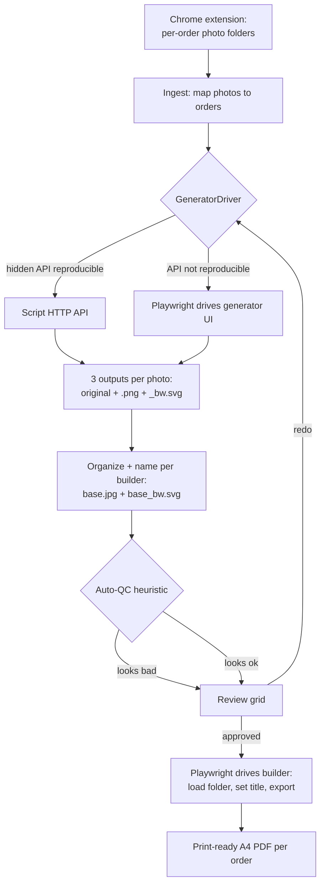

# Fotomalovánky Order Automation - Plan

## Goal Capsule

- **Objective:** Ship a local Windows tool that turns the per-order photo folders your Chrome extension already downloads into per-order print-ready A4 PDFs — auto-generating each coloring-book version, organizing and naming the files, letting you review/redo the bad conversions, and driving your existing builder to the final PDF. One "Go" click; one manual touchpoint (reviewing flagged photos).
- **Authority hierarchy:** This plan → existing repo conventions (once code exists) → operator preference. Where they conflict, the later item wins for details the plan leaves open; a scope or approach change is escalated, not guessed.
- **Stop conditions (escalate, don't guess):** If the U2 spike finds the generator can be driven by *neither* its HTTP API *nor* browser automation, stop — the entire pipeline depends on that seam. For the builder, escalate only if it cannot be automated (U5) *and* the fallback layout re-implementation (kept in scope in U5) also proves infeasible — a merely un-automatable builder is not itself a stop condition, because the fallback covers it.
- **Execution profile:** On-demand, single-operator, low-volume local batch tool. Not a hosted service.
- **Tail ownership:** The implementer runs the Verification Contract, packages the tool, and hands the operator the launcher plus a short setup doc.

---

## Product Contract

### Summary

Build a local "click Go" tool for `fotomalovanky.cz` that automates the tedious middle of the current manual order flow: it takes the order-photo folders the existing Chrome extension downloads, runs each photo through the `fotomalovanky-app` generator automatically, collects the three outputs (original, coloring `.png`, coloring `_bw.svg`) named the way the builder expects, flags likely-bad conversions for the operator to redo, and then drives the existing `fotomalovanky-service` builder to produce the standardized print-ready A4 PDF per order. No code changes to either app, no hosting.

### Problem Frame

Today the operator does the whole chain by hand: for each Shopify order they feed the customer photo into the generator app, pick a variant and tune positive/negative prompts, wait for the diffusion pipeline, download the three outputs, use the extension to name/organize files, load the folder into the builder, and export the print PDF. The per-photo generation loop is the high-click, high-wait bottleneck, and it repeats for every photo of every order. The download-from-Shopify step is already solved by the extension; the generation, organization, review, and PDF-export steps are not.

The constraint that shapes everything: the operator has **no source-code access** to either app — only the live deployed URLs. Automation therefore cannot add API endpoints; it must drive the apps as they exist (script the HTTP calls their web UIs already make, or drive the browser). Conversion quality also varies — most photos convert fine on default settings, but some need a redo — so the pipeline cannot be fully unattended; it needs a human review gate.

### Requirements

**Input & orchestration**
- R1. The tool runs locally on the operator's Windows machine, on demand ("click Go"), with no hosted service and no monthly cost.
- R2. The tool consumes the per-order photo folders produced by the existing Chrome extension; it does not fetch orders from Shopify directly.
- R3. A single run processes a batch of orders end-to-end and reports per-order status (done / flagged / failed).

**Generation**
- R4. Each input photo is converted to its coloring-book version automatically via the `fotomalovanky-app` generator, producing the three outputs: original, coloring `.png`, coloring `_bw.svg`.
- R5. Generation settings (variant, diffusion steps, positive/negative prompts) come from operator-configurable defaults that match current manual usage.
- R6. Generation tolerates the generator's latency and cold-starts through retries, and a run is resumable so already-generated photos are skipped.

**Quality & review**
- R7. Likely-bad conversions are auto-flagged and surfaced in a review step where the operator can mark a result bad and redo it (re-run, alternate settings, or hand off to the app for manual crop/prompt).
- R8. Only operator-approved (or unflagged) results proceed to the PDF step.

**Output**
- R9. Outputs are organized into one folder per order, named to match what the builder expects (`<base>.jpg` photo paired with `<base>_bw.svg`).
- R10. For each approved order, the tool drives the existing `fotomalovanky-service` builder to produce the standardized print-ready A4 PDF, preserving the current layout and print settings.

**Operability**
- R11. The generator's token-scoped URL and any other secrets live in local config, never hardcoded in source.
- R12. The tool ships packaged for double-click launch with a short operator setup document.
- R13. Customer photos and generated files are stored locally only — nothing is sent to the cloud beyond what the generator already receives — and a documented purge action deletes an order's photo folder once its PDF is confirmed printed, or after a 30-day retention window.

### Scope Boundaries

**Non-goals**
- Changing the code of `fotomalovanky-app` or `fotomalovanky-service` — the tool drives them as-is.
- Replacing the Chrome extension — it stays the Shopify-download step.
- Improving the AI conversion quality itself — the generator is used as-is; the tool only automates around it and flags bad output.

#### Deferred to Follow-Up Work
- Direct Shopify API pull (fully hands-off from order, no extension click). Keeping the extension is the lower-risk starting point; a direct pull can be added later if the operator wants it.
- Real-time / scheduled / high-volume operation. This tool is on-demand batch only.
- Re-implementing the A4 side-by-side layout + PDF generation as a first-class feature (kept only as the U5 fallback if the builder can't be automated).

---

## Planning Contract

### Key Technical Decisions

- **KTD1. Local Python tool with a small local-web "click Go" UI, packaged as a Windows executable.** No code access to the apps and a non-technical operator both point to a self-contained local tool. Python gives clean HTTP scripting, Playwright browser automation, and image analysis for the quality heuristics in one stack. A one-page local web UI (local server + browser page) is the friendliest "select folder → Go → watch progress" surface and is packaged with a bundler so the operator double-clicks a launcher rather than using a terminal. *Alternative considered:* a Node/Playwright tool — viable, but Python's image-analysis libraries make the quality gate simpler.

- **KTD2. A `GeneratorDriver` abstraction, API-first with a browser fallback.** The generator's web UI already talks to a backend over HTTP (upload → job id → poll → outputs). The plan first tries to reproduce those calls directly (discovered from a one-time network/HAR capture); if they can't be reliably reproduced (signed uploads, opaque auth), it falls back to Playwright driving the visible UI. Both implement one interface so the rest of the pipeline is agnostic to which won. The choice is resolved by the U2 spike at implementation time, not now.

- **KTD3. Produce the PDF by automating the existing builder, not by re-implementing it.** Driving `fotomalovanky-service` (load folder → set title/dedication → export) keeps the output identical to the operator's current standardized layout and print settings, with zero re-implementation risk. Re-implementing the A4 side-by-side layout is the fallback only if the builder proves un-automatable.

- **KTD4. Keep the Chrome extension as the Shopify-download step.** The extension already downloads and correctly names order photos; reusing its output folders avoids Shopify API credentials and integration risk entirely. This makes the tool's input contract "a folder the extension produced," not "a Shopify order."

- **KTD5. Human-in-the-loop quality gate via auto-flag + review.** Because conversion quality is mixed, the tool auto-flags likely-bad results with image heuristics to cut review load, but the operator confirms and redoes; nothing reaches the PDF step without passing review.

- **KTD6. On-demand batch with resumable, idempotent processing driven by a per-order state manifest.** Low volume plus slow diffusion plus Render cold-starts means runs are long and can be interrupted. Completion is derived from a persisted per-photo status in a per-order `state.json` manifest — not from output-file existence alone, because a good result, a flagged-bad result, and an approved result all leave identical files on disk. Re-running reads the manifest and finishes only photos not yet approved-or-clean, so a resumed run re-generates anything flagged-for-redo and never lets an unresolved bad result slip through to the builder.

### High-Level Technical Design

End-to-end pipeline and its decision branches:



The `GeneratorDriver` and the builder driver are the two seams where "no code access" bites; both are isolated behind interfaces so the spike outcomes (API vs. browser; builder-automation vs. re-implement) change one module, not the pipeline.

### Assumptions

These are agent bets recorded for visibility; confirm or correct during implementation.
- The Chrome extension writes each order as a folder of correctly-named `.jpg`/`.jpeg` photos (verify the exact folder/name shape against a real sample before building ingest).
- The builder's folder contract is `<base>.jpg` + `<base>_bw.svg` pairs (observed on the builder's landing copy; confirm against a real load).
- The operator has a standard variant + diffusion-steps + prompt set they normally use; these become the configured defaults (capture from current usage).
- The generator's token-scoped URL (`/<token>/`) is the operator's stable private workspace link and can be reused by automation.

### Open Questions

- **Generator integration shape** — is the hidden HTTP API reproducible outside the browser, or must we drive the UI? Resolved in the Phase-0 walking skeleton via the U2 network/HAR spike (see Sequencing). *Blocking for U2's approach, not for starting.*
- **Builder automation mechanism** — does the builder expose a clean "export PDF" action Playwright can click, or must the PDF come from the browser's print path? Resolved in the Phase-0 walking skeleton via the U5 spike (see Sequencing).

### Risks & Dependencies

- **The generator and builder are external Render apps the operator does not control.** Their UI or API can change without notice, which would break the drivers. Mitigation: the `GeneratorDriver` / builder-driver abstractions, defensive selectors, and clear failure surfacing. **Decision:** the operator will not pursue API/source access from the apps' author for now, so the tool commits to the reverse-engineering + browser-automation path; this app-drift fragility is the accepted standing risk, and is why both external seams are proven first (see Sequencing). Revisit if breakage becomes frequent — a stable API remains the highest-leverage de-risk.
- **Render cold-starts and slow diffusion** make runs long and prone to timeouts. Mitigation: generous timeouts, bounded retries, resumability, and sequential (not hammering) requests.
- **Client-side print-to-PDF in the builder** can be awkward to automate. Mitigation: prefer the app's own export action; fall back to the browser's headless PDF path; U5 resolves which works.
- **QC heuristics are approximate** — they will have false positives and negatives. The human review gate (R7) is the intended backstop, not the heuristic alone.
- **Naming-contract drift** — if the extension's output names or the builder's expected pairing differ from the assumption above, organization and PDF export break. Mitigation: verify against real samples in U3/U5 before relying on the contract.

### Sequencing (Phased Delivery)

Build in walking-skeleton order so a fatal external seam surfaces before sunk cost:

- **Phase 0 — Walking skeleton (prove both seams).** After U1 scaffold, prove one real photo end-to-end: generator → `<base>.jpg` + `<base>_bw.svg` pair → builder → a single-order PDF. This resolves the U2 (generator) and U5 (builder) spikes and both Goal-Capsule stop conditions in minimal form, before any batch/UI/QC code exists. If either seam can't be driven, stop and escalate.
- **Phase 0.5 — Value gate (U8).** Run a small real-photo sample on default settings, measure the redo rate, and set the Definition-of-Done manual-touch threshold. Go/no-go before building the full pipeline.
- **Phase 1 — Build out.** U3 (organize + batch), U4 (QC + review grid), U6 (orchestration), hardening the U2/U5 drivers for batch (retries, resumability).
- **Phase 2 — U7 packaging + operator setup.**

### Data handling & privacy

- **Local only.** Customer photos, generated outputs, and PDFs live on the operator's machine. The tool adds no new cloud exposure — photos already pass through the generator in the current manual flow, and nothing beyond what the generator already receives is sent anywhere.
- **Trace redaction.** Playwright traces/screenshots are debug-only, written to a gitignored local temp dir, never committed, and strip or avoid capturing the token-scoped generator URL and customer-photo bytes. Deliberately minimal — just no secrets or faces in saved artifacts.
- **Retention & purge (R13).** A documented purge action deletes an order's photo folder once its PDF is confirmed printed, or after a 30-day retention window, whichever comes first. Local disk encryption is recommended for the operator's machine.

---

## Output Structure

Greenfield layout for the tool (repo-relative):

```
app/
  __init__.py
  config.py                # load/validate config, hold secrets
  ingest.py                # extension folders -> order/photo model
  organize.py              # write outputs with builder-compatible naming
  qc.py                    # image heuristics -> flagged/ok
  review.py                # review-gate state + redo; persists verdicts to state.json
  orchestrator.py          # wire stages into the "Go" run
  builder.py               # Playwright driver for fotomalovanky-service
  generator/
    __init__.py
    base.py                # GeneratorDriver interface
    api_driver.py          # scripted HTTP API driver (preferred)
    browser_driver.py      # Playwright UI driver (fallback)
  ui/
    server.py              # local web server: folder-select, Go, progress, review grid
    static/index.html      # single-page "click Go" UI + review grid
tests/
  test_config.py
  test_ingest.py
  test_organize.py
  test_qc.py
  test_review.py
  test_generator_api.py    # live-marked
  test_generator_browser.py# live-marked
  test_builder.py          # live-marked
  test_builder_layout.py   # fallback A4 layout
  test_orchestrator.py
.gitignore                 # excludes the live config and .env (only config.example.yaml is committed)
config.example.yaml
pyproject.toml
README.md
```

This tree is a scope declaration, not a constraint — the implementer may adjust it. Per-unit `Files` lists stay authoritative. Each order's output folder also carries a runtime `state.json` manifest (per-photo run/review status); it is generated during a run, not committed to the repo.

---

## Implementation Units

### U1. Project scaffold, config, and local "click Go" UI

- **Goal:** Stand up the project skeleton, a validated config layer (paths, generator token URL, default variant/steps/prompts), and a one-page local web UI that lets the operator pick the input folder, press Go, and watch progress.
- **Requirements:** R1, R5, R11.
- **Dependencies:** none.
- **Files:** `pyproject.toml`, `.gitignore`, `app/config.py`, `app/ui/server.py`, `app/ui/static/index.html`, `config.example.yaml`, `tests/test_config.py`.
- **Approach:** Config loaded from a local YAML/env file; secrets (token URL) read from config/env only, and the live config plus any `.env` are gitignored so a stray `git add .` cannot commit the token — only `config.example.yaml` is committed. Local web server exposes a single page with a folder picker, a Go action that starts an orchestrator run, and a live progress log (server-sent events or polling). This UI is a shell that U4 extends with the review grid. No pipeline logic here yet — the Go action calls a stub that U6 replaces.
- **Patterns to follow:** Standard Python packaging (`pyproject.toml`), a minimal web framework already common in the ecosystem; keep the UI dependency-light.
- **Test scenarios:**
  - Config loads from a valid file; all defaults resolve.
  - Missing required key (generator URL) → a clear, actionable error, not a stack trace.
  - Secret values (token URL) are never written to logs or the progress stream.
  - `GET /` serves the page; `POST /run` with a valid folder path starts a run and streams progress lines; `POST /run` with a non-existent path returns a validation error.
  - The repo ignores the live config and `.env` (gitignore covers them); only `config.example.yaml` is tracked.
- **Verification:** Launching the tool opens the page; selecting a folder and pressing Go streams a (stubbed) progress log without errors.

### U2. GeneratorDriver: API-first, browser fallback (spike)

- **Goal:** Establish how the tool drives the generator and implement the winning driver behind a common interface: given one photo + settings, return the three outputs.
- **Requirements:** R4, R6.
- **Dependencies:** U1.
- **Files:** `app/generator/base.py`, `app/generator/api_driver.py`, `app/generator/browser_driver.py`, `tests/test_generator_api.py`, `tests/test_generator_browser.py`.
- **Approach:** Define `GeneratorDriver.generate(photo, settings) -> outputs`. First run the spike: capture the generator's network traffic (HAR) during one manual conversion to see whether upload → job-poll → download can be reproduced directly. If yes, build `api_driver`. If not, build `browser_driver` with Playwright (upload, select the configured variant + steps, set prompts, process, wait for completion, download the three outputs). Select the active driver via config/spike result.
- **Execution note:** Start with the network-capture spike; the API-vs-browser decision is made and recorded here, at implementation time. Prove one photo end-to-end through the chosen driver as the generator half of the Phase-0 walking skeleton (see Sequencing) before wiring batch.
- **Patterns to follow:** Retry-with-backoff around network calls; treat cold-start timeouts as retryable.
- **Test scenarios:**
  - API driver (fixture-backed): upload returns a job id; polling transitions processing → done; download yields exactly the three outputs (original, `.png`, `_bw.svg`).
  - API driver: repeated 5xx / cold-start timeout → retries up to the configured limit, then surfaces a clear failure.
  - Browser driver (live-marked): drives the UI to produce the three downloads for one photo with the configured variant/steps/prompts.
  - Interface conformance: both drivers satisfy the same `generate` contract (parametrized).
- **Verification:** One real photo converts through the selected driver and lands the three named outputs locally.

### U3. Order ingestion, batch generation, and output organization

- **Goal:** Turn the extension's downloaded folders into an order→photos model, run each photo through the `GeneratorDriver`, and write outputs into per-order folders with builder-compatible naming — resumably.
- **Requirements:** R2, R3, R6, R9.
- **Dependencies:** U2.
- **Files:** `app/ingest.py`, `app/organize.py`, `tests/test_ingest.py`, `tests/test_organize.py`.
- **Approach:** Ingest maps `<order>/<photo>.jpg` inputs to orders, ignoring non-image files. For each photo, call the driver, then write `<base>.jpg` (original) + `<base>_bw.svg` (coloring) and keep the `.png` into the order's output folder, and record the photo's status in a per-order `state.json` manifest (the state vocabulary — `ok` / `flagged` / `pending_review` / `manual_in_progress` / `approved` / `failed` — is owned by U4's review gate). Completion is derived from that manifest — not output-file existence — so re-runs skip only photos already resolved and re-generate any flagged-for-redo. A single photo failure records status and continues the batch.
- **Patterns to follow:** Pure functions for path mapping and naming (easy to unit-test); side-effecting IO isolated.
- **Test scenarios:**
  - Ingest maps a mixed folder to the correct order→photo structure and ignores non-image files.
  - For input `abc.jpg`, the coloring output is written as `abc_bw.svg`, the `.png` is kept, and the original is retained — matching the builder's expected pairing.
  - Re-running a partially-completed order skips photos the manifest marks resolved but re-generates any marked flagged-for-redo (idempotent/resumable).
  - The per-order `state.json` records each photo's status and is the source of truth for resume.
  - One photo's generation failure is recorded and does not abort the rest of the batch.
  - Empty or missing input folder → clear message, no crash.
- **Verification:** A sample multi-order folder produces correctly-named per-order output folders; a second run does no redundant work.

### U4. Quality gate: auto-flag and review/redo

- **Goal:** Auto-flag likely-bad conversions and give the operator a review step to confirm or redo, gating what proceeds to PDF.
- **Requirements:** R7, R8.
- **Dependencies:** U3.
- **Files:** `app/qc.py`, `app/review.py`, `app/ui/server.py` (review-grid endpoints), `app/ui/static/index.html` (review grid), `tests/test_qc.py`, `tests/test_review.py`.
- **Approach:** Heuristics on each generated coloring output detect degenerate results (near-blank / near-solid images, empty or path-less SVG, implausible ink coverage) and mark them flagged. U4 extends the U1 UI shell with the review grid — the unit that owns review logic also owns rendering it: original + coloring thumbnails per photo with flagged ones highlighted, plus redo/approve controls. Enumerate the grid's states: empty (before any output), loading/partial (tiles fill as each photo completes, with a per-tile "generating" placeholder), per-tile "redo in progress", per-tile failure, and ready ("batch complete — N flagged, review ready").

  **Approval policy (the U4 gate).** Each photo carries a `state.json` status — `ok`, `flagged`, `pending_review`, `manual_in_progress`, `approved`, or `failed`. Unflagged results (`ok`) auto-advance to builder-eligible with no click; flagged/pending results hold at review until the operator explicitly approves them; a flagged result is never auto-approved. Builder-eligible = `ok` or `approved`.

  **Redo paths.** The operator marks a result bad → it re-queues through the `GeneratorDriver` (optionally with an alternate variant), or is handed off to the app for manual crop/prompt. Handoff is a redo, not a shortcut past review: clicking "hand off" on a flagged tile opens the generator in the browser at that photo and sets state to `manual_in_progress`; when the replacement outputs land in the order folder (matched by filename, or dropped onto the tile), the tool overwrites that photo's outputs, re-runs the same QC heuristic, and sets state to `pending_review`. The tile re-enters the grid as a normal reviewable item, never auto-approves, and is not builder-eligible until the operator explicitly approves it — exactly like a re-generated redo. `state.json` is the single source of truth throughout.
- **Patterns to follow:** Keep heuristics as pure functions returning a score/verdict + reason, so thresholds are tunable and testable.
- **Test scenarios:**
  - A near-blank (almost all white) coloring output is flagged.
  - A near-solid / near-black output is flagged.
  - A normal line-art output (mid-range ink coverage, non-empty SVG paths) passes.
  - A zero-byte or path-less SVG is flagged.
  - Marking a result bad re-queues it and updates its status; approving advances it.
  - A review verdict (bad / approved) is persisted to `state.json` and survives a tool restart.
  - The grid renders its enumerated states: empty, loading/partial, per-tile redo-in-progress, per-tile failure, and batch-ready.
  - An unflagged (`ok`) photo auto-advances to builder-eligible without operator action; a flagged photo is never builder-eligible until explicitly approved (no auto-approval).
  - A manual handoff sets state to `manual_in_progress`; when replacement outputs land they overwrite the old outputs, re-run QC, and set `pending_review` — the tile re-enters review and reaches the builder only after explicit approval.
  - The builder step only sees approved/unflagged results (a flagged, unresolved photo is withheld).
- **Verification:** On a batch with a deliberately bad conversion, the bad one is flagged, a redo replaces it, and only good results advance.

### U5. Builder automation → print-ready A4 PDF

- **Goal:** For each approved order folder, drive `fotomalovanky-service` to produce the standardized print-ready A4 PDF.
- **Requirements:** R10.
- **Dependencies:** U3 (organized folders); consumes U4's approval gate.
- **Files:** `app/builder.py`, `tests/test_builder.py`, `tests/test_builder_layout.py`.
- **Approach:** Spike the builder's PDF path first: does it expose an export action Playwright can click, or must the PDF come from the browser's print pipeline? Then implement the driver — load the order folder, set title/dedication and rotation/cover defaults, export, and save a non-empty PDF into the order folder. If the builder proves un-automatable, implement the fallback re-created A4 side-by-side layout (kept behind a flag).
- **Execution note:** Prove this as the builder half of the Phase-0 walking skeleton (see Sequencing) — one photo → PDF — before batch; validate the PDF is genuine (`%PDF` header, non-zero) and visually matches the current manual output.
- **Patterns to follow:** Reuse the Playwright setup conventions from `browser_driver.py`.
- **Test scenarios:**
  - Driver loads an order folder, sets title/dedication, exports, and saves a non-empty PDF with the expected filename.
  - A photo missing its `_bw.svg` pair is surfaced before export (builder needs pairs).
  - Output PDF is valid (`%PDF` header, non-zero size).
  - Fallback layout (when enabled) produces a PDF with photo + coloring side-by-side.
- **Verification:** One real approved order yields a print-ready A4 PDF matching the operator's current builder output.

### U6. End-to-end orchestration, resumability, and run report

- **Goal:** Wire ingest → generate → QC/review → builder into the single "Go" run, with per-order status, resumability, and a summary report.
- **Requirements:** R3, R6, R8.
- **Dependencies:** U2, U3, U4, U5.
- **Files:** `app/orchestrator.py`, `tests/test_orchestrator.py`.
- **Approach:** Replace U1's stub with the real run: process orders, emit per-photo/per-order progress to the UI, hold flagged photos at the review gate, and after approval drive the builder. The progress log distinguishes its states: an active-work line with an elapsed/heartbeat indicator during long generator waits (so a slow diffusion call doesn't read as a hang), and a visually distinct per-photo failure line. On a driver break (missing selector, changed API shape, cold-start timeout past the retry limit), the driver raises a typed, plain-language error naming which seam broke (generator vs builder); the orchestrator marks that photo/order `failed` with that reason, continues the rest of the batch, and lists it in the run report — no stack traces reach the operator UI. Produce a final report (done / flagged / failed per order). Interrupt-and-resume reads each order's `state.json` and completes only unresolved work.
- **Patterns to follow:** Drivers injected (stubbed in tests) so orchestration is testable without the live apps.
- **Test scenarios:**
  - End-to-end on a fixture order with stub drivers: ingest → generate → QC → approve → builder → a PDF path is returned and the order's status is done.
  - A flagged photo blocks only its own order's PDF until resolved; other orders still complete.
  - A generator or builder driver break surfaces as a plain-language failure naming the broken seam, marks that photo/order failed, continues the batch, and appears in the run report (no stack trace in the UI).
  - Interrupting mid-batch and re-running reads `state.json` and completes only unresolved orders, preserving prior review verdicts (an approved photo is not re-flagged; a flagged-for-redo photo is re-generated).
- **Verification:** A multi-order run drives the whole pipeline end-to-end and returns an accurate status report.

### U7. Packaging and operator setup

- **Goal:** Package the tool for double-click launch on the Windows machine and document first-run setup for a non-technical operator.
- **Requirements:** R1, R12.
- **Dependencies:** U6.
- **Files:** `README.md`, packaging config in `pyproject.toml`.
- **Approach:** Produce a bundled launcher (e.g., a single Windows executable). Document first-run steps: paste the generator token URL into config, install the Playwright browser, and point the tool at the extension's download folder. Keep it short and operator-facing.
- **Execution note:** Packaging/config unit; verify by a launch smoke on the target Windows machine, not unit tests.
- **Test expectation:** none — packaging and docs; verified by launching the built tool and confirming the UI serves and a run starts.
- **Verification:** On the operator's Windows machine, double-clicking the launcher opens the UI and a real batch runs to completion following only the README.

### U8. Value gate: redo-rate validation

Sequenced in Phase 0.5, right after the walking skeleton (see Sequencing) — listed here out of numeric order to keep U1–U7 intact.

- **Goal:** Before committing to the full batch pipeline, measure how often photos need a manual redo on default settings, and set the Definition-of-Done manual-touch threshold from real data.
- **Requirements:** R5, R7.
- **Dependencies:** U2 (generator driver).
- **Files:** `tests/test_value_gate.py` (live-marked); a small script/CLI entry reusing `app/generator/*` and `app/qc.py`.
- **Approach:** Run ~20–50 representative real photos through the chosen generator driver on the configured default variant/steps/prompts, apply the U4 QC heuristics (or eyeball where heuristics aren't built yet), and record the fraction flagged/redone. Compare against the tolerable manual-touch threshold; a high rate is a go/no-go signal that the value case needs re-framing or better defaults before full automation is built.
- **Execution note:** A go/no-go gate, not feature code — its output is a measured number and a threshold, not a shipped surface.
- **Test expectation:** none — measurement/validation step; verified by producing a recorded redo-rate figure on a real sample.
- **Verification:** A redo-rate percentage is recorded on a real sample and used to set the DoD manual-touch threshold.

---

## Verification Contract

The repo is greenfield; these become the concrete gates once scaffolded.

- **Unit tests:** `pytest tests/` — covers config validation, ingest mapping, output naming, QC heuristics, review-gate logic, and orchestration with stub drivers. These must pass with no network.
- **Driver smoke (live-marked):** `pytest -m live tests/test_generator_api.py tests/test_generator_browser.py tests/test_builder.py` — exercises the real generator and builder. Playwright traces/screenshots are captured on failure to a gitignored local temp dir with the token URL and customer-photo bytes stripped. Run manually against the live apps, not in a no-network gate.
- **End-to-end smoke:** launch the tool, run it against one real sample order folder, and confirm per-order print-ready PDFs are produced with builder-compatible naming.
- **Value gate (U8):** the redo-rate measurement on a real ~20–50 photo sample is recorded and compared to the manual-touch threshold before full batch automation is built.
- **Review-gate behavior:** unit-verify that `ok` photos auto-advance, flagged/pending photos hold until explicit approval, and a manual handoff re-enters review via `pending_review` and reaches the builder only after approval.
- **Setup requirement:** `playwright install` (or bundled browser) must be part of first-run so the browser-driven paths work.
- **Manual acceptance:** the operator runs a real batch; outputs match the quality and layout of the current manual process.

---

## Definition of Done

**Global**
- The operator can point the tool at the extension's download folder, click Go, review/redo flagged photos, and receive per-order print-ready A4 PDFs — matching current manual-process quality and layout.
- All non-live unit tests pass; the end-to-end smoke produces a valid PDF from a real order folder.
- The generator token URL and any secrets live in local config, not in source.
- The tool is packaged for double-click launch on the Windows machine, with a README the operator can follow unaided.
- The U8 redo rate is measured on a real sample and lands at or below the agreed manual-touch threshold; if it exceeds it, the value case was re-confirmed or defaults improved before shipping.
- A documented purge action exists and removes an order's photo folder on print-confirmation or after the 30-day retention window; nothing is stored in the cloud beyond what the generator already receives.
- Driver breaks fail loud and specific (naming the broken seam) without stack traces in the operator UI, and do not abort the batch.
- Abandoned-approach code from the U2/U5 spikes (the driver path that lost) is removed, not left in the diff.

**Per unit**
- Each unit's listed test scenarios pass (or, for U7, the launch smoke succeeds).
- Each unit's Verification line is demonstrably true.

---

## Sources & Research

- `fotomalovanky-app.onrender.com` — the generator: upload → Job ID → 10 resolution variants (1MP–1.5MP) → diffusion-steps slider (Lightning LoRA) → positive/negative prompts → crop → outputs (original, coloring `.png`, coloring `_bw.svg`). Underlying model: **Qwen Image Edit (2509 & 2511)**. Inspected directly during planning.
- `fotomalovanky-service.onrender.com` — the builder: "A4 Gallery Builder", loads an order folder of `.jpg`/`.jpeg` photos + matching `_bw.svg` coloring versions, arranges photo + coloring side-by-side, title/dedication + rotation + cover-size controls, Print / PDF export. Client-side. Inspected directly during planning.
- Existing Chrome extension (operator-owned) — downloads and correctly names order photos from Shopify; the tool's input contract is its output folders.
