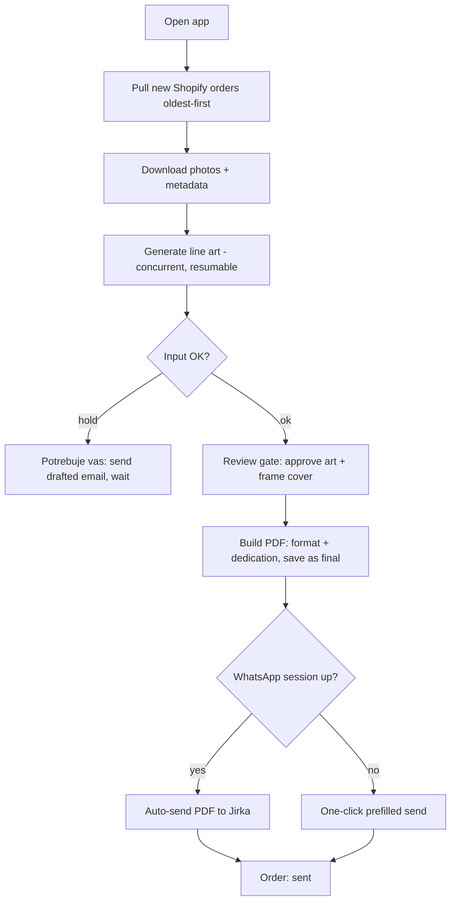

# Unified Studio Dashboard - Plan

## Goal Capsule

- **Objective:** One internal, Fotomalovánky-only web app that collapses the operator's 14-step manual order routine into a single cockpit. New Shopify orders pull in oldest-first, generation runs, the operator makes only the two calls that need a human — approve the line art, frame the cover — then the app builds the galerie/full-page PDF with the dedication and sends it to Jirka on WhatsApp automatically. The same screen shows the live state of every order, replacing the hardcoded numbers in today's `dashboard.html` mockup.
- **Product authority:** This plan → existing repo conventions (the order-automation master plan and the intake-gate plan under `docs/plans/`) → operator preference. A scope or approach change is escalated, not guessed.
- **Open blockers:** v1 intake is unblocked — it keeps the existing Chrome-extension bridge, so nothing waits on an external party. Two later gates, neither blocking v1: the Shopify Admin API migration waits on Lukas delivering the API key; the auto-WhatsApp handoff needs Jirka's number and a one-time session login. Neither blocks writing or planning.
- **Execution profile:** Same as the tool today — single operator, local, on-demand, human-scale volume, Node/Playwright stack.

---

## Product Contract

### Summary

A local web dashboard that turns the operator from the integration layer between five tools into a reviewer. v1 delivers the order cockpit — Shopify pull → generate → approve → build → auto-WhatsApp to Jirka — plus a live status board over the real order data. Marketing, gallery, and analytics tabs are deferred to later versions.

---

### Problem Frame

Today the operator *is* the pipeline. A single order takes 14 manual steps spread across five tools: pick the oldest unstarted order in Shopify and hit *Start Node* in the Chrome extension; drag the downloaded photos into the generator; open the generator two or three more times in parallel because there is no queue; hop back to Shopify to re-read the format and dedication that the extension already captured; feed the builder; check the toggleable cover zoom; save the PDF as `<order> final`; and WhatsApp it to Jirka, who prints at home and ships.

The cost is not any single hard step — nothing here is hard. It is the tool-hopping, the absent queue, and the re-reading of data the system already had. The operator's attention is spent gluing tools together instead of on the only two decisions that actually need judgment.

---

### Key Decisions

- **Internal-only, hardcoded to Fotomalovánky.** No accounts, no tenancy, no per-shop config. Formats, Jirka, the store, and the brand are baked in. Chosen for speed; multi-shop was explicitly rejected.
- **Local, pull-on-open — no always-on server.** The operator works in irregular bursts, so the app pulls everything outstanding when it opens rather than watching Shopify with webhooks. Removes hosting and keeps the local-first shape the tool already has (127.0.0.1 review gate, file-drop).
- **Keep the Chrome-extension bridge for v1; migrate to the Shopify Admin API later.** The API key is pending (Lukas), so v1 consumes what the extension already captures — dedication (*věnování*), format, and expected count in `objednavka.json` — which is enough to stop the operator re-reading Shopify. Intake is designed as a swappable source so the later API migration replaces only how orders enter, not the pipeline after. Until then the per-order *Start Node* click stays manual.
- **Fully-auto WhatsApp to Jirka, with a graceful fallback.** A persistent unofficial WhatsApp Web session sends the PDF with zero taps on the happy path. Its fragility is accepted; when the session breaks, the app degrades to a one-click prefilled send rather than failing silently.
- **The two judgment steps stay human by design.** Approving the line art and framing the cover are the point of the operator's involvement, not automation gaps.
- **Make the existing shell real, don't rebuild.** `dashboard.html` already draws the six tabs (Kreativy, Angly, Kalendář, Objednávky, *Potřebuje vás*). v1 wires the order tabs to live data; the rest stay as-is until their versions land.

---

### Actors

- A1. Operator (David) — runs the cockpit, makes the two judgment calls.
- A2. Shopify — source of orders, dedication, format, expected photo count, customer photos.
- A3. Generator / RunPod API — turns customer photos into coloring-book line art.
- A4. Jirka — printer and fulfiller; the WhatsApp recipient of the final PDF.
- A5. Customer — uploads the photos; receives the drafted Czech email on a problem order.

---

### Key Flows

- F1. Happy-path order
  - **Trigger:** Operator opens the app; unstarted orders exist in Shopify.
  - **Steps:** App pulls new orders oldest-first with their metadata → downloads photos → generation runs (multiple orders concurrent, resumable) → operator approves the art and frames the cover at the review gate → app builds the correct-format PDF with the dedication page and saves it as `<order> final` → app sends the PDF to Jirka on WhatsApp with an order/format/dedication line → order moves to *sent* on the board.
  - **Covered by:** R1–R11.
- F2. Problem order (needs-you)
  - **Trigger:** Input QC holds an order (too few photos, unusable image).
  - **Steps:** Order surfaces under *Potřebuje vás* with the pre-drafted Czech email ready → operator sends → order waits for the customer's reply → hold lifts automatically when photos are corrected.
  - **Covered by:** R12.
- F3. WhatsApp session unavailable
  - **Trigger:** The unofficial session is logged out or broken at send time.
  - **Steps:** App stages the PDF and prefilled message and surfaces a one-click send to Jirka instead of erroring; the order stays *ready-to-send*, not lost.
  - **Covered by:** R10.

---

### Requirements

**Order queue & intake**
- R1. The app auto-enqueues each order the extension delivers into the orders folder, oldest-first, so the operator never hand-manages the queue. The per-order *Start Node* fetch stays manual until the Admin API migration, which replaces only how orders enter — not the pipeline after.
- R2. Each order carries its dedication (*věnování*), format (galerie / full-page), expected photo count, and customer photos as structured data captured once — the operator never re-reads Shopify for them.
- R3. Photos download automatically into that order's Objednávka folder using the existing per-order naming.

**Generation**
- R4. Generation runs per order through one internal queue that processes several orders concurrently — replacing the "open the generator two or three times" workaround.
- R5. Generation is resumable after a failure and reports per-order progress on the board.

**Review & approval**
- R6. A review gate shows the generated line art; the operator approves or rejects and selects the cover photo per order.
- R7. The cover keeps the toggleable zoom (bigger/smaller) the current builder has.

**PDF build**
- R8. On approval, the app builds the PDF in the order's format with the dedication title page, EXIF-orientation correct, saved to the Objednávka folder as `<order> final`.

**Jirka handoff**
- R9. The final PDF sends to Jirka on WhatsApp automatically, with a message line stating the order number, format, and dedication.
- R10. When the WhatsApp session is unavailable, the app degrades to a one-click prefilled send (PDF and message staged) and never fails silently.

**Live status board**
- R11. The dashboard shows live order state — queued, generating, needs-you, ready-to-send, sent — oldest-first, replacing the hardcoded numbers in `dashboard.html`.
- R12. Orders held by input QC surface under *Potřebuje vás* with their pre-drafted Czech email ready to send.

**Local & credentials**
- R13. The app runs locally on the operator's machine; nothing requires an always-on server or a public endpoint.
- R14. Live Shopify, WhatsApp, and generator credentials stay untracked and gitignored, never committed — including through the repo consolidation.

---

### Acceptance Examples

- AE1. Format and dedication carry through.
  - **Covers R2, R8, R9.** **Given** a galerie order with dedication "Pro babičku", **when** it is built and handed off, **then** the PDF is galerie format with "Pro babičku" on the dedication page and the WhatsApp line to Jirka reads the order number, "galerie", and "Pro babičku" — with no return trip to Shopify.
- AE2. Concurrent generation without the tab hack.
  - **Covers R4.** **Given** five unstarted orders, **when** the operator starts a burst, **then** the queue generates several at once and the operator opens the generator zero extra times.
- AE3. WhatsApp fallback.
  - **Covers R10.** **Given** the WhatsApp session is logged out, **when** an approved order is ready to send, **then** the app presents a one-click prefilled send to Jirka and the order stays ready-to-send rather than erroring.
- AE4. Problem order holds and lifts on its own.
  - **Covers R12.** **Given** an order with too few photos, **when** it is pulled, **then** it appears under *Potřebuje vás* with a drafted email and no generation runs; **when** the customer's replacement photo arrives, **then** the hold lifts without a manual flag.

---

### Scope Boundaries

**Deferred for later (not v1)**
- Marketing calendar with the next holiday/target 2–3 weeks ahead and the creative shown beside each entry.
- A finished-products gallery.
- PostHog analytics wiring (keys are staged in the marketing `.env`, unread by any code).
- Surfacing the existing Meta Ads / PNO factory inside the dashboard.
- Migrating order intake from the Chrome extension to the Shopify Admin API (gated on the pending API key from Lukas).

**Outside this product's identity**
- Multi-shop / multi-tenant, accounts, auth, or reselling to other businesses. Settled as internal-only.

**Manual on purpose**
- Approving the line art and framing the cover stay operator decisions.

---

### Dependencies / Assumptions

- **Chrome extension (v1 intake bridge)** — the current per-order scrape that drops photos + `objednavka.json`; v1 builds on it.
- **Shopify Admin API key (deferred)** — pending from Lukas; gates the later migration off the extension, not v1.
- **WhatsApp session** — a persistent unofficial web session authorized to message Jirka; its fragility is an accepted risk mitigated by the R10 fallback.
- **Generator RunPod API** reachable via the existing driver.
- **Volume is human-scale** — dozens per burst, not thousands — so per-order human approval stays feasible at the Christmas peak. Assumption; revisit if the peak is larger.
- **Repo consolidation (done).** `Marketing Automatization/` is now a plain folder in this repo — the nested `.git` was removed (all 3 commits saved to `../marketing-automatization-history.bundle` beside the repo) and the 38 MB duplicate generator deleted. The copy's one non-redundant change — `src/ui/server.js` serving `dashboard.html` as home and moving the review grid to `/review` — is preserved at `docs/spikes/dashboard-serving-server.patch`. The folder's own `.gitignore` keeps `.env`, the customer-PII order CSV, `data/`, `reports/`, and the ~4 GB `Extra files/` untracked (verified via `git check-ignore`). When that server change is ported, the layout must settle where `dashboard.html` canonically lives — the patch assumes it sits at the repo root, but it currently lives at `Marketing Automatization/dashboard.html`.

---

### Outstanding Questions

**Deferred to planning**
- The specific WhatsApp automation library and how the session persists across restarts.
- The mechanics of merging the two repos and de-duplicating the generator (history-preserving vs snapshot).
- Whether generation "auto-starts" when an order folder drops or is a single per-burst trigger.

**Deferred to a later phase (post-v1)**
- Migrating intake from the extension to the Shopify Admin API once Lukas delivers the key, including whether the extension is then retired or kept as a photo/edge-case fallback.

---

### Sources / Research

- Existing six-tab shell and hardcoded order/creative data to make live: `Marketing Automatization/dashboard.html`.
- Generator, resumable RunPod driver, review gate, and Playwright PDF build already in place: `src/` (e.g. `src/generator/apiDriver.js`) and the master plan `docs/plans/2026-07-08-001-feat-fotomalovanky-order-automation-plan.md`.
- Input QC hold and problem-order Czech email drafts (feeds *Potřebuje vás*): `docs/plans/2026-07-11-001-feat-order-intake-gate-plan.md`.
- Current Shopify bridge (admin-page scrape) and dedication capture that the API pull would replace: `Shopify chrome extention/`.
- Deferred marketing capabilities: `Marketing Automatization/factory/` (Meta Ads / PNO) and `Marketing Automatization/content-studio/`.
