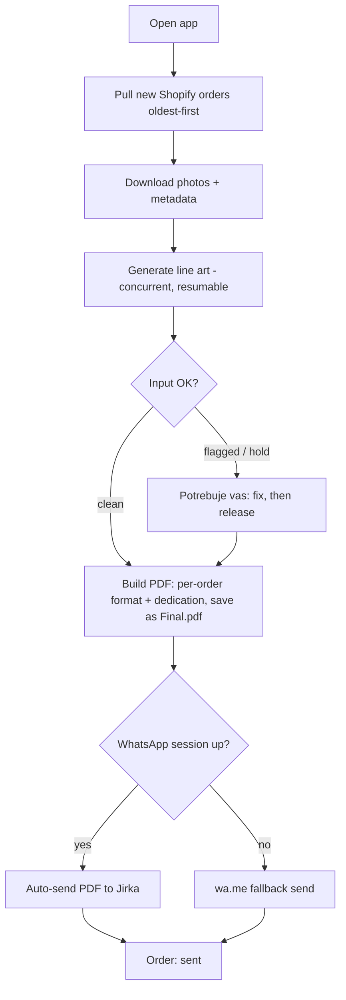
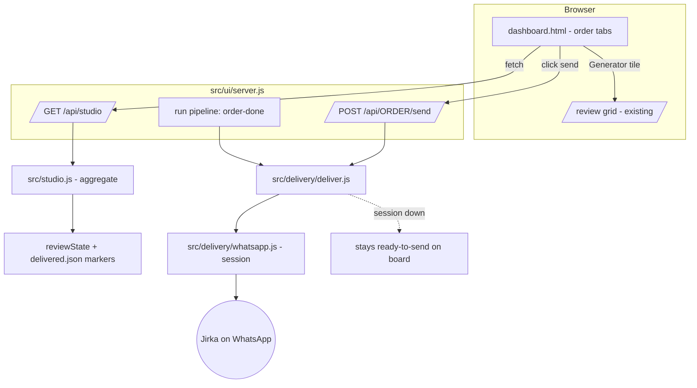

# Unified Studio Dashboard - Plan

## Goal Capsule

- **Objective:** One internal, Fotomalovánky-only web app that collapses the operator's 14-step manual order routine into a single cockpit. New Shopify orders pull in oldest-first and generation runs; clean orders build in their own galerie/full-page format with the dedication and ship to Jirka on WhatsApp automatically, while only flagged orders wait for the operator to review and release. The same screen shows the live state of every order, replacing the hardcoded numbers in today's `dashboard.html` mockup.
- **Product authority:** This plan → existing repo conventions (the order-automation master plan and the intake-gate plan under `docs/plans/`) → operator preference. A scope or approach change is escalated, not guessed.
- **Open blockers:** v1 intake is unblocked — it keeps the existing Chrome-extension bridge, so nothing waits on an external party. Two later gates, neither blocking v1: the Shopify Admin API migration waits on Lukas delivering the API key; the auto-WhatsApp handoff needs Jirka's number and a one-time session login. Neither blocks writing or planning.
- **Stop conditions (escalate, don't guess):** If a real order's `objednavka.json` does not carry the galerie/full-page format and it isn't derivable from the purchased product/variant, keep delivery on the config-default format with an operator override — do not block the pipeline on it. If the unofficial WhatsApp session proves unusable in practice, ship the one-click fallback as the primary handoff rather than expanding scope to the official API.
- **Execution profile:** Same as the tool today — single operator, local, on-demand, human-scale volume, Node/Playwright stack.

---

## Product Contract

### Summary

A local web dashboard that turns the operator from the integration layer between five tools into a reviewer. v1 delivers the order cockpit — pull → generate → build → auto-WhatsApp clean orders to Jirka, with flagged orders held for review — plus a live status board over the real order data. Marketing, gallery, and analytics tabs are deferred to later versions.

---

### Problem Frame

Today the operator *is* the pipeline. A single order takes 14 manual steps spread across five tools: pick the oldest unstarted order in Shopify and hit *Start Node* in the Chrome extension; drag the downloaded photos into the generator; open the generator two or three more times in parallel because there is no queue; hop back to Shopify to re-read the format and dedication that the extension already captured; feed the builder; check the toggleable cover zoom; save the PDF as `<order> final`; and WhatsApp it to Jirka, who prints at home and ships.

The cost is not any single hard step — nothing here is hard. It is the tool-hopping, the absent queue, and the re-reading of data the system already had. The operator's attention is spent gluing tools together instead of on the problem orders that actually need his judgment.

---

### Key Decisions

- **Internal-only, hardcoded to Fotomalovánky.** No accounts, no tenancy, no per-shop config. Formats, Jirka, the store, and the brand are baked in. Chosen for speed; multi-shop was explicitly rejected.
- **Local, pull-on-open — no always-on server.** The operator works in irregular bursts, so the app pulls everything outstanding when it opens rather than watching Shopify with webhooks. Removes hosting and keeps the local-first shape the tool already has (127.0.0.1 review gate, file-drop).
- **Keep the Chrome-extension bridge for v1; migrate to the Shopify Admin API later.** The API key is pending (Lukas), so v1 consumes what the extension already captures — dedication (*věnování*), format, and expected count in `objednavka.json` — which is enough to stop the operator re-reading Shopify. Intake is designed as a swappable source so the later API migration replaces only how orders enter, not the pipeline after. Until then the per-order *Start Node* click stays manual.
- **Fully-auto WhatsApp to Jirka, with a graceful fallback.** A persistent unofficial WhatsApp Web session sends the PDF with zero taps on the happy path. Its fragility is accepted; when the session breaks, the app degrades to a one-click prefilled send rather than failing silently.
- **The operator's touch is problem orders, not every order.** Clean orders generate, build, and ship to Jirka automatically; only flagged or held orders wait for the operator to review and fix. Cover selection is the builder's automatic default in v1 — manual cover framing is deferred.
- **Make the existing shell real, don't rebuild.** `dashboard.html` already draws the five tabs (Kreativy, Angly, Kalendář, Objednávky, *Potřebuje vás*) over a home page. v1 wires the order tabs to live data; the rest stay as-is until their versions land.

---

### Actors

- A1. Operator (David) — runs the cockpit; reviews and releases flagged orders.
- A2. Shopify — source of orders, dedication, format, expected photo count, customer photos.
- A3. Generator / RunPod API — turns customer photos into coloring-book line art.
- A4. Jirka — printer and fulfiller; the WhatsApp recipient of the final PDF.
- A5. Customer — uploads the photos; receives the drafted Czech email on a problem order.

---

### Key Flows

- F1. Happy-path order
  - **Trigger:** Operator opens the app; unstarted orders exist in Shopify.
  - **Steps:** App pulls new orders oldest-first with their metadata → downloads photos → generation runs (multiple orders concurrent, resumable) → a clean order builds automatically in its own format with the dedication page, saved as `<order> Final.pdf`, and auto-sends to Jirka on WhatsApp with an order/format/dedication line → a flagged order waits for the operator to fix and release, then sends → order moves to *sent* on the board.
  - **Covered by:** R1–R11.
- F2. Problem order (needs-you)
  - **Trigger:** Input QC holds an order (too few photos, unusable image).
  - **Steps:** Order surfaces under *Potřebuje vás* with the pre-drafted Czech email ready → operator sends → order waits for the customer's reply → hold lifts automatically when photos are corrected.
  - **Covered by:** R12.
- F3. WhatsApp session unavailable
  - **Trigger:** The unofficial session is logged out or broken at send time.
  - **Steps:** App stages the PDF and prefilled message and surfaces a one-click send to Jirka instead of erroring; the order stays *ready-to-send*, not lost.
  - **Covered by:** R10.

---

### Requirements

**Order queue & intake**
- R1. The app auto-enqueues each order the extension delivers into the orders folder, oldest-first, so the operator never hand-manages the queue. The per-order *Start Node* fetch stays manual until the Admin API migration, which replaces only how orders enter — not the pipeline after.
- R2. Each order carries its dedication (*věnování*), format (galerie / full-page), expected photo count, and customer photos as structured data captured once — the operator never re-reads Shopify for them.
- R3. Photos download automatically into that order's Objednávka folder using the existing per-order naming.

**Generation**
- R4. Generation runs per order through one internal queue that processes several orders concurrently — replacing the "open the generator two or three times" workaround.
- R5. Generation is resumable after a failure and reports per-order progress on the board.

**Review & approval**
- R6. A review gate shows the generated line art; the operator approves, rejects, or redoes photos on flagged orders.
- R7. v1 uses the builder's automatic cover (the first-N photos by the global `coverCount`); manual cover selection and zoom are deferred.

**PDF build**
- R8. On approval, the app builds the PDF in the order's format with the dedication title page, EXIF-orientation correct, saved to the order's outbox folder as `<order> Final.pdf` (the tool's existing output name).

**Jirka handoff**
- R9. The final PDF sends to Jirka on WhatsApp automatically, with a message line stating the order number, format, and dedication.
- R10. When the WhatsApp session is unavailable, the app degrades to a one-click prefilled send from a separate path — a `wa.me` click-to-chat opened from the operator's own WhatsApp, so a ban of the automation number can't disable the fallback too — staging the PDF and message; it never fails silently.

**Live status board**
- R11. The dashboard shows live order state — queued, generating, needs-you, ready-to-send, sent — oldest-first, replacing the hardcoded numbers in `dashboard.html`.
- R12. Orders held by input QC surface under *Potřebuje vás* with their pre-drafted Czech email ready to send.

**Local & credentials**
- R13. The app runs locally on the operator's machine; nothing requires an always-on server or a public endpoint.
- R14. Live Shopify, WhatsApp, and generator credentials stay untracked and gitignored, never committed — including through the repo consolidation.

---

### Acceptance Examples

- AE1. Format and dedication carry through.
  - **Covers R2, R8, R9.** **Given** a galerie order with dedication "Pro babičku", **when** it is built and handed off, **then** the PDF is galerie format with "Pro babičku" on the dedication page and the WhatsApp line to Jirka reads the order number, "galerie", and "Pro babičku" — with no return trip to Shopify.
- AE2. Concurrent generation without the tab hack.
  - **Covers R4.** **Given** five unstarted orders, **when** the operator starts a burst, **then** the queue generates several at once and the operator opens the generator zero extra times.
- AE3. WhatsApp fallback.
  - **Covers R10.** **Given** the WhatsApp session is logged out, **when** a clean or released order is ready to send, **then** the app presents a one-click `wa.me` send from the operator's own WhatsApp and the order stays ready-to-send rather than erroring.
- AE4. Problem order holds and lifts on its own.
  - **Covers R12.** **Given** an order with too few photos, **when** it is pulled, **then** it appears under *Potřebuje vás* with a drafted email and no generation runs; **when** the customer's replacement photo arrives, **then** the hold lifts without a manual flag.

---

### Scope Boundaries

**Deferred for later (not v1)**
- Marketing calendar with the next holiday/target 2–3 weeks ahead and the creative shown beside each entry.
- A finished-products gallery.
- PostHog analytics wiring (keys are staged in the marketing `.env`, unread by any code).
- Surfacing the existing Meta Ads / PNO factory inside the dashboard.
- Migrating order intake from the Chrome extension to the Shopify Admin API (gated on the pending API key from Lukas).

**Outside this product's identity**
- Multi-shop / multi-tenant, accounts, auth, or reselling to other businesses. Settled as internal-only.

**Manual on purpose**
- Approving the line art and framing the cover stay operator decisions.

---

### Dependencies / Assumptions

- **Chrome extension (v1 intake bridge)** — the current per-order scrape that drops photos + `objednavka.json`; v1 builds on it.
- **Shopify Admin API key (deferred)** — pending from Lukas; gates the later migration off the extension, not v1.
- **WhatsApp session** — a persistent unofficial web session authorized to message Jirka; its fragility is an accepted risk mitigated by the R10 fallback.
- **Generator RunPod API** reachable via the existing driver.
- **Volume is human-scale** — dozens per burst, not thousands — so per-order human approval stays feasible at the Christmas peak. Assumption; revisit if the peak is larger.
- **Repo consolidation (done).** `Marketing Automatization/` is now a plain folder in this repo — the nested `.git` was removed (all 3 commits saved to `../marketing-automatization-history.bundle` beside the repo) and the 38 MB duplicate generator deleted. The copy's one non-redundant change — `src/ui/server.js` serving `dashboard.html` as home and moving the review grid to `/review` — is preserved at `docs/spikes/dashboard-serving-server.patch`. The folder's own `.gitignore` keeps `.env`, the customer-PII order CSV, `data/`, `reports/`, and the ~4 GB `Extra files/` untracked (verified via `git check-ignore`). When that server change is ported, the layout must settle where `dashboard.html` canonically lives — the patch assumes it sits at the repo root, but it currently lives at `Marketing Automatization/dashboard.html`.

---

### Outstanding Questions

**Resolve before building Phase 2**
- **WhatsApp session-viability spike (gating task).** Before U4–U7, keep one QR login alive across the app's real open/close cadence for several days and measure how often it logs out. If it churns badly, ship fallback-primary (the operator releases each order, no auto-send) and revisit auto-send later — the pull-on-open model gives the session repeated offline gaps.

_Decided during review, now reflected above:_ auto-send clean orders / hold flagged (KTD7); no manual cover framing in v1 (R7); capture per-order format (U9); serve the shell from `static/`, not the marketing folder (KTD2); the fallback sends from the operator's own WhatsApp via `wa.me` (R10).

**Deferred to planning**
- Whether generation "auto-starts" when an order folder drops or is a single per-burst trigger.
- Send pacing/throttle values for peak bursts, to stay under WhatsApp's anti-automation thresholds.

**Deferred to a later phase (post-v1)**
- Migrating intake from the extension to the Shopify Admin API once Lukas delivers the key, including whether the extension is then retired or kept as a photo/edge-case fallback.

---

### Sources / Research

- Existing six-tab shell and hardcoded order/creative data to make live: `Marketing Automatization/dashboard.html`.
- Generator, resumable RunPod driver, review gate, and Playwright PDF build already in place: `src/` (e.g. `src/generator/apiDriver.js`) and the master plan `docs/plans/2026-07-08-001-feat-fotomalovanky-order-automation-plan.md`.
- Input QC hold and problem-order Czech email drafts (feeds *Potřebuje vás*): `docs/plans/2026-07-11-001-feat-order-intake-gate-plan.md`.
- Current Shopify bridge (admin-page scrape) and dedication capture that the API pull would replace: `Shopify chrome extention/`.
- Deferred marketing capabilities: `Marketing Automatization/factory/` (Meta Ads / PNO) and `Marketing Automatization/content-studio/`.

---

## Planning Contract

**Product Contract preservation:** unchanged — planning added HOW without altering any R/A/F/AE. The plan-time refinement that v1 keeps the Chrome-extension intake bridge was already settled in the Product Contract above.

### Key Technical Decisions

- KTD1. Extend the existing review server; do not build a new app. The cockpit is `createReviewServer` in `src/ui/server.js` grown to serve the studio shell and a live board. It reuses the run pipeline (`runPipeline` in `src/orchestrator.js`), `reviewState` (`src/review.js`), and the existing review/approve routes untouched. A second app would fork the pipeline and the state model.
- KTD2. Copy `dashboard.html` and the specific asset files it loads into the tool's own `src/ui/static/`, and serve it there like the existing grid: `/` serves the dashboard, the review grid moves to `/review`. This keeps the served tree out of the secrets-laden `Marketing Automatization/` folder entirely, so no asset whitelist or path-traversal guard is needed (the preserved patch's `/`+`/review` routing is reused; its scoped-asset route is dropped). One-way copy — the marketing `dashboard.html` stays the design source.
- KTD3. WhatsApp via `whatsapp-web.js` with a single long-lived client owned by the server process, using LocalAuth for session persistence so the QR login happens once. Accept the heavyweight dependency and the unofficial-API fragility; gate every send on a session health check and degrade per KTD5. Inject the client like the existing `driver`/`builder` seams so tests use a fake.
- KTD4. Delivery is idempotent via a durable per-order marker. A `delivered.json` written into the order's outbox folder records that Jirka received it (timestamp, format, dedication sent). Auto-send fires on the orchestrator's `order-done` event when `status` is `DONE` and a `pdfPath` exists; an order with a marker is never re-sent, so reopening the app or re-running is safe.
- KTD5. A derived order-level delivery state for the board, separate from the photo-level `handoff`. The board computes `ready-to-send` (built, no marker) versus `sent` (marker present); the existing `handoff` term (photo manual-repair, `src/review.js`) is left alone.
- KTD6. Only the order tabs go live. *Objednávky* and *Potřebuje vás* fetch the new status API; Kreativy / Angly / Kalendář keep their hardcoded literals until their deferred versions land.
- KTD7. QC-clean orders auto-send to Jirka on build completion (`order-done`, status DONE, `pdfPath`); flagged or held orders wait in *Potřebuje vás* for the operator to review, fix, and release, then send. This matches `runPipeline`, which already holds only flagged orders — the operator's remaining touch is problem orders, not every order, and not the cover. Read the `order-done` event's `pdfPath` (the run report reduces it to a boolean).

### High-Level Technical Design

Order-level delivery status is derived on read, never stored as a mutable field: `queued` (in inbox, no run), `generating` (run active), `held` (intake hold, shown under *Potřebuje vás*), `pending-review` (generated, awaiting approval), `ready-to-send` (PDF built, no `delivered.json`), `sent` (marker present), `failed`.

### Assumptions

- Per-order format (U9) derives from the purchased product/variant captured in `objednavka.json` — the same source the expected photo count uses. If the variant isn't captured there, U9 needs a small extension change; if it doesn't map, the build falls back to the config default and flags the order for override — it never guesses silently.
- The WhatsApp session survives the pull-on-open cadence well enough for auto-send to be the common path — validated by the pre-Phase-2 spike; if not, fallback-primary ships instead.
- Jirka is one fixed WhatsApp recipient; his number/id lives in the gitignored `config.json`.
- Volume stays human-scale, so a single serial WhatsApp sender keeps up.

### Sequencing

Two phases. Phase 1 (U1–U3, U9, and U8's read path) stands up the live board and correct per-order builds with no delivery — immediate value, independently shippable. Before Phase 2, run the session-viability spike (Open Questions). Phase 2 (U4–U7, and U8's send button) adds the WhatsApp handoff.

---

## Implementation Units

### U1. Studio and delivery config

- **Goal:** add the config keys the rest of v1 reads.
- **Requirements:** R2, R9, R13, R14.
- **Dependencies:** none.
- **Files:** `src/config.js`, `config.example.json`, `test/config.test.js`.
- **Approach:** add a `whatsapp` block (`enabled`, `recipient`, `sessionDir`), a `delivery.format` default, and a product/variant → format map (for U9). The `delivery.format` default is the internal builder mode (`gallery`, mirroring the existing `config.pdf.mode`) — the Czech display label "galerie" is a caption concern (U5), not a config value. `whatsapp.sessionDir` **defaults to a path outside the repo tree** (OS per-user data dir), because the LocalAuth store is a full-account bearer credential: add `.gitignore` entries for `.wwebjs_auth/` and the resolved `sessionDir` so it can never be committed. Live values stay in the gitignored `config.json`, documented in `config.example.json`.
- **Test scenarios:** defaults resolve when keys are absent (`delivery.format` → `gallery`); the resolved `whatsapp.sessionDir` is outside the repo and git-ignored; `whatsapp.enabled=false` yields a disabled sender; `whatsapp.enabled=true` with no `recipient` is a clear config error naming the missing key.
- **Verification:** `npm test`; `config.example.json` documents every new key.

### U2. Serve the studio shell; review grid at /review

- **Goal:** the dashboard becomes the home page, served from the tool's own `static/`; the review grid moves to `/review`.
- **Requirements:** R11; preserves R6.
- **Dependencies:** U1.
- **Files:** `src/ui/server.js`, `src/ui/static/dashboard.html` (copied in) plus the asset files it references, `tools/gridSmoke.mjs`.
- **Approach:** copy `Marketing Automatization/dashboard.html` and the specific asset files it loads into `src/ui/static/`; serve it at `/` and move the review grid to `/review`. Reuse the preserved patch's `/`+`/review` routing; drop its scoped-asset route — nothing outside `static/` is served, so no traversal guard is needed.
- **Test scenarios:** `GET /` serves the dashboard; `GET /review` serves the grid; a dashboard asset under `static/` is served; a request for a path outside `static/` returns 404; existing `/api/state` and review routes are unaffected.
- **Verification:** grid smoke passes; manual — home shows the dashboard, `/review` shows the grid.

### U3. Live status API and aggregation

- **Goal:** one endpoint returns the live order board.
- **Requirements:** R11, R12; advances R1.
- **Dependencies:** U1.
- **Files:** `src/studio.js` (new), `src/ui/server.js`, `test/studio.test.js` (new).
- **Approach:** `src/studio.js` aggregates `reviewState` (inbox + outbox) plus `delivered.json` markers into a board model — per-order derived status (per HTD), oldest-first, plus KPI counts and the *Potřebuje vás* list (held orders with their draft email). Add `GET /api/studio`. Keep aggregation a pure function over injected state for testability. Note two inputs `reviewState` does not expose today: stat the built `<order> Final.pdf` (export a `pdfPathFor` helper) to tell `ready-to-send`/`sent` from `pending-review`, and inject the server's live run state (active + currently-generating orderId) to tell `generating` from `queued` — both otherwise show all-null photo statuses.
- **Test scenarios:** orders sort oldest-first; a held order appears in needs-you with its draft email; a built order with no marker is `ready-to-send`, with a marker is `sent`; KPI counts match the set; an empty inbox returns an empty board, not an error.
- **Verification:** `npm test`; manual — `/api/studio` reflects a real inbox.

### U4. WhatsApp transport

- **Goal:** a session-managed sender that can push a PDF plus caption to Jirka.
- **Requirements:** R9.
- **Dependencies:** U1.
- **Files:** `src/delivery/whatsapp.js` (new), `package.json` (add `whatsapp-web.js`), `test/whatsapp.test.js` (new).
- **Approach:** wrap a single `whatsapp-web.js` client with LocalAuth at `config.whatsapp.sessionDir`; expose `ready()` (health), `sendDocument(recipient, filePath, caption)`, and a one-time QR-login surface that logs only the ephemeral QR to the operator window (never the auth payload). Initialise the client **only after the HTTP port bind succeeds**, and single-instance-guard the `sessionDir`, so a double-launch can't wedge or corrupt the LocalAuth Chromium profile (the server today guards duplicates only at port bind). Inject the client so tests use a fake; a send never throws into the run.
- **Execution note:** unit-test the wrapper against a fake client; prove the real client with a one-time login + runtime smoke, not unit coverage.
- **Test scenarios:** `ready()` is false before login (callers must fall back); `sendDocument` calls the client with recipient/file/caption and resolves a result; a client that throws resolves to a failure result, not an exception; `sessionDir` comes from config.
- **Verification:** unit tests with a fake client; manual — one-time QR login, then a test PDF arrives in Jirka's chat.

### U5. Delivery orchestration — message, marker, fallback

- **Goal:** decide and record what gets sent to Jirka, idempotently.
- **Requirements:** R9, R10.
- **Dependencies:** U4.
- **Files:** `src/delivery/deliver.js` (new), `test/deliver.test.js` (new).
- **Approach:** format the Jirka caption (order number, the Czech display label for the built mode — "galerie"/"celostránkové" — and dedication) from order info; skip when a `delivered.json` marker exists; call U4's transport when `ready()` and write the marker durably (atomic rename) after a confirmed send; when not ready, return a `staged` outcome and write no marker. The send and the marker write cannot be atomic together: if the app closes between a successful send and the marker write, the order re-derives to `ready-to-send` and could be sent twice — acceptable at human scale, but the send-then-write ordering must be explicit.
- **Test scenarios:** `Covers AE1.` caption states order/format/dedication with no Shopify re-read; a marker present → skipped (idempotent); `Covers AE3.` transport down → `staged`, no marker, order stays `ready-to-send`; transport success → marker written with timestamp/format/dedication; a missing format falls back to the config default and still appears in the caption.
- **Verification:** `npm test`.

### U6. Auto-send on build completion

- **Goal:** built orders hand off to Jirka automatically.
- **Requirements:** R9.
- **Dependencies:** U5.
- **Files:** `src/ui/server.js`, `test/uiServer.test.js`.
- **Approach:** on the run's `order-done` event, for each order with `status DONE` and a `pdfPath`, call U5's deliver — clean orders send with no click. A `HELD` order does not send; it waits in *Potřebuje vás* until the operator fixes and releases it (U7), which then delivers. Read the event's `pdfPath` (the run report reduces it to a boolean). Serial; surface each outcome (sent / staged) on the board.
- **Test scenarios:** `Covers AE1.` a clean order finishing `DONE` triggers exactly one deliver call with its PDF; a `HELD` or `FAILED` order triggers none; a previously-flagged order delivers on release; a deliver failure is logged and leaves the order `ready-to-send` without crashing; an already-sent order (marker) is not re-sent.
- **Verification:** server test with a fake deliver; manual — approve → build → auto-send.

### U7. Manual and fallback send endpoint

- **Goal:** the release-and-send action for flagged orders, and the fallback send when auto delivery is down.
- **Requirements:** R10.
- **Dependencies:** U5.
- **Files:** `src/ui/server.js`, `test/uiServer.test.js`.
- **Approach:** `POST /api/<order>/send` invokes U5's deliver for that order — used by the operator to release a fixed flagged order, and as the fallback when the session is down. Returns the outcome (sent / staged / already-sent); a `staged` outcome hands back the `wa.me` link for the operator's own WhatsApp. Consistent with the existing `/api/<order>/...` routes.
- **Test scenarios:** `Covers AE3.` sends a ready-to-send order, or returns `staged` with the `wa.me` link when transport is down; returns `already-sent` for an order with a marker; an unknown order returns 409.
- **Verification:** server test; manual — click send on a ready order.

### U8. Dashboard front-end live wiring

- **Goal:** the order tabs show live data and can send to Jirka.
- **Requirements:** R11, R12.
- **Dependencies:** U2, U3, U7.
- **Files:** `Marketing Automatization/dashboard.html`, `tools/studioSmoke.mjs` (new).
- **Approach:** replace the hardcoded `ORDERS` literal (Objednávky) and the *Potřebuje vás* list with `fetch('/api/studio')`; render the queue oldest-first with status badges, KPI counts, and ready/sent state; make the "Generátor" tile link to `/review`; surface held orders with their draft email and a copy action; add a per-order send button hitting `POST /api/<order>/send`. Leave Kreativy / Angly / Kalendář literals untouched.
- **Execution note:** mostly front-end wiring; prove it with a runtime smoke against a fake-backed server, mirroring `tools/gridSmoke.mjs`.
- **Test scenarios:** the board renders queued orders oldest-first from `/api/studio` with no static data; `Covers AE4.` a held order appears under *Potřebuje vás* with its draft email; the send button POSTs to `/api/<order>/send` and reflects the returned state; the marketing tabs still render their static content. (AE2 — concurrent generation without the tab hack — is a property of the reused `runPipeline` per KTD1, verified by the existing `queue-smoke`, not by U8.)
- **Verification:** `npm run studio-smoke`; manual — open home, board reflects a real inbox oldest-first, held order shows its email, send button delivers or stages.

### U9. Per-order build format

- **Goal:** each order builds in its own galerie/full-page format, with no config edits between orders (formats mix within a burst).
- **Requirements:** R2, R8.
- **Dependencies:** U1.
- **Files:** `src/orderInfo.js`, `src/orchestrator.js` (buildOrder options), `test/orderInfo.test.js`.
- **Approach:** derive the format from the purchased product/variant — the same order data the intake gate already uses for the expected photo count — via the U1 variant→format map, and pass it into `buildOrder`'s builder `options.mode`. Fall back to `config.delivery.format` and flag the order for override when the variant doesn't map. The U5 caption echoes the *built* mode.
- **Execution note:** first confirm whether `objednavka.json` already carries the product/variant (it should — expected-count derives from it per the intake-gate plan). If not, this unit also needs a small Chrome-extension change to capture it, coordinated with whoever maintains the extension.
- **Test scenarios:** a variant mapping to full-page builds full-page and captions full-page; an unmapped variant falls back to the config default and is flagged for override; a galerie order and a full-page order in one burst each build correctly with no config change.
- **Verification:** `npm test`; manual — a mixed-format burst builds each order in its right format.

---

## Verification Contract

- **Unit tests** — `npm test` (`node --test`) green, including new `test/studio.test.js`, `test/deliver.test.js`, `test/whatsapp.test.js`, and additions to `test/uiServer.test.js` and `test/config.test.js`.
- **Smoke** — `npm run smoke` (grid, queue, editor, dedication) stays green; add `npm run studio-smoke` (`tools/studioSmoke.mjs`) driving the live board against a fake-backed server, and wire it into the `smoke` script.
- **Served-tree check** — the dashboard is served from `src/ui/static/`; a request for any path outside `static/` returns 404, so no secret, source, or order file is reachable.
- **Manual acceptance (one pass on a real order)** — extension drops an order → home board shows it oldest-first in the right state → a clean order builds as `<order> Final.pdf` in its captured format and auto-sends to Jirka with the order/format/dedication caption; a flagged order waits in *Potřebuje vás* until fixed and released. With the session logged out, the order shows `ready-to-send` and the send button stages a one-click `wa.me` send.
- **No regression** — existing review/approve/redo/build flows and their tests are unchanged.

---

## Definition of Done

**Global**

- Home serves the live studio dashboard; `/review` serves the existing grid with unchanged behavior.
- *Objednávky* and *Potřebuje vás* render live data oldest-first; the marketing tabs are untouched.
- Clean orders auto-send to Jirka with the correct order/format/dedication caption; flagged orders send on release — idempotent via `delivered.json`.
- Each order builds in its own galerie/full-page format with no config edits mid-burst.
- A logged-out session degrades to a one-click `wa.me` send from the operator's own WhatsApp; no silent failure.
- The served tree (`static/`) holds no secrets, source, or order data — the shell is copied out of the marketing folder.
- `npm test` and `npm run smoke` (including `studio-smoke`) are green; existing flows are unregressed.
- `whatsapp-web.js` — and its bundled Puppeteer/Chromium, a second resident browser runtime alongside Playwright — is the only new npm dependency; abandoned or experimental code is removed from the diff.

**Per unit**

| Unit | Done signal |
|---|---|
| U1 | New config keys resolve with defaults and are documented in `config.example.json`. |
| U2 | Home serves the dashboard from `static/`, `/review` serves the grid; nothing outside `static/` is served. |
| U3 | `GET /api/studio` returns the oldest-first board with correct derived statuses and counts. |
| U4 | The wrapper sends a document via an injected client and reports session health without throwing. |
| U5 | Delivery formats the caption, writes/reads `delivered.json`, and returns sent/staged/skipped correctly. |
| U6 | A built order auto-sends once; held/failed orders don't; failures leave it `ready-to-send`. |
| U7 | `POST /api/<order>/send` sends, stages, or reports already-sent per state. |
| U8 | The order tabs render live data and the send button works against a running server. |
| U9 | Each order builds in its captured format; unmapped variants fall back and are flagged for override. |
