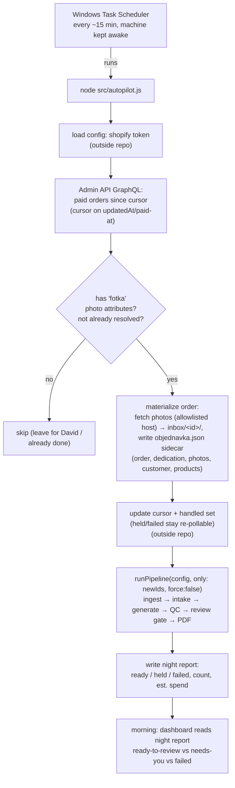

# feat: Overnight Autopilot

## Goal Capsule

A paid Shopify order that arrives while David is asleep is **detected, pulled into the inbox, generated, and built into a finished `<order> Final.pdf`** — all unattended — so that in the morning the only work left is the two human judgment steps (approve the line-art, frame the cover) and the manual send to Jirka. Autopilot stages everything **up to review**. It never sends.

This is a new **trigger** in front of the existing pipeline, not a new pipeline. `runPipeline` (ingest → intake gate → generate → QC → review gate → PDF build) already carries every guardrail; autopilot's whole job is to feed it new orders on a schedule and report what happened by morning. The worst case David can wake up to is *"a few orders are waiting for my review"* — never bad output sent anywhere.

**Layered on:** the shipped Unified Studio Dashboard (see related `...-002...`). It evolves one decision from that work — "pull orders on open (no always-on server)" — into "poll on a schedule so orders arrive overnight." Everything else in the dashboard/pipeline is reused unchanged.

---

## Product Contract

### Requirements

- **R1 — Unattended detection.** Detect new **paid** Shopify orders that carry customer photos, with no logged-in browser and no human present, via the Shopify Admin API.
- **R2 — Inbox materialization.** Materialize each detected order into the inbox in the exact shape the existing pipeline expects: photo files named so `ingest.js` recovers the order id, plus an `objednavka.json` sidecar carrying the accented dedication.
- **R3 — Full staging.** Run each new order through the existing pipeline to a finished PDF, staged for review — generation and PDF build happen overnight, not in the morning.
- **R4 — Guardrails preserved unattended.** The intake gate still holds problem orders and drafts the Czech email; QC still flags bad line-art; the review gate still blocks unapproved photos from the PDF; and **nothing is ever auto-sent**.
- **R5 — Scheduled + survives the night.** Runs on David's Windows machine on a ~15-minute schedule and keeps running overnight; the machine's sleep/wake requirement is documented so the task actually fires.
- **R6 — Idempotent.** An order already handled is never re-pulled or re-processed on a later poll; the poll cursor and handled-order set persist across runs, outside the repo.
- **R7 — Secret + PII safety.** The Shopify token is a full-store credential stored outside the repo / gitignored, same posture as the generator token; no token, `.env`, `config.json`, order CSV, night report, or customer PII is ever committable.
- **R8 — Morning summary.** A morning summary shows which orders are ready for review, which are held (with their drafted emails), which failed, plus the overnight order count, an estimated RunPod spend, and the last-run time — surfaced on the dashboard.
- **R9 — Manual fallback intact.** The manual "open the tool + press Go" flow keeps working exactly as today, as the fallback whenever the API or scheduler path stalls.
- **R10 — Photo-bearing orders only.** Autopilot only touches orders that carry customer photos; orders for other products (t-shirts, gift cards) are left untouched for David to handle.

### Scope Boundaries

**In scope:** the API poller, order → inbox materializer, handled-order state, the unattended runner that drives the existing `runPipeline`, the morning summary surface, and the Windows scheduling + sleep/wake documentation.

#### Deferred for later
- **Auto-send to Jirka.** The WhatsApp handoff (auto + one-click fallback) stays Phase 2, gated on the session-viability spike. Autopilot deliberately stops at "ready for review."
- **Cloud / always-on VM.** Out of scope; the always-on machine is David's Windows box (or a future dedicated laptop).
- **Nightly spend cap.** David chose *no cap* — every detected paid photo order runs. No `maxOrdersPerRun` field, enforcement, or test is in this plan. If a runaway night ever proves it's needed, a count/spend cap is a one-unit follow-up; the morning summary's spend line is the trigger to reconsider.

#### Outside this product's identity
- **The two human judgment steps stay manual by design.** Autopilot never approves line-art and never frames a cover.
- **No migration off the Chrome extension for interactive daytime use.** The extension remains a valid manual path; autopilot is an addition, not a replacement.

---

## Planning Contract

### Key Technical Decisions

- **KTD1 — Read photos + dedication + format from line-item custom attributes via the Admin API. [CONFIRMED by U0 against live orders, 2026-07-11.]** The data is fully API-reachable under `read_orders`; the browser was only ever a delivery mechanism. The **public** Admin API returns `lineItem.customAttributes` as `{key,value}` only — **there is no `type` field** (`injected.js`'s `type:"URL"` is admin-internal-only). Extraction matches on **key substring**, never on `type`. The real keys, confirmed against the store:
  - **Photos:** `Fotka (N)-M` — N = total photo count, M = 1-based index (e.g. `Fotka (4)-1 … Fotka (4)-4`). Match `/fotka/i` **and** value is an `https://` URL; order by the trailing `-M`.
  - **Dedication:** `Věnování` (capital V, diacritics). Match `/v[ěe]nov/i`.
  - **Format/layout:** `Rozvržení`. **This is the only signal for galerie-vs-full-page — it is NOT in the variant** (see the format caveat in KTD9). Values: `🖼️ Galerie (vaše fotka vedle omalovánky)` → gallery, `📄 Celostránková omalovánka (plná stránka pro vybarvování)` → full-page.
  - **Skip** any `_`-prefixed key (`_tpo_add_by`, …) — hidden Tigren internals.

  Advances R1, R2, R10.
- **KTD2 — Reuse `runPipeline` unchanged; autopilot is a new trigger.** All guardrails (intake hold + email draft, QC, review gate, resumability) already live in `src/orchestrator.js`. Autopilot materializes orders into the inbox and calls `runPipeline({ force: false })` over the newly ingested ids — it adds no generation or build logic of its own. Advances R3, R4, R9.
- **KTD3 — Windows Task Scheduler, not a long-lived Node daemon.** A scheduled task that runs `node src/autopilot.js` every ~15 min is the simplest robust unattended trigger on Windows: it survives crashes, needs no supervision, and leaks no long-lived process. A 1am order picked up at 1:15 is well within "ready by morning." Advances R5.
- **KTD4 — Persist cursor + handled set outside the repo, keyed on payment time not creation time.** The cursor and handled-order set live in the OS per-user data dir (the `defaultSessionDir()` family used for the WhatsApp session store), so a 15-min poll never re-pulls and no state or PII is committable. **Cursor on `updatedAt`/`processedAt` (or a paid-at field), never `createdAt`:** an order created before the cursor but paid *after* it (delayed capture, bank transfer, `pending → paid`) would be missed forever by a `createdAt`-bounded query — a silent, permanent miss. A sliding recent-window query with the handled-set for dedup is an acceptable alternative. **Held/failed orders stay re-pollable** (excluded from the *permanent* handled set until they reach a terminal ready/sent state or age out) so a customer's re-upload lets the intake hold self-lift overnight — see KTD8. Advances R1, R6, R7.
- **KTD5 — "No auto-send" holds by construction.** Autopilot calls `runPipeline` with `force: false` and no delivery step; the send path simply does not exist in this scope. The invariant is structural, not a flag that could be flipped by accident. Advances R4.
- **KTD6 — Server-side photo fetchability. [CONFIRMED reachable by U0, 2026-07-11 — fallback ladder not needed.]** The photos live on **`cdn.tigren.com`** (the upload app is **Tigren "Product Options"**, `_tpo_*` — *not* Easify; the Easify collaborator request was a red herring). A **cookieless Node `fetch`** of a real `Fotka` URL returned `200 / image/jpeg / 457 KB`, verified as genuine JPEG bytes (`FFD8FF…`). So rung (a) — plain unattended fetch — applies; the token-auth and app-API rungs are **not** needed. Because the CDN is public, **the token must NEVER be sent to `cdn.tigren.com`** (it is not a Shopify host); the SSRF guard's "token only to the canonical Shopify host" rule (U3) means the fetch carries no auth at all, which is exactly right. The "needs manual download" rung remains the documented degradation if the CDN ever starts refusing a URL, but it is not the expected path.
- **KTD7 — Token acquisition. [DONE, 2026-07-11.]** A `read_orders` offline token (`shpat_…`) was captured via the Shopify CLI (app reconfigured `embedded=false`, `use_legacy_install_flow=true`, `scopes="read_orders"`) + a classic-OAuth catcher. It lives at `C:/Users/David/Desktop/shopify-token-setup/shopify-token.json`, **outside the repo**. U1 wires it into gitignored config. Scope note: `read_orders` reads `order.email`, `order.name`, `lineItem.customAttributes`, and `lineItem.variantTitle` (scalar), but **not** the `customer{}` or `variant{}` connections (those need `read_customers`/`read_products`) — the pipeline needs none of the denied fields (see KTD9).
- **KTD8 — A held order must be able to self-lift unattended.** `runPipeline`'s intake gate re-derives its verdict every run, so a hold clears on its own once corrected photos are in the folder — but only if the photos are **re-pulled**. A permanent handled-set would freeze a held order forever (it's materialized once, never re-pulled), defeating the self-healing guardrail R4 advertises. So held/failed orders are re-polled (KTD4) and re-materialized from the current Shopify attributes until they resolve or age out, and the morning summary flags any order still held so David knows it won't lift until the customer re-uploads. Caveat: this only helps when the customer corrects by **re-uploading to the same Shopify order** (re-pullable); a customer who emails new photos is outside the API and needs the manual path (R9). Advances R4, R6.
- **KTD9 — Per-order format comes from the `Rozvržení` attribute, NOT the variant. [CONFIRMED by U0 — corrects an assumption in U2/U3/U9.]** The spike found that the same `variantTitle` (`🖨️ Tištěné omalovánky / 4`) ships with **both** layouts — 4-photo orders appeared 17× as galerie and 4× as full-page. So `resolveFormat` (`src/orderInfo.js`) keying `delivery.formatMap` off `products[].variant`/`.title` **cannot distinguish the two** for autopilot orders; every book would build in one format. Fix within this feature: U2 extracts the `Rozvržení` value, U3 writes it into the sidecar, and format resolution keys off it. Lowest-friction wiring that reuses the existing map: materialize a synthetic product entry whose `variant` is the `Rozvržení` string (or a normalized `gallery`/`full-page` token) so `resolveFormat` matches it via `config.delivery.formatMap` with **no change to `orderInfo.js`** — the map is then keyed by the two `Rozvržení` values. `variantTitle` (the real product/count) is still captured for the count check and the morning summary. Advances R1, R8-equivalent (correct per-order format unattended).

### High-Level Technical Design

The overnight loop, from the scheduler to the morning dashboard:

The dashed invariant across the whole diagram: **no edge leads to a send**. `runPipeline` produces `<order> Final.pdf` and stops; delivery is a separate, manual, Phase-2 concern.

### Risks & Dependencies

- **[HARD DEP] Admin API token.** Nothing runs without it (KTD7). Mitigation: the manual flow is untouched (R9); autopilot no-ops with a clear log line when the token is absent or `shopify.enabled` is false.
- **[RETIRED by U0 — photos ARE session-free] Photo URLs may need the session.** Confirmed: photos live on `cdn.tigren.com` (Tigren upload app) and a cookieless Node `fetch` returns `200 / image/jpeg` (verified JPEG bytes). Rung (a) — plain unattended fetch — applies; no auth is needed or sent. The fallback ladder is retained only as documented degradation: if the CDN ever refuses a URL, autopilot **reports the order "needs manual download"** rather than pretending the (attended) extension covers it.
- **[SECURITY] Order-supplied photo URLs → SSRF / token exfil.** The `fotka` URL comes from order/line-item data (potentially app- or customer-influenced). An unconstrained server-side fetch of that URL is SSRF (against localhost — the local dashboard server — or internal hosts), and rung (a) would leak the full-store token to any host that merely *looks* Shopify-hosted. Mitigation (a **U3 acceptance criterion**, not just a note): fetch only from an explicit **host allowlist** (https-only, exact-suffix match, resolved IP not private/loopback); send `X-Shopify-Access-Token` **only** to the exact canonical Shopify file host; reject non-image content-types; cap download size.
- **[OPS] Windows won't stay awake by itself.** A sleeping/off machine runs nothing — and on **Windows 10 Home** the machine can also force-install updates and **auto-reboot** outside active hours, killing an in-flight run. Mitigation (U6 docs): disable sleep (or wake timers); set Windows Update **active hours / pause** to avoid overnight reboots; the task runs whether-logged-in + start-when-available to catch up a missed slot; the morning summary's "last run HH:MM" makes a slept/rebooted night obvious.
- **[COST] Unattended RunPod spend.** No cap by David's choice — an abnormal night (order flood, or a regeneration bug) spends unattended. Mitigation: the night report surfaces order count + estimated spend prominently; `runPipeline`'s existing `pdfIsCurrent`/`force:false` caching means a lost state-dir re-materializes but does **not** re-generate already-built PDFs, bounding the blast radius of a state loss to re-download, not re-spend. An optional cap is deferred (see Scope Boundaries), not built.
- **[API] Rate limits / pagination.** A busy poll must page correctly and respect Shopify's cost-based GraphQL throttling. Mitigation: page by cursor, request only the fields needed, back off on THROTTLED.
- **[DATA] Order-number vs internal id.** As `tools/patchExtension.mjs` notes, the customer-facing number (`#1524`) differs from Shopify's internal id (`Order.name` is the customer-facing one). Materialize folders and sidecars by the **customer-facing name** (strip the `#`) so ids line up with the extension's output and `ingest.js`.
- **[DATA — confirmed present in U0] Payment mix may leave photo orders un-triggered.** The live sample carried both `PAID` and `PENDING` photo orders, so this is real, not hypothetical: an order can sit `PENDING` (COD *dobírka* / bank transfer *bankovní převod*) and never reach `paid` overnight. Autopilot filters to paid and **surfaces a count of non-paid photo orders seen-but-skipped** so silent misses are visible; the KTD4 cursor keys on `updatedAt` so a `pending → paid` transition re-surfaces the order.

---

## Implementation Units

> **Sequencing note:** U0 is a **go/no-go spike** that runs first, before any build unit. The whole feature rests on two unproven facts — the real shape of line-item attributes on the *public* Admin API, and whether photo URLs are fetchable cookieless — and both are cheap to check against one real order. Do not build U1–U6 until U0 confirms them (or surfaces the fallback rung to take).

### U0. Feasibility spike — confirm the API shape and photo fetchability [DONE — 2026-07-11, all-green]

**Goal:** With the acquired token, prove against real orders that (a) line-item custom attributes are reachable and carry the photo/dedication/format keys in the public API's shape, and (b) a photo URL is fetchable from a **cookieless Node process**. Confirm the store's payment methods while here.

**Requirements:** de-risks R1, R2, R10; resolved KTD1, KTD6, KTD9 before build.
**Dependencies:** the Shopify token (KTD7 — done).
**Files:** `C:/Users/David/Desktop/shopify-token-setup/spike.mjs` + `probe-format.mjs` + `probe-email.mjs` (throwaway probes, outside the repo alongside the token; not shipped).

**Findings (recorded as resolved facts — supersede the Open Questions below):**
- **customAttributes shape:** `{key, value}` — **no `type` field** (KTD1). Match by key substring only.
- **Keys:** photos `Fotka (N)-M`; dedication `Věnování`; format `Rozvržení`; skip `_`-prefixed. (Full detail in KTD1.)
- **Format is in `Rozvržení`, not the variant** — same `variantTitle` ships both layouts (KTD9). Values map galerie→gallery, celostránková→full-page.
- **Photos fetch cookieless:** host `cdn.tigren.com` (Tigren, not Easify); plain `fetch` → `200 / image/jpeg`, verified JPEG bytes. Rung (a) applies; token never sent to the CDN (KTD6).
- **Scope:** `read_orders` reads `order.email` (recipient for held-order emails ✓), `order.name`, `customAttributes`, `variantTitle` (scalar). It does **not** read `customer{}` or `variant{}` — the pipeline needs neither (surname absent → neutral greeting, already handled by `orderInfo.js`).
- **Payment mix:** recent orders are `PAID` and `PENDING`. Filter to paid; surface a seen-but-skipped count for `PENDING` photo orders (KTD4 cursor, R10). No COD/transfer confirmation was forced, but `PENDING` is present, so the seen-but-skipped guard is warranted.

**Verification:** ✅ all of the above confirmed against the live store. U2 is written to the real `{key,value}` shape and the confirmed keys; the format wiring targets `Rozvržení` (KTD9); the SSRF allowlist is `cdn.tigren.com`.

### U1. Shopify config block + secret/PII safety

**Goal:** Add a validated `shopify` config block and lock down its secret and the state/report files so nothing committable ever holds a full-store credential or PII.

**Requirements:** R7; enables R1.
**Dependencies:** U0 (build to the confirmed API shape).
**Files:**
- `src/config.js` (modify — add `shopify` validation + resolution, mirroring the `whatsapp`/`delivery` blocks already there)
- `config.example.json` (modify — document the block)
- `.gitignore` (modify — ignore the token file, the state/report dir, and any `*_export*.csv`)
- `test/config.test.js` (modify)

**Approach:** Add `shopify: { enabled, storeDomain, accessToken, apiVersion, photoKeyMatch, dedicationKeyMatch, layoutKeyMatch, estSpendPerOrder, photoHostAllowlist }`. `enabled` defaults false (autopilot off until configured). When enabled, require `storeDomain` (`aqi8it-7n.myshopify.com`) and an `accessToken`; defaults from the confirmed U0 facts: `apiVersion` = `2026-07`, `photoKeyMatch` = `fotka`, `dedicationKeyMatch` = `věnování` (matched case/diacritic-insensitively — the live key is `Věnování`), `layoutKeyMatch` = `rozvržení` (the `Rozvržení` format attribute, KTD9), `photoHostAllowlist` = `["cdn.tigren.com"]` (U3's SSRF allowlist), and `estSpendPerOrder` = the Open-Questions figure (morning summary, U4/U5). Because the confirmed photo host is a **non-Shopify CDN**, the fetch carries no token (KTD6) — the allowlist gates SSRF, and the "token only to canonical Shopify host" rule means the token is simply never sent on a photo fetch. Resolve the token from the config value **or** an env var so it can live outside the committed file; redact it in `redactForLog` (fully drop it — a bare token is not a URL, so mask it directly rather than via URL-parsing). Reuse the outside-repo path guard from `whatsapp.sessionDir` for any on-disk token path. **No `maxOrdersPerRun`** — David declined a cap; a cap is deferred (see Scope Boundaries), not a live field.

**Patterns to follow:** the `whatsapp` and `delivery` blocks in `src/config.js` (validation shape, `ConfigError` messages, `redactForLog`), and the outside-repo enforcement added for `whatsapp.sessionDir`.

**Test scenarios:**
- `shopify` absent → `enabled:false`, no error, autopilot inert.
- `enabled:true` without `storeDomain` or `accessToken` → `ConfigError` naming the missing key.
- `redactForLog` masks the access token; the raw token never appears in redacted output.
- `photoKeyMatch`/`dedicationKeyMatch`/`apiVersion`/`estSpendPerOrder`/`photoHostAllowlist` defaults applied when omitted.
- A token path resolving inside the repo tree is rejected (reuse the sessionDir guard).

**Verification:** config with a well-formed `shopify` block validates and round-trips defaults; a committable-secret shape is refused with an operator-readable message.

### U2. Shopify Admin API client + pure attribute extraction

**Goal:** A client that lists recent paid orders since a cursor and a **pure** core that extracts photo URLs and the dedication from line-item custom attributes — the same shapes `injected.js` reads.

**Requirements:** R1, R10.
**Dependencies:** U0, U1.
**Files:**
- `src/shopify/adminClient.js` (create — the GraphQL adapter)
- `src/shopify/orders.js` (create — pure normalization/extraction)
- `test/shopifyOrders.test.js` (create)

**Approach:** Split adapter from pure logic like the rest of `src/`. The **adapter** (`adminClient.js`) does the authenticated GraphQL POST to `https://<storeDomain>/admin/api/<version>/graphql.json` with `X-Shopify-Access-Token`, pages by cursor **on `updatedAt`/`processedAt`** (KTD4), and returns raw order nodes; the network call is injected so tests never hit the wire. **Field selection is dictated by the confirmed `read_orders` scope (U0):** request `name`, `email` (order-level scalar — the recipient; `customer{}` is DENIED under `read_orders`), `displayFinancialStatus`, `updatedAt`, and `lineItems{ title, variantTitle, quantity, customAttributes{ key, value } }`. Do **NOT** request `customer{…}` or `variant{…}` — both ACCESS_DENIED under `read_orders` and would fail the query (variant title comes from the `variantTitle` **scalar**, which is readable). The **pure** module (`orders.js`) matches **by key substring only** (KTD1 — no `type` field): a `value` whose `key` includes `photoKeyMatch` and looks like a URL is a photo (order by the trailing `-M` index); the `value` whose `key` includes `dedicationKeyMatch` is the dedication; the `value` whose `key` includes `layoutKeyMatch` (`Rozvržení`) is the **format** (KTD9); skip `_`-prefixed keys. Normalize to `{ orderId: <name, '#' stripped>, updatedAt, financialStatus, photos: [url], dedication, layout, email, products: [{ title, variant: variantTitle, qty }] }`. `layout` drives per-order format (KTD9); `email` is the held-order recipient; `products` carries the variantTitle+count for the count check and summary. An order with zero photo URLs normalizes to `photos: []` so U4 filters it out (R10). No surname is available (neutral greeting — `orderInfo.js` already handles this).

**Technical design (directional):** extraction follows `injected.js` `d()`/`h()` *in intent* — walk line items, match on `key` substring, dedication is the first non-empty match — but **without** the `type==='URL'` gate, which is admin-internal-only. Write the fixtures from a **real public Admin API response** (U0), not from an `injected.js`-shaped `{type,key,value}` payload, or the tests will pass against a shape production never sees.

**Patterns to follow:** the injected/adapter split in `generator/apiDriver.js` (adapter) vs pure helpers; `intake.js`'s injected-`assess` testability pattern; the sidecar fields `orderInfo.js` already reads (`products`, `customer`, `dedication`).

**Test scenarios:** (fixtures are the **real** U0-confirmed public-API shape: `{key,value}`, keys `Fotka (N)-M` / `Věnování` / `Rozvržení` / `_tpo_*`, `variantTitle` scalar, order-level `email`.)
- A real-shape order with `Fotka (4)-1..4` (two are URLs) + `Věnování` + `Rozvržení: 🖼️ Galerie…` + `variantTitle` + order `email` → `photos:[u1,u2]` (index-ordered), `dedication` set, `layout` = the galerie value, `products:[{variant:variantTitle}]`, `email` set, `orderId` = `name` minus `#`.
- The same 4-photo `variantTitle` with `Rozvržení: 📄 Celostránková…` → `layout` = the full-page value (proves format comes from the attribute, not the variant — KTD9).
- An order with no photo attributes → `photos:[]` (filtered downstream, R10).
- Dedication attribute absent → `dedication:''` (book still buildable); order `email` absent → `email:''` (held email still drafts, empty recipient); `Rozvržení` absent → `layout:''` (format falls back to config default).
- `_`-prefixed attributes (`_tpo_add_by`) are ignored; attributes carry **no `type` field** → photos still extracted by key match (guards the internal-vs-public regression).
- Pagination: a `hasNextPage` cursor is followed until exhausted; the since-cursor bounds results.
- Adapter error / THROTTLED response is a typed error the runner logs, not a crash; the token never appears in the error text.

**Verification:** given a canned real-shape multi-order payload, the pure extractor returns exactly the photo-bearing orders with correct urls/dedication/customer/products/id; the adapter issues one authed request per page and never logs the token.

### U3. Order → inbox materializer

**Goal:** Turn a normalized photo-bearing order into an on-disk order folder that the existing `ingest.js` accepts — photos named for id-recovery plus the `objednavka.json` sidecar.

**Requirements:** R2; verifies KTD6.
**Dependencies:** U2.
**Files:**
- `src/shopify/materialize.js` (create)
- `src/shopify/safeFetch.js` (create — the allowlisted photo fetcher)
- `test/shopifyMaterialize.test.js` (create)

**Approach:** For each order, create `<inbox>/<orderId>/`, download each photo URL, and write it as `<orderId>_img<NNNN>_-_<label>.<ext>` so `ingest.js` `orderIdFromPhoto` recovers the id (mirror the extension's `Ee()` naming + `Z()` sanitize + extension-from-MIME fallback). Write `objednavka.json` with `{ order, dedication, photos, customer, products, source: "shopify-admin-api", downloadedAt }` — the sidecar shape `src/orderInfo.js` reads, carrying (per U0): **format via `products` (KTD9)** — set the product entry's `variant` to the order's `layout` (the `Rozvržení` value, or a normalized `gallery`/`full-page` token) so `resolveFormat` matches it against `config.delivery.formatMap` with no change to `orderInfo.js`, and keep the real `variantTitle` for the count check/summary; and **customer `{ surname: '', email }`** — `read_orders` gives the order `email` (recipient) but no surname, which `parseCustomer` already tolerates (neutral greeting). Download goes through `safeFetch` (injected in tests). Skip a photo that fails all fetch attempts and mark the order **incomplete** rather than writing a half folder that would mislead intake.

**Security — `safeFetch` is a U3 acceptance criterion, not a nicety (SSRF / token exfil):** the photo URL is order-supplied data. Before fetching: require `https`, require the host to exactly-suffix-match the `photoHostAllowlist` (U1), reject if the resolved IP is private/loopback (no SSRF against the local dashboard server), cap the response size, and reject non-image content-types. Send `X-Shopify-Access-Token` **only** when the host is the exact canonical Shopify file host — never to a host that merely contains "shopify". A URL failing any check is refused (order marked incomplete), not fetched.

**Patterns to follow:** the extension's `Ee()`/`Z()` naming in `shopify-fotomalovanky-chrome/src/orders/index.js`; `src/orderInfo.js` for the sidecar's `products`/`customer`/`dedication` fields; `intake.js` for the injected-adapter test seam.

**Test scenarios:**
- A 2-photo order → folder with two files whose names satisfy `orderIdFromPhoto`, plus a valid `objednavka.json` (`order`, accented `dedication`, `photos[]`, `customer`, `products`).
- Filenames + sidecar make `ingestOrders` return exactly this order; `resolveFormat` reads the sidecar `products` and picks the mapped format (not the fallback).
- Dedication with Czech accents survives into the sidecar unchanged.
- **SSRF/exfil guard:** a `fotka` URL on a non-allowlisted host, or `http`, or resolving to a private/loopback IP → refused, no fetch, order incomplete; the token is sent only to the canonical Shopify host and to no other.
- A photo URL that fails to fetch → order flagged incomplete, no partial folder downstream.
- MIME fallback: a URL with no extension gets the right suffix from the response content-type; a non-image content-type is rejected.

**Verification:** a materialized folder is ingested by the unchanged `ingest.js` with the format/customer data intact; every non-allowlisted or non-image fetch is refused and the token never leaves the canonical host; a fetch failure degrades safely.

### U4. Autopilot runner + handled-order state

**Goal:** The unattended entrypoint: poll → filter new photo-bearing orders → materialize → run the existing pipeline → write the night report. Owns the persisted cursor + handled set.

**Requirements:** R3, R4, R6, R8; honors KTD2, KTD4, KTD5.
**Dependencies:** U2, U3.
**Files:**
- `src/autopilot.js` (create — module + CLI entry)
- `src/autopilotState.js` (create — cursor + handled-set store, outside repo)
- `test/autopilot.test.js` (create)
- `test/autopilotState.test.js` (create)

**Approach:** Load config; if `shopify.enabled` is false or no token, log and exit 0 (inert). Otherwise: read state (cursor + handled-set from the OS data dir), poll via U2, drop orders already **resolved** or with `photos:[]` (R10) — but keep **held/failed orders re-pollable** so a customer's re-upload lets the intake hold self-lift overnight (KTD8); materialize the rest (U3), advance the cursor **on `updatedAt`/`processedAt`** (KTD4), then call `runPipeline({ config, inboxRoot, outboxRoot, only: newIds, force: false, onEvent })` — `config` is required (it carries `paths`, `builder`, and the driver factories) and must be threaded in; reuse the shipped pipeline with all guardrails (KTD2). Write the **night report** to a **single fixed path** under the outside-repo data dir (`defaultSessionDir()` family, gitignored per U1) — `overnight-report.json` with per-order status (ready / held / failed), the run window, order count, and estimated spend (count × `shopify.estSpendPerOrder`). A single order's failure is recorded and never aborts the batch — `runPipeline` already isolates per-order failures. **No send step exists** (KTD5). CLI entry (`node src/autopilot.js`) is what the scheduled task runs.

**Execution note:** integration-first — drive the runner in a test with a stubbed Shopify client and stub generator/builder before wiring the real adapter, so the "new order → materialized → pipeline → report, nothing sent" contract is proven end to end without the network or a GPU.

**Patterns to follow:** `runPipeline`'s `onEvent` contract and per-order isolation in `src/orchestrator.js`; the CLI-entry guard (`import.meta.url === pathToFileURL(process.argv[1]).href`) used in `orchestrator.js` and `ui/server.js`; `defaultSessionDir()` in `src/config.js` for the outside-repo state location.

**Test scenarios:**
- New photo-bearing order detected → materialized → `runPipeline` runs it → report lists it `ready`; no send occurs (assert no delivery call/path exists).
- A **resolved** order (ready/sent) already in the handled set is skipped — not re-materialized, not re-generated (R6).
- A **held** order stays re-pollable: on the next run its corrected photos are re-materialized and the intake hold self-lifts (KTD8, R4) — assert it is *not* frozen out by the handled-set.
- A no-photo order returned by the poll is skipped (R10).
- An order the intake gate holds is recorded `held` with its drafted email (and recipient from `customer`) noted, not `failed` (R4).
- A generation failure on one order is recorded `failed`; other orders still complete; batch exit is clean.
- `shopify.enabled:false` or missing token → runner exits 0 with a clear log line, touches nothing (R9 fallback intact).
- The night report is written to the fixed data-dir path and captures order count + estimated spend (`count × estSpendPerOrder`).
- A non-`paid` photo order seen in the poll is counted as *seen-but-skipped* in the report (payment-mix visibility) rather than vanishing.

**Verification:** an end-to-end offline run (stubbed client + stub drivers) detects, materializes, pipelines, and reports overnight state with the no-send invariant holding; a held order re-lifts on a second run; the run is idempotent for resolved orders across two consecutive runs.

### U5. Morning summary on the dashboard

**Goal:** Surface the night report on the dashboard so David opens to a clear "what happened overnight" — ready-to-review vs needs-you vs failed, with count, estimated spend, and last-run time.

**Requirements:** R8.
**Dependencies:** U4.
**Files:**
- `src/studio.js` (modify — fold the night report into the board payload)
- `src/ui/server.js` (modify — expose it on `/api/studio`)
- `src/ui/static/dashboard.html` (modify — a morning-summary banner/tile)
- `test/studio.test.js` (modify)
- `test/reviewServer.test.js` (modify)

**Approach:** Read `overnight-report.json` (if present) and attach a compact `overnight` block to the `/api/studio` payload: `{ ranAt, orders: { ready, held, failed }, count, estSpend }`. On the dashboard home + Objednávky, render a dismissible banner ("Overnight: 4 ready to review, 1 needs you, 0 failed · last run 04:12 · est. €X"). Held orders already surface under Potřebuje vás (shipped); this just adds the at-a-glance overnight rollup and makes a machine that slept obvious (stale `ranAt`). No new status vocabulary — reuse the board states.

**Patterns to follow:** the `studioBoard`/`/api/studio` shape and the KPI/needs-you rendering shipped in `...-002...`; the token-never-leaks assertions in `test/reviewServer.test.js`.

**Test scenarios:**
- A present night report → `/api/studio` carries the `overnight` block with correct ready/held/failed counts and `ranAt`.
- No report (fresh install / manual-only day) → no `overnight` block, dashboard renders normally (R9).
- The report read never leaks the Shopify or generator token to the page.
- A stale `ranAt` (older than the poll interval) is still surfaced so a slept/off machine is visible.

**Verification:** the dashboard shows an accurate overnight rollup when a report exists and is unchanged when none does; no secret crosses to the page.

### U6. Windows scheduled task + sleep/wake setup

**Goal:** Register the recurring task that runs `node src/autopilot.js`, and document the machine settings so it actually fires overnight.

**Requirements:** R5; hardens R7.
**Dependencies:** U4.
**Files:**
- `tools/installAutopilotTask.ps1` (create — registers/updates the scheduled task; idempotent)
- `docs/autopilot-setup.md` (create — sleep/wake, token, and rotation operator docs)
- `src/purge.js` (modify — age out the night report + state dir alongside inbox photos under `retentionDays`)

**Approach:** A PowerShell helper that registers a Task Scheduler task (every ~15 min, run whether logged in or not, start-when-available so a missed run catches up) pointing at `node src/autopilot.js`. Document, in plain language for a single operator:
- **Stay awake AND stay up:** disable sleep (or wake timers + "wake to run this task"); on **Windows 10 Home**, set Windows Update **active hours / pause updates** so a forced overnight reboot doesn't kill a run — a stale "last run" in the morning banner is the tell that the night was lost.
- **Token:** where the `read_orders` token goes (outside the repo / env var), and a short **rotation/revocation runbook** — how to revoke and reissue it in the Shopify Dev Dashboard app. The token is a full-store credential: a leak exposes every order's customer PII, so treat rotation as routine hygiene, and revoke immediately on any suspected leak.
- **PII lifecycle:** the night report and state hold customer data (names/emails), so they're gitignored (U1) *and* aged out by the existing `retentionDays` purge — no indefinite PII pile-up.
- **Dedicated laptop:** noted as a drop-in — same script, same setup.
Idempotent re-run, mirroring `patchExtension.mjs`'s "run twice, changes nothing".

**Execution note:** ops/config unit — prefer a runtime smoke (register the task, confirm it appears and runs once) over unit coverage; the `purge.js` change gets a unit test.

**Test scenarios:**
- `purge.js`: a night report / state file older than `retentionDays` is removed; a fresh one is kept.
- The rest: `Test expectation: none — scheduling script + operator docs; verified by a one-time runtime smoke (task registers, fires once, autopilot writes a report).`

**Verification:** running the helper registers a working task; a manual trigger produces a night report; old reports/state age out; the docs let David set sleep/wake, install and rotate the token unaided.

---

## Verification Contract

- `npm test` stays green and deterministic; new units add coverage in `test/shopifyOrders.test.js`, `test/shopifyMaterialize.test.js`, `test/autopilot.test.js`, `test/autopilotState.test.js`, and the extended `config`/`studio`/`reviewServer` suites.
- `npm run smoke` stays green; consider `tools/autopilotSmoke.mjs` for an offline end-to-end (stub client + stub drivers → report → dashboard banner).
- **No-send invariant** is asserted in `test/autopilot.test.js`: no code path in autopilot reaches a delivery/send call.
- **Secret containment:** no test, fixture, or committed file contains the Shopify token; `git` status after a run shows no token/state/report/PII staged.
- **Manual-fallback intact:** existing orchestrator and review-server suites still pass unchanged — autopilot adds a trigger, it does not alter `runPipeline`.
- **SSRF/exfil guard** is asserted in `test/shopifyMaterialize.test.js`: a non-allowlisted / non-https / private-IP / non-image photo URL is refused, and the token is sent only to the canonical Shopify host.
- **Public-API shape guard:** a U2 extractor test feeds attributes with **no `type` field** and still extracts photos by key match, so the internal-vs-public regression can't silently return zero photos.
- **One-time runtime checks** (documented, not automated): (a) the U0 spike — the real `customAttributes` shape and cookieless photo fetchability against one live order; (b) the scheduled task fires overnight and writes a report (U6).

## Definition of Done

- A paid photo order created while the machine is awake-but-unattended is, within one poll interval, detected, materialized, generated, and built to `<order> Final.pdf`, and appears the next morning under "ready to review" — with nothing sent.
- A problem order is held with its drafted Czech email; a failed order is reported failed; neither aborts the batch.
- Re-running autopilot never re-processes a handled order.
- The Shopify token lives outside the repo; nothing secret or PII-bearing is committable.
- The dashboard shows an accurate overnight summary, and the manual "open + Go" flow is unchanged.
- David can, from the setup doc alone, install the token, register the task, and set the machine to stay awake.

---

## Open Questions

- **[RESOLVED in U0, 2026-07-11] Real public-API attribute shape + cookieless photo fetchability.** `customAttributes` = `{key,value}`, no `type` field; keys `Fotka (N)-M` / `Věnování` / `Rozvržení`. A `Fotka` URL on `cdn.tigren.com` fetched cookieless (`200 / image/jpeg`, valid JPEG). Rung (a) applies. See U0 findings + KTD1/KTD6/KTD9.
- **[RESOLVED in U0] Store payment mix.** Live orders include both `PAID` and `PENDING` — the seen-but-skipped guard is warranted; cursor keys on `updatedAt` so a `pending → paid` transition re-surfaces (KTD4).
- **[Assumption, David-validated] Overnight *generation* (not just detection) is worth the unattended spend + stay-awake burden.** David chose full overnight generation over a lighter detect-and-ingest-only MVP. If overnight order volume turns out low, revisit whether pull-on-open already suffices — the morning summary's counts are the evidence.
- **[RESOLVED in U0] Which app hosts the photo URLs.** **Tigren "Product Options"** (`cdn.tigren.com`, `_tpo_*`), not Easify. `photoHostAllowlist = ["cdn.tigren.com"]`; the CDN is public so rung (a) needs no auth and the token is never sent there.
- **[Follow-up, non-blocking] Surname for the email greeting.** `read_orders` yields the order `email` but not `customer.lastName` (needs `read_customers`). The held-order email drafts to the right recipient with a neutral greeting. Only add `read_customers` if a personalized greeting is later wanted — deferred, not required.
- **Estimated per-order RunPod spend constant** (`estSpendPerOrder`) — a rough figure from a few real runs; refine once real numbers exist.
- **Poll interval** — 15 min is the working default; tune if orders should appear faster or the API cost of polling matters.
- **Webhook vs poll (deliberately poll).** A Shopify `orders/paid` webhook is push/near-instant but needs a public HTTPS endpoint, which the no-always-on-server constraint rules out. Polling is the deliberate choice; noted so it isn't re-raised as an oversight.

## Sources & Research

- `shopify-fotomalovanky-chrome/src/orders/injected.js` — shows photos/dedication live in line-item custom attributes (keys `fotka` / `věnování`), harvested from the admin's *internal* GraphQL as `{type,key,value}` (`type:"URL"`). Basis for KTD1 — but the **public** Admin API shape differs (no `type`), which is why U0 confirms it before U2 (see KTD1 caveat). `src/orders/index.js`/`src/background/index.js` also show the photo download runs in the background worker with the admin cookie jar (KTD6).
- `shopify-fotomalovanky-chrome/src/orders/index.js` + `tools/patchExtension.mjs` — the photo-naming (`Ee()`/`Z()`) and the `objednavka.json` sidecar shape U3 must reproduce.
- `src/ingest.js`, `src/orderInfo.js` — the inbox/order model and sidecar contract the materializer targets.
- `src/orchestrator.js` (`runPipeline`) — the pipeline + guardrails autopilot reuses unchanged (KTD2).
- `src/config.js` — the `whatsapp`/`delivery` validation and `defaultSessionDir()` / outside-repo enforcement patterns U1 and U4 mirror.
- `docs/plans/2026-07-11-002-feat-unified-studio-dashboard-plan.md` — the dashboard/status board this layers on; source of the "pull on open" decision this plan evolves.
