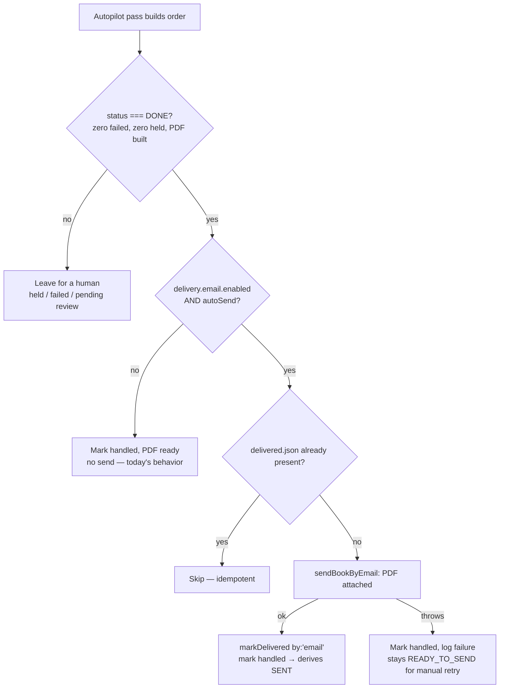

# feat: Auto-deliver finished books to Jirka by email

**Product Contract preservation:** N/A — no upstream brainstorm; this plan bootstraps its own scope.

## Summary

Close the last human step in the order pipeline: today a finished book stops at **READY_TO_SEND** and waits for the operator to click "Odeslat Jirkovi" (which sends over a **dead** WhatsApp seam). This plan adds an **email transport** (PDF attached, over a real cloud SMTP relay) and lets the overnight autopilot **auto-send only fully-clean orders** — the ones that ran the whole pipeline with zero human touches. Anything that needed a human (QC flag, intake hold, generation failure) still waits for a manual send. Off by default; double-gated; the no-send invariant is relaxed deliberately, not removed.

This is mostly **re-wiring existing seams**, not new construction:
- `src/studio.js` `markDelivered()` already writes the terminal `delivered.json` marker and its comment already anticipates *"automated delivery (Phase 2) would write the same marker in the operator's place."*
- `src/proton/smtpClient.js` `sendMail()` already supports attachments and any `host`/`port` — point it at a cloud relay instead of the local Proton Bridge.
- The board already derives **SENT** purely from the marker, so an auto-sent order drops off the active board on its own.

**Scope, confirmed with the user before writing:** transport = **email with PDF attached**; trigger = **only fully-clean orders**.

---

## Problem Frame

The autopilot (`src/autopilot.js`) is deliberately send-free: it builds the PDF and stops (`// never reaches a delivery/WhatsApp path`). The only delivery path is the operator's manual click, routed through `src/whatsapp/whatsappClient.js` — which is dead in the cloud (headless Chromium won't survive Render; the WhatsApp session keeps corrupting). So "absolute automation" has a hole at the very end: **finished books never leave without a human.**

Two things must change:
1. A transport that **works unattended and in a datacenter** — email, reusing the existing SMTP client against a real relay (not the loopback Bridge).
2. A **safe trigger** in the autopilot that sends only orders proven clean, keeping a human on anything that needed judgment.

**In scope:** email transport, the fully-clean auto-send trigger, config + validation, morning-report visibility, tests.
**Not in scope:** removing/hardening WhatsApp (kept as the local fallback), a retry queue, Drive delivery, auto-sending held-order re-upload emails (survey item #5 — sibling work, same SMTP move).

---

## Requirements

- **R1** — A finished book can be delivered to Jirka by **email with the PDF attached**, over a configurable SMTP relay (not the local Bridge).
- **R2** — The overnight autopilot **auto-sends only fully-clean orders**: zero failed photos, zero QC-held photos, no intake hold, PDF built. Formally: the pipeline entry's `status === ORDER_STATUS.DONE`.
- **R3** — Auto-send is **double-gated and off by default**: it fires only when `delivery.email.enabled` **and** `delivery.email.autoSend` are both true. With either off, today's behavior is unchanged (autopilot sends nothing).
- **R4** — A successful send writes the **same `delivered.json` marker** a human would (`by: 'email'`), so the board derives SENT and the order drops off automatically. It is **idempotent** — an order already marked delivered is never re-sent.
- **R5** — A **send failure is non-fatal**: the autopilot pass completes, the order is **not** marked delivered, and it stays on the board as READY_TO_SEND for a manual one-click retry over the same email transport. No book is ever lost or double-sent.
- **R6** — The manual "Odeslat Jirkovi" click **works over email** when email is enabled (WhatsApp remains the fallback when it isn't).
- **R7** — The morning report/banner shows **how many books were auto-sent overnight**, so the operator sees what left without them.
- **R8** — The SMTP credential is a full-mailbox credential: **gitignored `config.json` only** (or env-var override for Render), never in source — same posture as the Shopify token and Bridge password.

---

## High-Level Technical Design

The safety of this feature lives entirely in one decision gate — when does a book actually leave. Everything else is plumbing. The gate (evaluated per order, per autopilot pass):



*Directional — the prose contract in R2–R5 is authoritative where they differ.*

The delivery path itself is a straight line, shared by the autopilot and the manual route:
`pick transport (email if enabled, else WhatsApp) → send PDF → on success markDelivered`.

---

## Output Structure

New files (everything else is edits to existing modules):

```
src/delivery/
  emailDelivery.js     # sendBookByEmail — SMTP send with the PDF attached
  deliverOrder.js      # shared transport-agnostic deliver seam (email | whatsapp) + markDelivered
test/
  emailDelivery.test.js
  deliverOrder.test.js
```

---

## Key Technical Decisions

- **KTD1 — Reuse `createSmtpClient`, don't build a mailer.** It already does attachments and takes `host`/`port`/`secure`/`user`/`pass`/`fromAddress`. The only difference from the Bridge use is the endpoint — a real relay instead of `127.0.0.1:1025`. New `delivery.email.smtp` config, not the local `mail` block (which is Bridge-bound and dead in the cloud).
- **KTD2 — `status === ORDER_STATUS.DONE` *is* the fully-clean predicate.** `src/orchestrator.js` sets DONE only when `failed.length === 0` **and** `held.length === 0` and the PDF built; a QC-flagged page routes to HELD, a hold never generates. In an unattended pass there is no human, so DONE = zero human touches. No new "cleanliness" flag is needed. (The pre-existing unused `manualTouchThreshold` config knob is noted as an optional future refinement, not wired here — YAGNI.)
- **KTD3 — One shared `deliverOrder` seam for both callers.** The manual route (`server.js` `/api/<order>/deliver`) and the autopilot both call `deliverOrder`, which picks email-when-enabled else WhatsApp, sends, then `markDelivered`. Avoids two divergent send paths and keeps the "mark only on success" contract in one place.
- **KTD4 — Failed auto-send degrades to today's manual state, no retry queue.** On send failure the order is marked *handled* (so it isn't re-generated / re-downloaded next pass) but **not** *delivered* — it sits as READY_TO_SEND for a manual retry. A retry queue is deferred (YAGNI); the board already surfaces the unsent book.
- **KTD5 — WhatsApp stays as the local fallback.** Deleting it is out of scope; email simply takes precedence when enabled. David can retire WhatsApp later as a one-line config choice.

---

## Implementation Units

### U1. `delivery.email` config block + validation

**Goal:** A validated, off-by-default email-delivery config, so turning it on is explicit and a misconfiguration is a clear error, not a silent never-send.
**Requirements:** R1, R3, R8.
**Dependencies:** none.
**Files:** `src/config.js`, `config.example.json`, `config.render.example.json`, `test/config.test.js`.
**Approach:** Add a `delivery.email` sub-block: `{ enabled, to, autoSend, smtp: { host, port, secure, user, pass, fromName, fromAddress } }`. Mirror the existing `whatsapp`/`mail` validation shape (`src/config.js:119–169`): disabled → block absent, tool runs with no delivery config. When `enabled`, require `to` and `smtp.host`/`smtp.user`/`smtp.pass` with clear `ConfigError`s. `autoSend` defaults `false` (email-on-manual-click works with it off). Allow `FMA_DELIVERY_SMTP_PASS` env override for the password (Render), same pattern as `FMA_SHOPIFY_TOKEN`. Carry the "full-mailbox credential — gitignored config.json only" comment.
**Patterns to follow:** the `whatsapp` block (`src/config.js:119–141`) and `mail` block (`:152–169`); env-override pattern from the Shopify token.
**Test scenarios:**
- Enabled with no `to` → `ConfigError` naming `delivery.email.to`.
- Enabled with missing `smtp.host`/`user`/`pass` → `ConfigError`.
- Disabled (or block absent) → parses clean, delivery inert, no behavior change.
- Valid block → parsed values surface on the config object; `autoSend` absent → `false`.
- `FMA_DELIVERY_SMTP_PASS` set, config `pass` blank → env value used.

### U2. `sendBookByEmail` — the email transport

**Goal:** Send one finished PDF to Jirka as an email attachment; throw on any failure so the caller never marks a failed send as delivered.
**Requirements:** R1, R5.
**Dependencies:** U1.
**Files:** `src/delivery/emailDelivery.js`, `test/emailDelivery.test.js`.
**Approach:** `sendBookByEmail({ pdfPath, orderId, config, smtpFactory })`. Build a `createSmtpClient` from `config.delivery.email.smtp` (inject `transportFactory`/`smtpFactory` for tests), then `sendMail({ to: config.delivery.email.to, subject: `Objednávka ${orderId}`, text: <one-line body naming the order>, attachments: [{ filename: `Objednavka-${orderId}.pdf`, path: pdfPath }] })`. Refuse a missing PDF up front (`existsSync`). Let `SmtpError` propagate. Return `{ sent: true, to, messageId }` on success. Reuse the subject convention from `deliveryCaption` (`Objednávka <id>`).
**Patterns to follow:** `src/whatsapp/whatsappClient.js` `sendDocument` contract (throw-on-failure, verify file exists first); `src/proton/smtpClient.js` `sendMail` attachment shape (`{ filename, path }` → nodemailer).
**Execution note:** Implement test-first — the throw-on-failure contract is what keeps a failed send off the delivered marker.
**Test scenarios:**
- Happy path: fake transport records one `sendMail` with the PDF as attachment, correct `to`, subject `Objednávka <id>`; returns `{ sent: true }`.
- Missing PDF path → throws before any send; transport never called.
- Transport `sendMail` rejects → error propagates (caller relies on this to skip the marker).
- Attachment filename/subject format asserted.

### U3. `deliverOrder` — shared transport-agnostic seam + manual route rewire

**Goal:** One deliver seam both callers use: pick email when enabled (else WhatsApp), send, and mark delivered only on success — so the manual click works over email and the autopilot reuses identical logic.
**Requirements:** R4, R6.
**Dependencies:** U2.
**Files:** `src/delivery/deliverOrder.js`, `src/ui/server.js`, `test/deliverOrder.test.js`.
**Approach:** `deliverOrder({ orderDir, orderId, pdfPath, config, by, waClient })`: if `config.delivery.email.enabled` → `sendBookByEmail` (`by: 'email'`); else if a WhatsApp client is available → `sendDocument` (`by: 'whatsapp'`, unchanged); else throw a clear "no delivery transport configured" error. **Before sending, if `deliveredMarkerPath` already exists, return early (idempotent) — never re-send.** On successful send, `markDelivered(orderDir, { by, to, messageId })`. Rewire `server.js` `/api/<order>/deliver` (`:1175–1188`) to call `deliverOrder` instead of hard-calling WhatsApp; the WhatsApp-test route (`:1157`) is untouched.
**Patterns to follow:** the existing `/api/<order>/deliver` flow (send → `markDelivered` only on success); `markDelivered` idempotency in `src/studio.js:24`.
**Test scenarios:**
- Email enabled → routes to email, `markDelivered` called with `by:'email'`; WhatsApp client never touched.
- Email disabled + WhatsApp client present → WhatsApp path, `by:'whatsapp'` (regression: today's behavior preserved).
- Neither transport → throws clear message; no marker written.
- `delivered.json` already present → returns early, no send, no re-mark (idempotent).
- Send throws → marker **not** written (order stays sendable).

### U4. Autopilot auto-send of fully-clean orders

**Goal:** After the pipeline builds, auto-send every fully-clean (`DONE`) order when `autoSend` is on — the trigger that removes the last human step — while never sending anything that needed a human, and never failing the pass on a bad send.
**Requirements:** R2, R3, R4, R5.
**Dependencies:** U3.
**Files:** `src/autopilot.js`, `src/autopilotReport.js`, `test/autopilot.test.js`.
**Approach:** In `runAutopilot`, after `runPipelineFn(...)`, iterate `pipeline.orders`; for each with `status === ORDER_STATUS.DONE`, when `config.delivery.email.enabled && config.delivery.email.autoSend`, call `deliverOrder({ ..., by:'email' })`. Count `sent` and `deliveryFailed` in the report. **Handled-marking contract (KTD4):** a DONE order is marked handled either way (so it isn't re-generated), but only marked *delivered* on a successful send; a failed send is logged and counted, order stays READY_TO_SEND. Never call `deliverOrder` for held/failed/materialize-failed orders (they aren't DONE). **Update the module header** (`src/autopilot.js:1–5`): the no-send invariant is now *conditional* — "sends ONLY fully-clean DONE orders, and ONLY when `delivery.email.autoSend` is on; every other order and every disabled config still sends nothing."
**Patterns to follow:** the existing per-order report loop (`src/autopilot.js:109–115`); `markHandled` usage (`:113`).
**Execution note:** Test-first — this relaxes the autopilot's load-bearing no-send invariant. The regression guard (autoSend off → zero sends) is the most important test in the plan.
**Test scenarios:**
- Clean `DONE` order + `enabled` + `autoSend` → `deliverOrder` called once; report `sent === 1`; order derives SENT.
- **`autoSend` off (or `enabled` off) → `deliverOrder` never called** (no-send invariant preserved — regression guard).
- `HELD` / `FAILED` / materialize-failed order + `autoSend` on → never sent.
- Send throws → pass resolves normally, order **not** delivered, `deliveryFailed === 1`, order still marked handled (not re-generated next pass).
- Order with `delivered.json` already present → not re-sent (idempotent through `deliverOrder`).
- Covers R2/R3: two orders, one DONE one HELD, autoSend on → exactly the DONE one sends.

### U5. Surface auto-sent count in the morning report + banner

**Goal:** The operator sees how many books left overnight without them.
**Requirements:** R7.
**Dependencies:** U4.
**Files:** `src/autopilotReport.js`, `src/studio.js`, `src/ui/static/dashboard.html`, `test/studio.test.js`.
**Approach:** Carry the `sent` (and optionally `deliveryFailed`) count from the report into `overnightSummary` (`src/studio.js:207`), and add a banner label ("… · N odesláno Jirkovi") in `dashboard.html`. The board itself needs no change — SENT already derives from the marker written in U4.
**Patterns to follow:** `overnightSummary` field-picking (`src/studio.js:207–219`); the existing banner counts.
**Test scenarios:**
- Report with `sent: 3` → `overnightSummary.sent === 3`.
- Report missing the field → defaults to 0, banner omits the clause.
- `deliveryFailed > 0` surfaces (so a silent all-failed night is visible).
**Test expectation:** dashboard.html label change is presentational — covered by the `overnightSummary` unit test; no separate DOM test.

---

## Risks & Mitigations

- **Relaxing the no-send invariant (the autopilot's central safety property).** Mitigation: double-gated (`enabled && autoSend`), off by default, only `DONE`-clean orders, and a dedicated regression test proving `autoSend` off sends nothing (U4).
- **PII leaves the building automatically.** The PDF carries the customer's photos-turned-coloring-pages and their dedication; auto-send removes the human glance before it leaves. A wrong `to` would email customer material to the wrong address, at scale, unattended. Mitigation: `to` required + validated (U1); the fully-clean gate caps blast radius; the `delivered.json` marker makes every send auditable; consider a one-line startup log naming the configured recipient.
- **SMTP credential.** Full-mailbox credential → gitignored `config.json` or `FMA_DELIVERY_SMTP_PASS` env (Render), never source (R8, U1).
- **Duplicate sends on re-poll.** Mitigated by the marker check in `deliverOrder` (U3) plus `markHandled` (U4).
- **Transient SMTP failure loses a send.** Mitigated by KTD4: failed send → order stays READY_TO_SEND for manual retry; no queue, but nothing is lost or double-sent.

---

## Open Questions

- **SMTP provider/endpoint.** Proton offers no plain SMTP submission without the Bridge, so the cloud relay must be something else — Proton paid SMTP submission if available, a Gmail/Workspace app-password, or a transactional relay (Resend/Postmark/SES/Brevo). *Config-level, David's pick; does not block the code — `createSmtpClient` is provider-agnostic.*
- **Jirka's delivery email address** (the `to`). Needed to turn it on, not to build it.
- **Email body content.** Default: subject `Objednávka <id>` + a one-line body + the PDF. Richer body (dedication text, layout, page count) is a trivial follow-up if Jirka wants it.

---

## Sources & Research

Grounded entirely in local code (no external research — the transport and marker seams already exist):
- `src/studio.js` — `markDelivered` / `deliveredMarkerPath`, SENT derivation, `overnightSummary`.
- `src/proton/smtpClient.js` — `createSmtpClient` / `sendMail` with attachment support.
- `src/whatsapp/whatsappClient.js` — the current (dead-in-cloud) send seam and its throw-on-failure contract.
- `src/autopilot.js` — the send-free pass and the report loop; `src/orchestrator.js` — the `DONE`/`HELD` decision proving the clean predicate.
- `src/ui/server.js:1175` — the manual `/api/<order>/deliver` route being generalized.
- `src/config.js:119–169` — the `whatsapp`/`mail` validation patterns U1 mirrors.
