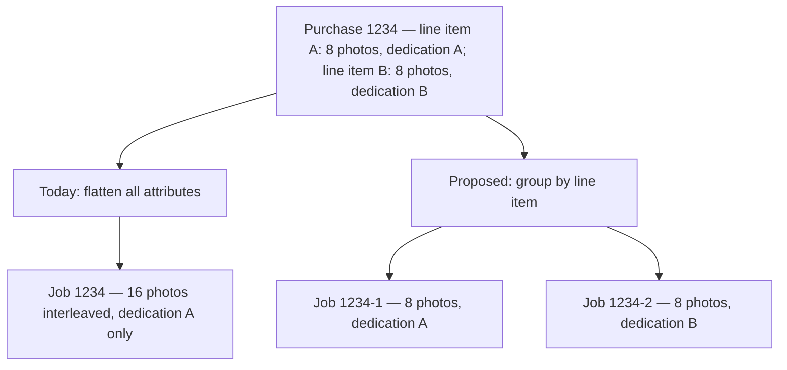
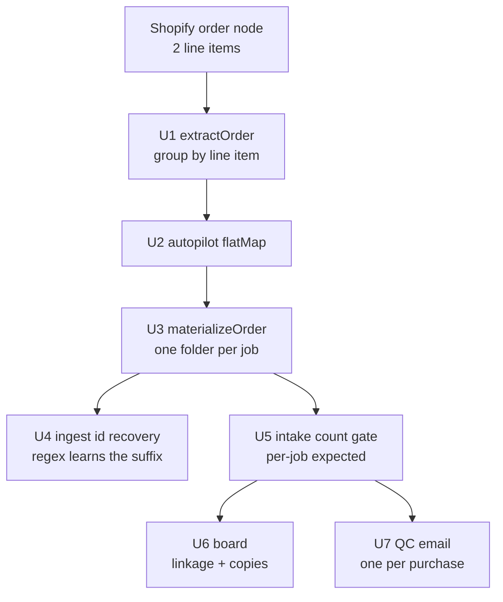

# Split Multi-Book Purchases - Plan

## Goal Capsule

- **Objective.** A purchase containing more than one book produces one independent job per book, each with its own photos, dedication, layout and PDF, instead of a single fused job holding everyone's photos interleaved.
- **Product authority.** This plan owns the purchase-to-job split and the photo-count gate that guards it. The per-order ZIP download is not active scope; it is a separate plan.
- **Authority hierarchy.** Product behavior is owned by the R-IDs in the Product Contract. Implementation mechanism is owned by the KTDs in the Planning Contract. A unit overrides neither.
- **Ride-along.** One brand-mark cleanup (R16, U9) is carried here by decision, not because it belongs to the fix. It is independent and can land as its own commit.
- **Execution profile.** Node 20+ ESM, no build step. Tests are `node --test`. No database, no migration, no deploy gate — the change is confined to how a Shopify payload is read and how the resulting folders are named.
- **Stop conditions.** Stop and surface rather than guess if: a real order on disk turns out to use a photo-attribute key shape other than `Fotka (N)-M`; splitting would require renaming an existing outbox folder; or the count gate would hold a job that completes correctly today.
- **Open blockers.** None. Planning is complete.

**Product Contract preservation:** changed — R17 and KD6 added. Flow analysis found that `markPrinted` and `markDelivered` act on one folder with no sibling check, so half a parcel can be dispatched while its other book is still held. The operator chose a warning over a block. No existing R-ID was split, renumbered, or rescoped.

---

## Product Contract

### Summary

Preserve Shopify line-item boundaries through order extraction so a multi-book purchase becomes one job per book rather than one merged job. Jobs from a split purchase carry a position suffix on the order number, keeping them distinct everywhere the order number is already used as a key. A per-job photo-count gate holds any job whose photo count disagrees with what its own line item advertised.

### Problem Frame

The intake path deliberately discards line-item structure. `customerAttributes()` in `src/shopify/orders.js` concatenates the custom attributes of every line item into one flat array with no boundary marker, and every stage after it receives a single order object.

Three separate losses follow from that one flatten:

Photo keys carry a trailing index that is local to each line item, restarting at 1 per item. Two 8-photo line items therefore both emit indices 1 through 8. Because the sort in `extractOrder` is stable, ties keep insertion order, so the merged array interleaves the two books — book A photo 1, book B photo 1, book A photo 2, book B photo 2 — rather than concatenating them. The output is scrambled, not merely doubled.

Dedication and layout are resolved with `.find()` over the same flat array, so the first line item's values win and the second book's dedication is silently discarded. A customer ordering one book for each of two children gets both books dedicated to the first child.

The count check that could have caught this instead hides it. `expectedPhotosFrom` returns on the first matching variant title, so a two-line-item purchase reports an expected count of 8 while 16 photos sit in the folder. The check under-reports rather than flagging.

The behaviour was found while placing test orders for marketing, not by a customer. No production order is known to have hit it, and no recovery workaround exists because none has been needed. Nothing in the storefront prevents a real customer from triggering it, and two books in one checkout is an ordinary purchase — a gift for each of two children or two grandparents.

No test exercises any of this. The order fixtures in `test/shopifyOrders.test.js` and `test/autopilot.test.js` hardcode exactly one line-item edge, and no other test file constructs a multi-line-item order.

### Key Decisions

- KD1. **One job per line item, split at extraction.** (session-settled: user-directed — chosen over an order object holding a list of books: the on-disk layout is already one folder per job, so downstream stages need no change.) Governs R1, R2, R3, R4.
- KD2. **Quantity means copies, not distinct books.** (session-settled: user-approved — chosen over splitting on quantity: two copies of one book are byte-identical, and splitting would pay the generation cost twice for the same output.) Governs R6, R7.
- KD3. **Suffix only when a purchase splits.** (session-settled: user-directed — chosen over suffixing every order uniformly: nothing existing is renamed, and the suffix itself signals a multi-book parcel.) Governs R8, R9, R11.
- KD4. **The photo-count gate holds rather than warns.** (session-settled: user-directed — chosen over leaving the count check as-is: a gate independently catches this class of bug, where a warning depends on the operator noticing.) Governs R12, R13.
- KD5. **The purchase, not the job, is the unit for customer mail.** (session-settled: user-directed — chosen over one email per affected job: the customer bought once and should hear once.) Governs R14.
- KD6. **Dispatching half a parcel warns rather than blocks.** (session-settled: user-directed — chosen over a hard block: sending one book early is sometimes legitimate, so the operator keeps the final say.) Governs R17.

The split is a data-shape change at one boundary:

### Actors

- A1. **Operator** — runs fulfilment from the order board, prints and packs. Primary beneficiary; the one who sees jobs, holds and copy counts.
- A2. **Customer** — buys, uploads photos, receives the QC email and the finished books. Sees job identifiers only where they appear in customer-facing mail.
- A3. **Shopify** — supplies the order payload whose line-item structure is the input to the split.

### Requirements

**Splitting a purchase into jobs**

- R1. Line-item boundaries survive order extraction: each line item's custom attributes stay associated with that line item rather than being merged into a single flat set.
- R2. Each job's photos are exactly its own line item's photos, ordered by that line item's own upload order.
- R3. Each job carries its own dedication and layout, taken from its own line item.
- R4. Each job carries a reference to the purchase it came from, sufficient to identify the purchase and the job's position within it.
- R5. A purchase with a single line item produces a single job whose content and behaviour are unchanged from today.

**Copies versus distinct books**

- R6. A line item with quantity greater than one produces one job, not several. The quantity is a copy count for that job.
- R7. A job's copy count is visible to the operator wherever the job is listed and wherever it is prepared for printing.

**Job identity**

- R8. A job from a single-line-item purchase is identified by the plain order number, exactly as today.
- R9. A job from a multi-line-item purchase is identified by the order number plus a position suffix, unique within the purchase.
- R10. Jobs originating from one purchase are shown as linked, indicating each job's position and the purchase total.
- R11. No order folder, board row, manifest, retention marker, or autopilot state entry that exists before this change is renamed, moved, or migrated.

**Guarding the output**

- R12. A job's expected photo count is derived from its own line item, not from the first line item in the purchase.
- R13. A job whose actual photo count disagrees with its expected count is held rather than generated, and the operator is shown which job is held and why.

**Customer communication**

- R14. A purchase whose jobs raise photo problems produces one customer email covering the purchase, identifying which book each problem belongs to.

**Regression coverage**

- R15. Test coverage exercises a purchase with two line items of the same product, asserting per-job photo grouping, per-job dedication, and per-job expected count.

**Dispatching a parcel**

- R17. Marking one job printed or sent while a sibling job of the same purchase is unfinished warns the operator, naming the sibling and its state. The operator can proceed anyway.

**Brand mark (ride-along cleanup)**

- R16. The Generátor screen presents the same brand mark as the dashboard home.

### Key Flows

- F1. Two-book purchase, both books complete
  - **Trigger:** A2 checks out with two line items of the same product, eight photos and a distinct dedication on each.
  - **Actors:** A2, A3, A1
  - **Steps:** Extraction preserves both line items and produces two jobs. Each job receives its own eight photos, its own dedication, and a suffixed identifier. Both jobs appear on the board as linked positions within one purchase. Each generates and builds its own PDF.
  - **Outcome:** Two PDFs, correct dedication on each, photos grouped per book. One parcel, two books.
  - **Covered by:** R1, R2, R3, R4, R9, R10

- F2. Two-book purchase, one book short on photos
  - **Trigger:** As F1, but the second line item carries six photos against an advertised eight.
  - **Actors:** A2, A3, A1
  - **Steps:** Both jobs are created. The first job passes its count check and proceeds. The second job's count disagrees with its own line item and is held. A single customer email names the second book as the one needing photos.
  - **Outcome:** The complete book progresses; the incomplete one waits; the customer receives one message, not two.
  - **Covered by:** R12, R13, R14

- F3. One book, two copies
  - **Trigger:** A2 checks out with a single line item, quantity two, one photo set.
  - **Actors:** A2, A3, A1
  - **Steps:** Extraction produces one job carrying a copy count of two. The job keeps the plain order number. The board and the printing step show the copy count.
  - **Outcome:** One generation pass, one PDF, printed twice.
  - **Covered by:** R6, R7, R8

### Acceptance Examples

- AE1. **Covers R2, R9.** Given a purchase numbered 1234 with two line items of eight photos each, when extraction runs, then two jobs exist identified 1234-1 and 1234-2, and each holds exactly the eight photos of its own line item in that line item's upload order.
- AE2. **Covers R2.** Given a purchase whose two line items carry the identical photo set, when extraction runs, then each job holds its own full set of eight and neither is deduplicated against the other.
- AE3. **Covers R3.** Given the two line items carry different dedications, when the books are built, then each PDF shows its own line item's dedication and neither shows the other's.
- AE4. **Covers R5, R8, R11.** Given a purchase with one line item, when extraction runs, then one job exists identified by the plain order number, and its folder, manifest and board row are indistinguishable from one produced before this change.
- AE5. **Covers R6, R7.** Given a single line item with quantity two and one photo set, when extraction runs, then exactly one job exists, its copy count reads two, and only one set of coloring pages is generated.
- AE6. **Covers R12, R13.** Given a two-line-item purchase where the first line item advertises eight photos and carries eight, and the second advertises eight and carries six, when the count gate runs, then the first job proceeds and the second is held with its shortfall stated.
- AE7. **Covers R14.** Given the state in AE6, when the customer email is composed, then one email is produced for the purchase and it identifies the second book as the one short of photos.

<!-- ce-section: work-relationships -->
### How This Work Fits Together

This plan owns the purchase-to-job split and its count gate. The breakdown below is the current understanding of the surrounding work, not a committed roadmap; a later plan may revise, split, merge, or discard any of it.

- Per-order ZIP download — a button on each order producing an archive of the original photo, the PDF, and the SVG.
  - Depends on this plan: an archive built while two books are still fused would package the fused content. The job, not the purchase, is the likely archive unit, which this plan establishes.
  - Still to decide: whether one purchase yields one archive per job or a single archive covering the parcel.
- Brand mark consistency across surfaces.
  - Can proceed independently of this plan. R16 covers the Generátor screen only. The mark printed into generated PDFs already renders correctly from the deployed builder and is untouched here.
- Completing the vendored builder backup.
  - Can proceed independently of this plan, and of the brand work. `vendor/builder/app.js` requires `./logo.svg` and `./logo-horizontal.svg` on every cover, last, and collage page. The deployed service at the configured `builder.baseUrl` serves both, but neither is among the six files vendored into `vendor/builder/`, so a restore from that directory — the scenario `vendor/builder/README.md` exists to survive — would produce books with no logo. The vendored builder's own header additionally renders a placeholder mark unrelated to the brand.
  - Still to decide: whether to close the gap by vendoring the two assets, and whether to widen the backup check so it exercises a rendered cover page rather than only the page shell.

### Scope Boundaries

- The per-order ZIP download is deferred to its own plan.
- Two genuinely separate checkouts by the same customer stay separate. This plan does not link purchases; it splits within one.
- No storefront or Shopify-side change. The fix is entirely in how the payload is read.
- No migration of existing order folders, manifests, or state.
- The printed-page logo inside generated PDFs is out of scope. It renders correctly from the deployed builder and needs no change.
- Completing the vendored builder backup is out of scope. It is a disaster-recovery gap, not a brand-consistency one.

### Dependencies / Assumptions

- The storefront emits one line item per book a customer wants. Two books in one checkout arrive as two line items, which is the case this plan fixes.
- Photo custom-attribute keys carry an index local to their line item. Grouping by line item before ordering is therefore sufficient to restore correct per-book sequence; the indices themselves need no change.
- Every consumer that keys on the order number today — the review board, the studio board, the autopilot handled-map, retention and purge, and the manifest — continues to work unchanged once job identifiers are unique, because a suffixed identifier is already distinct. This assumption is load-bearing for R11 and was verified against those modules.

### Outstanding Questions

**Deferred to planning**

- OQ1. Whether "the Generátor section" in R16 means the `/review` screen alone or also the vendored builder's own header, which renders a placeholder unrelated to the brand. R16 is written against the `/review` screen, the destination of the dashboard's Generátor navigation.
- OQ2. What a purchase mixing different products — a printed book and a digital one, say — should produce. The split rule applies per line item regardless, but the two jobs may need different downstream treatment.
- OQ3. Whether a held job should block its sibling from being **built**. F2 assumes the complete book proceeds independently, which is the working assumption. Cheap to change later. The send-and-print side of this question is settled by KD6 and owned by R17.

**Resolve before the rest of R14 ships**

- OQ4. The Czech wording for a message covering two books. R14's remaining half needs a body that names which book each problem belongs to, and `src/emailDrafts.js` reserves customer-facing wording for the operator: "The Czech is provisional. The operator is the native speaker and brand voice; the final wording (gender agreement, tone) is their pass." The mechanism is settled — compose after the run loop, when every book's verdict is known, and write one draft per purchase — but it should not ship with agent-written copy.

### Sources / Research

- `src/shopify/orders.js` — `customerAttributes()` flattens across line items; `extractOrder` derives photos, dedication and layout from the flattened set; `expectedPhotosFrom` returns on the first matching variant.
- `src/shopify/materialize.js` — writes one directory keyed on the order number; photo filenames use the loop position over the merged photo array.
- `src/organize.js`, `src/batch.js`, `src/orchestrator.js`, `src/retention.js` — the one-folder-per-job output layout the split preserves.
- `src/review.js`, `src/studio.js`, `src/autopilotState.js`, `src/manifest.js`, `src/retention.js` — the five consumers that treat the order number as a unique key, and the reason KD3 keeps job identifiers distinct.
- `src/emailDrafts.js` — composes the QC email against a single order with no multi-job concept; the surface R14 changes.
- `test/shopifyOrders.test.js`, `test/autopilot.test.js` — single-line-item fixtures; the coverage gap R15 closes.
- `src/ui/static/dashboard.html`, `src/ui/static/index.html` — the two brand marks R16 reconciles.
- `vendor/builder/README.md` — why `vendor/builder/` is the builder's only source of truth, and the six files it covers.

---

## Planning Contract

### Key Technical Decisions

- KTD1. **`extractOrder` returns a list of jobs; its single production caller flat-maps.** (session-settled: user-directed — chosen over an order object holding a list of books: the on-disk layout is already one folder per job.) `src/autopilot.js:68` is the only production caller. Returning a list keeps the merged intermediate object from existing at all, rather than leaving a fused shape alive for something to read by mistake. Covers R1, R2, R3, R4, R5.
- KTD2. **Feed the existing intake hold; do not build a second gate.** `assessCount` (`src/inputQc.js:143-151`) already returns `verdict: 'hold', reason: 'missing-photos'`, `assessIntake` (`src/intake.js:72-89`) folds it into a verdict, `src/manifest.js:169-225` persists it with an operator override, `src/orchestrator.js:201-237` gates all generation on it before any GPU spend, and `deriveOrderStatus` (`src/studio.js:86-109`) renders it as held. R13 needs that gate fed the job's own expected count, not new hold machinery, new status vocabulary, or a new operator surface. Covers R12, R13.
- KTD3. **Photo filenames carry the full job id, and the recovery regex learns the suffix.** `orderIdFromPhoto` (`src/ingest.js:15-18`) matches `^(\d+)_img\d+`, which stops at a hyphen. Left alone with suffixed filenames it returns `null` for every photo and `orderIdFor` silently falls back to the folder name — right answer, wrong path. Widening the regex to accept an optional `-<N>` keeps filenames authoritative, which is what `README.md:150-157` and `docs/OPERATOR.md:245-247` document. Covers R9.
- KTD4. **Customer-facing text keeps the bare Shopify order number.** `ctx.order` reaches the customer as "objednávka {order}" (`src/emailDrafts.js:57,64,71,78`). A customer's receipt says `1234`; it never says `1234-2`. Suffixed ids stay internal to the operator's board, folders and logs. Covers R14.
- KTD5. **Sibling jobs are derived from the purchase reference, not tracked in stored state.** `src/studio.js:8-14` sets the house rule that order status is derived on read and never stored. The purchase-level email (R14) finds a job's siblings by their shared purchase reference at composition time, so no new mutable cross-job state is introduced and no migration is needed. Covers R14, R10.
- KTD6. **Copies are carried as a count on the job, not as repeated generation.** (session-settled: user-approved — chosen over splitting on quantity: two copies of one book are byte-identical, so generating twice pays the AI cost twice for the same output.) Covers R6, R7.

### High-Level Technical Design

The change has one real seam. Everything downstream of extraction already speaks "one job, one folder"; the fix stops destroying the line-item boundary before that seam and lets the existing machinery do its job.

Unit dependency order: U1 → U2 → U3 → {U4, U5} → {U6, U7}. U8 (docs) follows whatever lands. U9 (brand mark) is independent of all of it.

### Assumptions

- Every book in a multi-book purchase arrives as its own Shopify line item. Quantity above one on a single line item means copies (R6), not distinct books.
- Photo attribute keys keep the `Fotka (N)-M` shape, with `M` local to each line item. Grouping by line item before ordering restores per-book sequence without touching the indices themselves.
- The Chrome-extension ingest path (`src/ingest.js`) has no line-item concept and produces single-job orders with bare numeric ids. Those keep working unchanged; the widened regex in KTD3 is backward-compatible with bare ids.
- No outbox folder on disk today came from a multi-line-item purchase, so no folder needs renaming (R11).

### Sequencing

U1 is the only unit that must land before the rest are meaningful, because it defines the job shape everything else consumes. U2 must land in the same commit as U1 — a list-returning `extractOrder` with a `.map` caller is broken in between. U10 must land before the change reaches the machine that runs the overnight autopilot. U9 can land at any time.

### Risks and Dependencies

- **The manual-pull recovery path still merges.** `src/ingest.js` builds an order from a folder of photos and has no line-item concept — one global photo index, one dedication. `src/autopilot.js:92` tells the operator to do exactly that manual pull whenever a Shopify photo download fails. So after this change ships, the prescribed recovery flow for a failed multi-book materialize still produces one interleaved job with one dedication. Worse, if the API path already wrote `1234-1` and `1234-2` and the operator later manual-pulls the same purchase, the board shows three folders for one customer. The split is Shopify-API-only by design (KTD1 places it at extraction); this risk is that the documented fallback silently is not. U8 must say so plainly in the operator docs.
- **Cutover re-processing.** Addressed by U10. Left unhandled, the overnight run regenerates and rebuilds purchases already fulfilled under their pre-split id, unattended.
- **Purchase-level email composition is the least contained work.** U7 changes the shape of a template module and adds cross-job awareness to a per-order loop. Its execution note authorizes stopping and surfacing rather than reshaping the orchestrator; the rest of the plan is valuable without it.
- **The filename/folder integrity check.** `orderIdFor`'s consensus rule is a real safety net — it caught a folder named 1522 holding 1523 photos. KTD3 keeps that net working for suffixed ids. Skipping U4 does not just risk a re-merge; it also disables that check for every split job.

---

## Implementation Units

### U1. Preserve line-item boundaries in order extraction

- **Goal:** `extractOrder` emits one job per line item instead of one fused order.
- **Requirements:** R1, R2, R3, R4, R5, R6, R8, R9. Covers KTD1, KTD6.
- **Dependencies:** none.
- **Files:** `src/shopify/orders.js`, `test/shopifyOrders.test.js`
- **Approach:**
  1. Replace `customerAttributes(node)` with a per-line-item grouping that keeps each line item's attributes together rather than concatenating them.
  2. Derive photos, dedication and layout per group, so the trailing `-M` sort runs within one line item and cannot collide across two.
  3. Derive each job's expected photo count from its own line item's variant title, replacing the first-match-wins behavior of `expectedPhotosFrom`. Keep the exported helper working for a single-line-item `products` array so `src/shopify/materialize.js:75` keeps its current call shape.
  4. Carry a copy count from the line item's `quantity` (KTD6).
  5. Assign the job id: the bare order number when the purchase has one line item, the order number plus a position suffix when it has more (R8, R9).
  6. Attach a purchase reference to each job — order number, position, and total (R4) — which KTD5 and R10 both read.
- **Patterns to follow:** the module is pure with no I/O and must stay that way (`src/shopify/orders.js` imports nothing). Named exports only. Open new functions with the house block comment that says why the function exists and which invariant it protects, as at `src/shopify/orders.js:1-11` and `:22-24`.
- **Test scenarios:**
  - Covers AE1. A two-line-item node of eight photos each yields two jobs, ids `1234-1` and `1234-2`, each holding exactly its own line item's eight URLs in that line item's `-M` order.
  - Covers AE2. A two-line-item node whose line items carry the identical photo set yields two jobs each holding the full set; neither is deduplicated against the other.
  - Covers AE3. Two line items with different dedications yield two jobs with different dedications; the same holds for layout.
  - Covers AE4. A single-line-item node yields exactly one job whose id is the bare order number, with no suffix and no purchase-position badge.
  - Covers AE5. A single line item with `quantity: 2` yields one job carrying a copy count of two.
  - A two-line-item node where the line items advertise different photo counts yields two jobs with different expected counts — the first line item's count does not leak onto the second.
  - A node with no usable id still returns nothing, and a null node still returns nothing, preserving today's guard at `src/shopify/orders.js:44-48`.
  - Attribute keys prefixed with `_` stay excluded within each group.
  - An order name that already contains a hyphen does not produce an id that collides with a position suffix. Order names are plain incrementing integers today, so this guards an assumption rather than a known case — worth pinning because the bug was found using ad hoc test orders.
- **Verification:** `test/shopifyOrders.test.js` passes, including its existing single-line-item cases unchanged.

### U2. Flat-map the extraction call site

- **Goal:** the autopilot consumes a list of jobs per order node.
- **Requirements:** R1. Covers KTD1.
- **Dependencies:** U1.
- **Files:** `src/autopilot.js`, `test/autopilot.test.js`
- **Approach:** `src/autopilot.js:68` currently maps each node through `extractOrder`. Change it to flat-map so one node can yield several jobs, and confirm the downstream `isHandled`/`markHandled` keying at `src/autopilot.js:78,86-98,113` now sees distinct job ids rather than one shared order number.
- **Execution note:** land this in the same commit as U1 — a list-returning `extractOrder` behind a `.map` is broken in between.
- **Test scenarios:**
  - A fetch returning one two-line-item node produces two entries in the autopilot's order list.
  - The handled-orders state records the two jobs independently: marking `1234-1` handled does not mark `1234-2` handled.
  - A single-line-item node still produces exactly one entry, and the existing fixture at `test/autopilot.test.js:49` still passes.
- **Verification:** `test/autopilot.test.js` passes.

### U3. Materialize one folder per job

- **Goal:** each job downloads into its own inbox folder with its own sidecar.
- **Requirements:** R2, R3, R9, R11, R12.
- **Dependencies:** U1.
- **Files:** `src/shopify/materialize.js`, `test/materialize.test.js`
- **Approach:**
  1. `orderDir` at `src/shopify/materialize.js:45` already joins on `order.orderId`; once that is the job id, the per-job folder falls out with no change. Confirm rather than assume.
  2. `photoName` (`src/shopify/materialize.js:25-32`) must embed the full job id including any suffix, so filenames and folder agree (KTD3).
  3. The `objednavka.json` sidecar at `:68-83` must carry the job's own `products` and `expectedPhotos`, not the purchase's flattened list, so `readOrderInfo` and `resolveExpected` resolve per job.
  4. Write the purchase reference and copy count into the sidecar so U6 and U7 can read them without re-fetching Shopify.
- **Patterns to follow:** the disk-touching test pattern at `test/materialize.test.js:18-35` — `mkdtempSync(join(tmpdir(), 'fma-…'))` inside `try`, `rmSync(root, { recursive: true, force: true })` in `finally`.
- **Test scenarios:**
  - Two jobs from one purchase materialize into two sibling folders named `1234-1` and `1234-2`, each holding only its own photos.
  - Photo filenames inside `1234-1/` carry the full job id, not the bare order number.
  - Each folder's sidecar carries that job's own expected photo count; the two differ when the line items advertise different counts.
  - Covers AE4. A single-line-item purchase materializes into one folder named with the bare order number, with filenames indistinguishable from those written before this change.
  - A photo that cannot be fetched still marks only its own job incomplete, not its sibling.
- **Verification:** `test/materialize.test.js` passes; a two-job fixture produces two folders on a temp root.

### U4. Teach filename id-recovery about the suffix

- **Goal:** a job folder's photos resolve to that job's id, through the filename path rather than the folder fallback.
- **Requirements:** R9. Covers KTD3.
- **Dependencies:** U3.
- **Files:** `src/ingest.js`, `test/ingest.test.js`
- **Approach:** widen `orderIdFromPhoto` (`src/ingest.js:15-18`) to accept an optional `-<N>` position suffix after the numeric order number. Leave `orderIdFor` (`src/ingest.js:31-35`) alone — its filename-consensus rule stays correct once the filenames it reads carry the full id. Update the function's block comment, which currently documents only the bare-number shape.
- **Execution note:** this unit is what stops the bug reappearing through a second door. Without it, suffixed filenames fail the regex, every photo returns `null`, and the folder-name fallback carries the result — correct today, and silently wrong the moment any path writes bare-numbered photos into a suffixed folder. Prove the regex path directly, not just the end result.
- **Test scenarios:**
  - `1234-1_img0001_-_foto.jpg` resolves to `1234-1`, not `1234` and not `null`.
  - `1523_img0002_-_hofbauerovi.jpeg` still resolves to `1523`, preserving the Chrome-extension case documented at `src/ingest.js:13-14`.
  - A folder of photos that unanimously carry the suffixed id resolves to the suffixed id without consulting the folder name.
  - A folder whose photos disagree still falls back to the folder name, preserving the behavior at `src/ingest.js:31-35`.
  - A folder named `1234-1` holding bare `1234_img*` photos resolves to `1234` by filename consensus — the known re-merge hazard. Assert the current behavior so the hazard is visible and pinned rather than latent.
- **Verification:** `test/ingest.test.js` passes.

### U5. Give the existing hold gate a per-job count

- **Goal:** a job whose photo count disagrees with its own line item is held before generation.
- **Requirements:** R12, R13. Covers KTD2.
- **Dependencies:** U3.
- **Files:** `src/orchestrator.js`, `test/orchestrator.test.js`
- **Approach:** no code change. `resolveExpected` (`src/orchestrator.js:126-130`) already reads `expectedPhotos` from the job's own sidecar, so making that sidecar per-job in U3 is what makes this correct — the whole gate then works unchanged: `assessIntake` folds the count finding into a verdict, the pre-generation gate at `:201-237` holds on `verdict === 'hold'` unless overridden or forced, and the board derives `held` from the persisted intake. The unit is its tests: prove the per-job count reaches the gate and that a short book is held while its complete sibling builds.
- **Test scenarios:**
  - Covers AE6. Two jobs from one purchase, the first with eight of eight photos and the second with six of eight: the first proceeds to generation, the second is held with `reason: 'missing-photos'`.
  - The held job's shortfall reports against its own expected count, not its sibling's.
  - An operator override on one job does not override its sibling.
  - A single-line-item order with a matching count still proceeds exactly as before, with no new hold.
  - Holding a job writes no generated output for that job — the gate fires before any generation spend.
- **Verification:** `test/orchestrator.test.js` passes; the existing hold fixtures at `test/orchestrator.test.js:27-34` still pass unchanged.

### U6. Surface copies and purchase linkage on the board

- **Goal:** the operator can see that a job is one of several in a parcel, and how many copies to print.
- **Requirements:** R7, R10.
- **Dependencies:** U1, U3.
- **Files:** `src/studio.js`, `src/ui/static/dashboard.html`, `test/studio.test.js`
- **Approach:**
  1. `boardEntry` (`src/studio.js:128-163`) gains a derived linkage field carrying position and total, plus the job's copy count. Read both from the job's sidecar, which U3 populates. Do not re-parse the hyphen back out of the id string — that is indistinguishable from a legitimately hyphenated order name and breaks if the suffix format ever changes. Derive on read; store no new mutable state (KTD5, and the module's own rule at `src/studio.js:8-14`).
  2. `orderRow` (`src/ui/static/dashboard.html:656-720`) renders the linkage as a third chip in the status cell at line 719, built the same way as the existing `staleChip` and `inc` chips at lines 710-713.
  3. The copy count attaches to the existing "Stránky" cell logic at `dashboard.html:659-661`.
- **Patterns to follow:** status is derived, never stored (`src/studio.js:8-14`). Chip construction mirrors the `inc`/`staleChip` pattern already in `orderRow`.
- **Test scenarios:**
  - A job from a two-book purchase carries linkage of position 1 of 2; its sibling carries 2 of 2.
  - A job from a single-book purchase carries no linkage, so no chip renders.
  - A job with a copy count above one exposes that count; a job with quantity one exposes no copy count.
  - Board sorting still orders `1234-1` before `1234-2` and both after `1233`, preserving the numeric-aware sort at `src/studio.js:168-201`.
- **Verification:** `test/studio.test.js` passes; the board renders both rows of a split purchase with correct chips.

### U7. Compose one QC email per purchase

- **Goal:** a customer whose purchase has photo problems receives one message naming the affected book, not one message per job.
- **Requirements:** R14. Covers KTD4, KTD5.
- **Dependencies:** U1, U5.
- **Files:** `src/emailDrafts.js`, `src/orchestrator.js`, `test/emailDrafts.test.js`
- **Approach:**
  1. Compose the draft across a purchase's jobs rather than one job in isolation. Siblings are found by their shared purchase reference (KTD5); nothing new is stored.
  2. Designate one job per purchase as the draft owner — the lowest position — and write the merged draft only there. A held sibling must not also write its own `draft-email.txt`, or the operator will have two copy-paste drafts on two held rows and nothing stopping them sending both.
  3. The templates in `src/emailDrafts.js` are single-order-shaped and deliberately generic ("jednu z fotek"), with no parameter for which book is affected. They need to accept a list of affected books so the merged text can name them.
  4. The draft names which book each problem belongs to, using the book's position within the purchase or its dedication — not its internal suffixed id.
  5. Customer-facing text keeps the bare Shopify order number (KTD4).
  6. A single-book purchase produces exactly the message it produces today, unchanged in wording.
- **Execution note:** this is the unit most likely to grow. If purchase-level composition turns out to need more restructuring of `draftEmailFor` (`src/orchestrator.js:132-146`) than expected, stop and surface rather than reshaping the orchestrator's per-order loop — the fix is still valuable with per-job drafts, and this requirement can land separately.
- **Test scenarios:**
  - Two jobs in one purchase, only the second short of photos: one draft is produced for the purchase, and it identifies the second book.
  - Both jobs short of photos, for different reasons: exactly one draft file exists across the two job folders, and it names both books with each one's own reason. The sibling folder holds no competing draft.
  - The draft's customer-facing text carries the bare order number and contains no suffixed id.
  - Covers AE7. A single-book purchase with a shortfall produces a draft identical in wording to today's.
  - A purchase whose jobs are all complete produces no draft.
- **Verification:** `test/emailDrafts.test.js` passes; existing single-order email cases are unchanged.

### U8. Reconcile the folder-versus-filename documentation

- **Goal:** the operator docs describe the suffixed job id rather than contradicting it.
- **Requirements:** R9, R10.
- **Dependencies:** U4.
- **Files:** `README.md`, `docs/OPERATOR.md`
- **Approach:**
  1. `README.md:150-157` and `docs/OPERATOR.md:245-247` both document that the order number comes from photo filenames and not the folder name, citing a real past bug where a folder named 1522 held 1523 photos. KTD3 keeps that invariant true rather than inverting it, so both passages need a suffix caveat rather than a rewrite.
  2. Extend `docs/OPERATOR.md`'s "the order number looks wrong" troubleshooting entry so a `-1`/`-2` suffix reads as expected rather than as the historical mismatch bug.
  3. Note in the run-report section (`README.md:104-113`) that order ids in reports and logs may now carry a suffix.
  4. Document that the split is Shopify-API-only. A manually pulled folder has no line-item information, so a multi-book purchase recovered that way arrives as one merged job — the operator must split it by hand or let the autopilot retry. This matters because `src/autopilot.js:92` prescribes the manual pull as the recovery path for a failed photo download.
- **Test scenarios:** `Test expectation: none — documentation only, no behavior change.`
- **Verification:** both passages describe the suffix, and neither still asserts that filenames never carry one.

### U9. Match the Generátor screen's brand mark to the dashboard

- **Goal:** the two screens present the same mark.
- **Requirements:** R16.
- **Dependencies:** none. Independent of every other unit.
- **Files:** `src/ui/static/index.html`
- **Approach:** the dashboard renders the real mark at `src/ui/static/dashboard.html:285` (``); `/review` renders a styled text wordmark at `src/ui/static/index.html:189`. Bring the `/review` header in line with the dashboard's, reusing the existing `brand-logo` styling from `src/ui/static/css/components.css:24` rather than introducing a second treatment. The asset is already served from the same static tree, so no new route is needed.
- **Test scenarios:** `Test expectation: none — presentational change with no behavioral surface.`
- **Verification:** both screens render the same mark at the same header position, in light and dark sidebar states.

### U11. Warn before half a parcel is dispatched

- **Goal:** the operator is told when they are about to send or print one book of a purchase whose other book is not finished.
- **Requirements:** R17. Covers KD6.
- **Dependencies:** U1, U6.
- **Files:** `src/studio.js`, `src/ui/static/dashboard.html`, `test/studio.test.js`
- **Approach:** `markPrinted` and `markDelivered` (`src/studio.js:24-58`) act on one order directory with no knowledge of siblings. Surface the sibling's state to the board so the row's send and print actions can warn before acting, naming which book is unfinished and why. The warning is advisory: the operator confirms and proceeds (KD6). Derive the sibling's state on read from the purchase reference, consistent with KTD5 and the module's own rule at `src/studio.js:8-14`.
- **Test scenarios:**
  - A job whose sibling is held reports a dispatch warning naming the sibling and its held state.
  - A job whose sibling is already done reports no warning.
  - A job from a single-book purchase reports no warning, and its send and print actions are untouched.
  - Proceeding past the warning still marks the job printed or sent — the warning never blocks the write.
- **Verification:** `test/studio.test.js` passes; a split purchase with one held job shows the warning on the complete job's actions.

### U10. Stop the cutover from re-running already-fulfilled purchases

- **Goal:** shipping this change does not cause the overnight autopilot to re-generate purchases it already completed.
- **Requirements:** R11.
- **Dependencies:** U1, U2.
- **Files:** `src/autopilot.js`, `src/autopilotState.js`, `test/autopilotState.test.js`
- **Approach:** the handled map in `src/autopilotState.js:47-55` records completed orders under the id they had when they finished — for a multi-book purchase processed before this change, that is the bare `1234`. After the change the same Shopify order extracts as `1234-1` and `1234-2`, neither of which appears in the map, so `toProcess` (`src/autopilot.js:78`) treats both as new work. Because the PDF freshness check (`src/orchestrator.js:53-58`) looks under the new folder path and finds nothing, it regenerates. Before treating a suffixed job as unhandled, check whether its bare purchase number is already recorded as handled, and treat that as handled. Shopify's polling lookback is a sliding window, so the exposure is time-bounded — but it lands unattended and overnight, which is when nobody is watching.
- **Execution note:** the failure this prevents costs real money and can produce a second parcel for an order already printed and packed. Prove it with a test that seeds a legacy handled entry and asserts no reprocessing, rather than reasoning about the window.
- **Test scenarios:**
  - A handled entry recorded under the bare order number suppresses both `1234-1` and `1234-2` from the process list.
  - A purchase with no handled entry still processes both jobs normally.
  - A single-book order handled before the change stays handled after it, since its id is unchanged.
  - A purchase handled under the bare number, where the operator has since deleted the old folder, still does not silently reprocess.
- **Verification:** `test/autopilotState.test.js` and `test/autopilot.test.js` pass; a seeded legacy handled entry produces an empty process list.

---

## Verification Contract

| Gate | Command | Applies to | Done signal |
|---|---|---|---|
| Unit tests | `npm test` (`node --test`) | U1–U7, U10 | All test files pass, including untouched suites |
| Order-pipeline smoke | `npm run queue-smoke` | U3, U5 | Queue smoke completes without a new hold or error |
| Generator smoke | `npm run studio-smoke` | U6 | Board renders without error |
| Full smoke | `npm run smoke` | Before declaring done | Grid, studio, queue, editor and dedication-safety smokes all pass |

No migration, deploy gate, or release validation applies — the change adds no persistent schema and renames nothing on disk.

**Regression focus.** The suites most likely to catch a mistake here are `test/shopifyOrders.test.js`, `test/materialize.test.js`, `test/ingest.test.js` and `test/orchestrator.test.js`. Every one of them currently passes against the merged behavior, so a green run before the change is not evidence of anything — the two-line-item fixtures added in U1 and U3 are what make the suite meaningful (R15).

---

## Definition of Done

**Global**

- A two-line-item purchase produces two independent jobs with correct per-book photo grouping, dedication, layout and expected count, verified by the acceptance examples in the Product Contract.
- A single-line-item purchase is byte-for-byte indistinguishable from one processed before the change: same folder name, same filenames, same manifest, same board row (R11).
- No existing outbox folder, manifest, retention marker or autopilot state entry was renamed, moved or migrated.
- A purchase already fulfilled under its pre-split id is not reprocessed after the change ships.
- `npm run smoke` passes.
- No dead-end or experimental code from abandoned approaches remains in the diff.

**Per unit**

- U1: two-line-item extraction covered by tests, including the identical-photo-set case and the differing-expected-count case.
- U2: the autopilot's handled-state treats sibling jobs independently.
- U3: two sibling folders on disk, each with its own sidecar and its own expected count.
- U4: the suffixed id resolves through the filename path, and the bare Chrome-extension case still resolves.
- U5: a short job is held by the existing gate; its complete sibling proceeds.
- U6: linkage and copy count render on the board, and absent on single-book purchases.
- U7: no suffixed id in customer-facing text — done. One draft per purchase naming the affected book — held on OQ4.
- U8: both documentation passages describe the suffix, and the manual-pull limitation is written down.
- U9: both screens show the same brand mark.
- U10: a seeded pre-split handled entry stops both sibling jobs from reprocessing.
- U11: dispatching a job whose sibling is unfinished warns and still allows the operator through.
