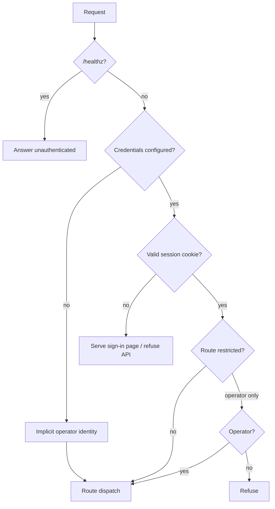
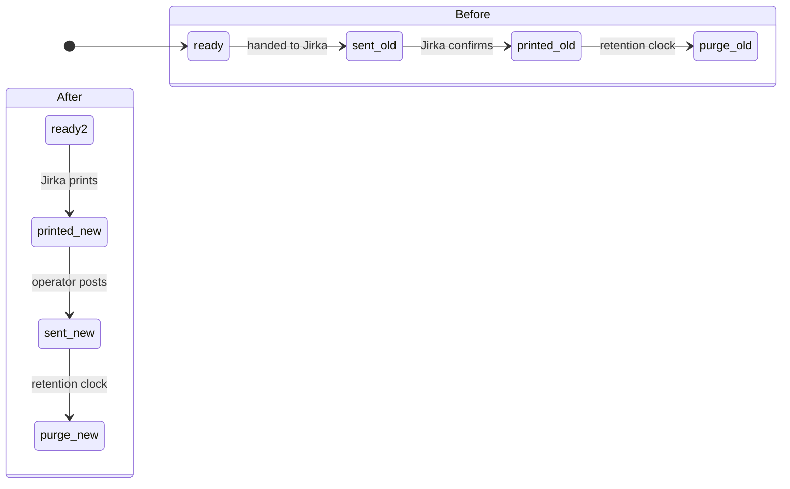

# Per-User Logins and WhatsApp Removal - Plan

## Goal Capsule

- **Objective.** Two named people sign in to the studio with their own credentials. Jirka is a full operator except settings, enforced on the server. WhatsApp is gone entirely, the order lifecycle is re-cut so `sent` means dispatched to the customer, retention runs from `sent`, and the operator can purge from the app.
- **Authority hierarchy.** Product behavior is owned by the R-IDs. Implementation mechanism is owned by the KTDs. A unit overrides neither.
- **Execution profile.** Node 20 ESM, plain `node:http`, no framework, no database, no new runtime dependency. Tests are `node --test`. Hosted as one container on Render behind HTTPS with a disk mounted at `/data`.
- **Stop conditions.** Stop and surface rather than guess if: the migration would need to write to an order folder it cannot first read; a role check cannot be enforced server-side and would exist only in the UI; or the cutover would leave the operator unable to sign in to the running deployment.
- **Open blockers.** None. Planning is complete.

**Sensitivity note.** The disk this runs on holds photographs of customers' children. Every decision below that looks over-careful — re-encoding avatars, refusing to reuse a marker file, backfilling a purge marker — is careful for that reason.

---

## Product Contract

### Summary

Replace the single shared Basic Auth password with two real accounts behind a branded sign-in page, give Jirka everything except settings, remove WhatsApp completely, and re-cut the tail of the order lifecycle so `printed` (Jirka) precedes `sent` (the operator posts it to the customer). Retention then hangs off `sent`, and an operator-only purge action finally gives it a way to run on the hosted box.

### Problem Frame

One password protects everything. `checkAuth` (`src/ui/server.js`) compares a request's Basic Auth header against `STUDIO_USER`/`STUDIO_PASS` and returns true when either is unset. There is no identity past that gate: no accounts, no sessions, no roles. `markPrinted` and `markDelivered` write `by: 'operator'` as a constant, whoever clicked.

That was adequate when one person used the tool. It stops being adequate the moment a second person needs in, because the only way to admit Jirka today is to give him the password that also opens the settings screen, the Shopify integration status, the customer mail view and the shutdown button.

WhatsApp is how a finished book currently reaches Jirka, and it is the reason the lifecycle reads `ready-to-send → sent → printed` — `sent` means *handed to the printer*. It is obsolete. Removing it removes the handoff mechanism, which is precisely why Jirka gets a login: he fetches the book himself. That in turn frees `sent` to mean what it more naturally means — posted to the customer — which puts it after printing rather than before.

Retention is the quiet part. `src/retention.js` deletes a customer's photographs only after a `printed.json` marker plus `retentionDays`. It is also the only thing that ever deletes them, and it has no way to run on Render at all: `purge.js` is a hand-invoked CLI with no route and no scheduled job. Photographs of children accumulate on a hosted disk with nothing to clear them.

### Actors

- A1. **Operator** (David) — full access including settings. Runs generation, reviews photos, posts finished books, and is the only one who can purge or shut down.
- A2. **Printer** (Jirka) — signs in, sees the books waiting to be printed, downloads them, marks them printed. Everything except settings.
- A3. **The unattended autopilot** — runs in-process on a timer and as a separate CLI entrypoint. It never crosses the HTTP boundary and therefore has no session.

### Requirements

**Signing in**

- R1. Each person signs in with their own username and password on a branded page served by the app, not the browser's credential dialog.
- R2. A successful sign-in starts a session that persists across requests until it expires or the person signs out.
- R3. Signing out ends the session on the server, not only in the browser.
- R4. `/healthz` answers without authentication, exactly as it does today.
- R5. Running with no credentials configured opens straight in with full access and no sign-in page, preserving the local desktop workflow.
- R6. Repeated failed sign-in attempts for one username are progressively slowed. An account is never hard-locked.
- R7. A sign-in attempt takes indistinguishable time whether or not the username exists.

**Who may do what**

- R8. Jirka reaches only what printing a book needs: the order board, an order's photos and downloads, generation, and the printed action. Everything else is refused — settings, shutdown, customer correspondence, publishing, and anything that spends money. The rule is an allowlist, so a route added later is refused until someone decides otherwise. Enforced on the server; hiding a control in the page is not sufficient.
- R9. A person's identity is recorded on every order marker they write, so printed-by and sent-by are distinguishable.
- R10. Jirka lands on a view showing the books ready to print, each offering the download and the printed action.

**Profile**

- R11. Either person can change their own username and set a profile photo.
- R12. Passwords are not changed in the application. The operator sets both outside it.
- R13. An uploaded photo is re-encoded before storage, and the stored file is never the bytes that were uploaded.

**The lifecycle**

- R14. `sent` means the finished book was dispatched to the customer, and follows `printed`.
- R15. `printed` means Jirka printed the book, and follows the book being ready.
- R16. An order carrying only the pre-existing delivery marker is not treated as dispatched to the customer.
- R17. An order already printed before this change retains a purge-eligibility date no later than it had before.

**Retention**

- R18. A customer's photographs become purge-eligible only after the order is marked sent, plus the configured retention window.
- R19. The operator can review what a purge would delete, and confirm it, from the application.

**Removal**

- R20. No WhatsApp code, route, control, configuration key, dependency, test or documentation reference remains.
- R21. Test coverage that lived alongside WhatsApp tests but concerns routes that remain is preserved.

### Key Flows

- F1. Jirka prints a book
  - **Trigger:** A2 signs in.
  - **Steps:** He lands on the print queue (R10), sees books whose PDF is built, downloads one, prints it, marks it printed. The marker records him (R9).
  - **Outcome:** The order leaves his queue and appears to A1 as awaiting dispatch.
  - **Covered by:** R1, R2, R8, R9, R10, R15

- F2. The operator posts a book
  - **Trigger:** A1 sees an order marked printed.
  - **Steps:** He packs and posts it, then marks it sent. The marker records him and starts the retention clock (R18).
  - **Outcome:** The order is terminal; its photographs become purge-eligible once the window elapses.
  - **Covered by:** R9, R14, R18

- F3. Jirka reaches for settings
  - **Trigger:** A2 navigates to the settings screen — by control, by URL fragment, or by calling the endpoint directly.
  - **Steps:** The page offers no control; the fragment does not open the view; the endpoint refuses.
  - **Outcome:** Refused at the server in every case (R8).
  - **Covered by:** R8

- F4. The operator clears old photographs
  - **Trigger:** A1 opens the purge action.
  - **Steps:** He is shown what would be deleted and why each remaining order is being skipped, then confirms.
  - **Outcome:** Photographs of orders sent longer ago than the retention window are deleted; line art and books remain.
  - **Covered by:** R18, R19

### Acceptance Examples

- AE1. **Covers R5.** Given no credentials configured, when the studio is opened, then the board appears with no sign-in page and settings are reachable.
- AE2. **Covers R1, R2.** Given credentials configured, when the studio is opened without a session, then the branded sign-in page is served rather than a browser credential dialog, and a correct sign-in reaches the board.
- AE3. **Covers R4.** Given credentials configured and no session, when `/healthz` is requested, then it answers normally.
- AE4. **Covers R7.** Given a sign-in attempt for a username that does not exist and one for a username that does with a wrong password, then the two take comparably long and are indistinguishable in their response.
- AE5. **Covers R8.** Given Jirka's session, when the settings endpoint is requested directly, then it is refused — and the same request with the operator's session succeeds.
- AE6. **Covers R8.** Given Jirka's session, when the settings view is opened by URL fragment rather than by clicking, then the view does not open.
- AE7. **Covers R9.** Given Jirka marks an order printed and the operator marks it sent, then the two markers name different people.
- AE8. **Covers R16.** Given an order carrying only the pre-existing delivery marker, when the board is derived after this change, then it does not read as dispatched to the customer and is not purge-eligible.
- AE9. **Covers R17.** Given an order already carrying a printed marker from before this change, when migration runs, then it carries a sent marker dated no later than its printed marker, flagged as backfilled.
- AE10. **Covers R13.** Given an uploaded avatar carrying EXIF GPS data, when it is stored, then the stored file is a re-encoded image without that metadata.
- AE11. **Covers R6.** Given five consecutive failed attempts for one username, then subsequent attempts for that username are delayed progressively, and a correct password still eventually succeeds without operator intervention.
- AE12. **Covers R18.** Given an order marked printed but not sent, when purge is inspected, then its photographs are reported as not yet eligible.

### Scope Boundaries

- Password reset, password change in the application, and any forgotten-password flow. Passwords are set outside the app (R12).
- A third account, role editing, or any user-administration screen. Two fixed roles.
- SSO, OAuth, two-factor.
- Session survival across redeploy. Sessions live in process memory and end when it restarts.
- Rate limiting on anything other than sign-in.

#### Deferred to Follow-Up Work

- Scheduled/unattended purging. This plan gives purge a confirmed, operator-driven path (R19); running it automatically is a separate decision with different risk.
- An audit log of who did what beyond the `by` field on markers.
- Re-examining whether the Playwright base image is still the right choice once WhatsApp's Chromium requirement is gone.

### Dependencies / Assumptions

- Render terminates TLS, so a `Secure` cookie is always transmissible in the hosted deployment.
- The app is served from a single origin with no sibling subdomains sharing its registrable domain.
- Both accounts are trusted people. The threat modelled is an outsider reaching a public URL, not one account attacking the other.
- The autopilot never crosses the HTTP boundary, so authentication cannot break it. Verified: it is called in-process on a timer and via a separate CLI entrypoint.

### Outstanding Questions

**Deferred to planning-time implementation**

- OQ1. Session lifetime within the 12–24h range, and whether activity renews it.

---

## Planning Contract

### Key Technical Decisions

- KTD1. **Passwords live in the Render environment as scrypt hashes, keyed by role; usernames and avatars live in a file on the disk.** (session-settled: user-directed — chosen over holding whole accounts in one place: usernames and photos change at runtime and cannot sit in env vars, while password hashes on a shared mount are the one thing worth keeping off it.) Keying the env by **role** rather than username is what makes both halves work: Jirka renaming himself cannot break his own sign-in, and changing a password in Render takes effect on the next attempt rather than being shadowed by a cached hash. The account file never stores a password or a hash. Covers R11, R12, and the recovery path behind R6.
- KTD2. **`crypto.scrypt` at the OWASP cost, with `maxmem` raised explicitly.** N=2¹⁷, r=8, p=1, 16-byte salt, 32-byte key, stored as one self-describing string so the cost can be raised later without a format change. Node defaults `maxmem` to 32 MiB and these parameters need roughly 128 MiB, so the call throws unless the limit is raised — this must be exercised in a test at production parameters, not mocked. Argon2id is stronger but needs a dependency this change is explicitly shedding; for two accounts it does not earn it. Covers R1.
- KTD3. **Opaque random session token in an in-process map, not a signed stateless cookie.** A signed cookie would survive redeploys, but real sign-out still needs a server-side revocation list, which reintroduces the state it was avoiding. The map makes sign-out honest — delete the entry. Redeploys ending all sessions is an accepted consequence, documented rather than engineered around. Covers R2, R3.
- KTD4. **`SameSite=Lax` plus an `Origin`/`Referer` check on mutating routes, instead of a CSRF token scheme.** Lax already blocks the cross-site request forgery vector outright; the residual gap it does not cover is same-origin XSS, which a token would not fix either. The origin check closes the documented gap at a fraction of the cost and no dependency.
- KTD5. **Per-username progressive backoff, never a hard lock, plus a floor on every attempt's duration.** A hard lock on a two-account app with no self-service recovery is a denial of service an attacker triggers by guessing wrong on purpose. The duration floor blunts both timing side-channels and raw throughput. Covers R6, R7.
- KTD6. **A new `sent.json` marker; the existing `delivered.json` is left in place and never read again.** (session-settled: user-directed — chosen over reinterpreting the existing marker: orders on the live disk carry it under the old meaning, and re-reading it would classify books still awaiting the printer as already posted to the customer, making them purge-eligible.) Covers R14, R16.
- KTD7. **Migration backfills a sent marker for every already-printed order, dated from its printed marker.** Without it those orders can never reach the new terminal state and their photographs become permanently un-purgeable — the opposite of the retention intent. Dating from `printed` preserves the eligibility date they already had (R17). Backfilled markers are flagged so the migration is auditable.
- KTD8. **Avatars arrive as base64 in a JSON body, are validated by decoding rather than by their declared type, and are always re-encoded.** This reuses the shape the AI-image route already uses, so no multipart parser is needed. Re-encoding through `sharp` — already a dependency — strips EXIF including GPS, which matters given what else is on this disk. Stored under a server-generated name outside the served static tree, and served back with a Content-Type the server chose and `X-Content-Type-Options: nosniff`. Covers R13.
- KTD9. **The session check replaces `checkAuth` at exactly its current position — after the `/healthz` early return, once per request.** Request-scoped, not stream-scoped: the ZIP route streams after headers are sent, so a session expiring mid-download must not interrupt it. Covers R4.
- KTD10. **Role is enforced on the server; the UI merely reflects it.** The dashboard resolves views from the URL fragment on load and on history navigation, so hiding a nav control does not prevent reaching the view — and `/review` is a separate page load that client-side logic never sees. Covers R8.
- KTD11. **Local ungated mode resolves to a single implicit operator identity.** Role checks need a defined answer when nobody signed in, or they throw or deny unpredictably. The profile surface is hidden in that mode, since there is no second identity to distinguish from. Covers R5.

### High-Level Technical Design

**The request gate.** One check, in the position `checkAuth` occupies today.

**The lifecycle re-cut.** The terminal step moves, and the retention clock moves with it.

**Migration, as a decision over markers already on disk.** Read-only inputs on the left; the marker written on the right.

| On disk today | Means | Migration writes |
|---|---|---|
| `printed.json` present | Printed and, under the old model, purge-eligible | `sent.json` dated from `printed.json`, flagged backfilled |
| `delivered.json` only | Handed to Jirka, not yet printed | nothing — the order returns to awaiting-print |
| neither | Not yet through the flow | nothing |

The middle row is the dangerous one and the reason KTD6 exists: those orders were never posted to anyone.

### Sequencing

U1 stands alone and should land first — it removes code the rest would otherwise have to reason around. U2 → U3 is the authentication spine and must land together; a sign-in page with no credential check is not shippable. U9 and U10 must land in the same change: re-cutting the state machine without the migration is what strands live orders.

### Risks and Dependencies

- **The cutover can lock the operator out of the running deployment.** Today's `STUDIO_USER`/`STUDIO_PASS` stop being the credential. The new environment variables must be set on Render *before* the deploy that starts requiring them, and the plan's verification includes signing in on the deployed instance before anything else is trusted.
- **Migration touches live customer data.** It writes markers into order folders on the mounted disk. It must be idempotent, must never write a marker it did not first derive from a marker it read, and must be reportable before it is run.
- **Two open PRs touch the same files.** #2 (split multi-book purchases) and #3 (German covers) both modify `src/studio.js` and the dashboard, and #2 changes the board's row rendering — which U12 and U6 also touch. This plan assumes both land first.
- **`qrcode` may be WhatsApp-only.** Verify before removing it with the rest; it is a separate dependency that may have another consumer.
- **The Playwright base image is justified in the Dockerfile by both the PDF builder and WhatsApp.** Removing WhatsApp does not remove the need for it — the builder still drives headless Chromium. Do not change the base image on the strength of the WhatsApp removal alone.

---

## Implementation Units

### U1. Remove WhatsApp entirely

- **Goal:** no WhatsApp code, route, control, config key, dependency, test or doc reference remains.
- **Requirements:** R20, R21.
- **Dependencies:** none.
- **Files:** `src/whatsapp/whatsappClient.js` (delete), `src/ui/server.js`, `src/ui/static/dashboard.html`, `src/studio.js`, `src/config.js`, `config.example.json`, `config.render.example.json`, `package.json`, `Dockerfile`, `docs/RENDER.md`, `test/whatsapp.test.js`, `test/autopilot.test.js`, `test/config.test.js`, `test/runServer.test.js`
- **Approach:**
  1. Delete the client module and its imports, the `wa` construction, the WhatsApp routes, the deliver route, the settings block's WhatsApp entry, and the shutdown hook.
  2. Remove the two "Odeslat Jirkovi" buttons, their handler, the state variable, the label map and the QR rendering from the dashboard.
  3. Remove the config keys and their validation, from both example configs.
  4. Drop `whatsapp-web.js`. Check whether `qrcode` has any other consumer before dropping it too.
  5. Remove the WhatsApp steps and warnings from the Render doc, and the WhatsApp clauses from the Dockerfile comments — leaving the Playwright base-image rationale intact, since the PDF builder still needs it.
  6. `markDelivered`'s comment claims a future automated WhatsApp delivery would write the same marker. That is now false and the marker itself is retired in U9; correct the comment rather than leaving it.
- **Execution note:** `test/whatsapp.test.js` also contains tests for `/api/<order>/pdf` and `/api/<order>/delete`, which are routes that stay. Move them somewhere they survive before deleting the file. WhatsApp references also appear in three other suites, which will fail at import if only the dedicated file is removed.
- **Test scenarios:**
  - The preserved PDF and delete-order tests still run and pass from their new home.
  - The config suite validates both example configs with no WhatsApp keys present.
  - The full suite passes with no unresolved imports.
  - A grep for `whatsapp`, `WhatsApp`, `Jirkovi` and `deliveryCaption` across the repo returns nothing outside this plan and historical documents.
- **Verification:** `npm test` passes; the dashboard renders with no WhatsApp strip.

### U2. Credentials: role-keyed hashes and password verification

- **Goal:** a password can be verified against a stored hash, resolved by role from the environment.
- **Requirements:** R1, R7, R12. Covers KTD1, KTD2.
- **Dependencies:** none.
- **Files:** `src/auth/credentials.js` (new), `test/credentials.test.js` (new)
- **Approach:**
  1. Hash and verify with `crypto.scrypt` at the parameters in KTD2, raising `maxmem` explicitly.
  2. Encode salt, cost parameters and hash into one self-describing string so the cost can be raised later without changing the storage format.
  3. Compare derived bytes with a timing-safe comparison, mirroring the existing `safeEqual` helper rather than inventing a second one.
  4. Resolve the expected hash for a **role**, from the environment.
  5. An unknown username must still perform a hash computation before failing, so its response time matches a wrong-password response.
  6. Provide a way to produce a hash for a password, so the operator can generate the values to paste into Render.
- **Execution note:** run the hashing test at the real production parameters, not reduced ones. The `maxmem` ceiling is the failure this unit exists to prevent, and a test at toy parameters will not catch it.
- **Test scenarios:**
  - A password hashed at production parameters verifies against itself, and the call does not throw on the memory limit.
  - A wrong password fails.
  - A hash string with altered cost parameters still verifies a password hashed under those parameters, proving the encoding is self-describing.
  - Covers AE4. Verifying an unknown role and verifying a known role with a wrong password take comparable time — assert that the unknown-role path performs the work rather than returning early.
  - A malformed or truncated hash string fails closed rather than throwing.
  - Missing environment configuration for a role fails closed.
- **Verification:** `test/credentials.test.js` passes, including the production-parameter case.

### U3. Sessions, the sign-in page, and the request gate

- **Goal:** signing in produces a session; the gate admits sessions and serves the sign-in page otherwise.
- **Requirements:** R1, R2, R3, R4, R5. Covers KTD3, KTD9, KTD11.
- **Dependencies:** U2, U5.
- **Files:** `src/auth/sessions.js` (new), `src/ui/server.js`, `src/ui/static/login.html` (new), `test/sessions.test.js` (new), `test/auth.test.js`
- **Approach:**
  1. Mint an opaque random token on successful sign-in and hold it in an in-process map against the role and an expiry. Never adopt a token the client supplied.
  2. Set the cookie `HttpOnly`, `Secure`, `SameSite=Lax`, `Path=/`, with `Max-Age`. Do not set `Domain`.
  3. Sign-out deletes the map entry, not just the cookie.
  4. Replace `checkAuth` at its exact current position — after the `/healthz` return, once per request. Resolve an identity onto the request for handlers to read.
  5. With no credentials configured, resolve the implicit operator identity and skip the sign-in page entirely (KTD11).
  6. Serve the sign-in page for an unauthenticated page request; refuse an unauthenticated API request without redirecting it.
- **Patterns to follow:** the server's existing `json()` helper and per-route `res.writeHead` style; `test/auth.test.js`'s environment save/restore pattern for credential-dependent tests.
- **Test scenarios:**
  - Covers AE2. With credentials configured, an unauthenticated page request returns the sign-in page, and a correct sign-in then reaches the board.
  - Covers AE3. `/healthz` answers with no session and credentials configured.
  - Covers AE1. With no credentials configured, the board is served directly with no sign-in page.
  - A wrong password does not set a session cookie.
  - Signing out invalidates the token server-side: replaying the old cookie value afterwards is refused.
  - A new sign-in issues a different token than the previous session held.
  - An expired session is refused.
  - An unauthenticated API request is refused rather than redirected to the page.
  - The cookie carries HttpOnly, Secure, SameSite and no Domain attribute.
- **Verification:** `test/sessions.test.js` and the existing server suites pass; the existing suites still run unauthenticated because they configure no credentials.

### U4. Sign-in hardening: throttling and same-origin checks

- **Goal:** guessing is slow, and mutating requests must come from this origin.
- **Requirements:** R6, R7. Covers KTD4, KTD5.
- **Dependencies:** U3.
- **Files:** `src/auth/throttle.js` (new), `src/ui/server.js`, `test/throttle.test.js` (new)
- **Approach:**
  1. Count failed attempts per username in process, and impose a growing delay before the next check for that username once a threshold is passed. Never refuse outright.
  2. Apply a minimum duration to every attempt regardless of outcome.
  3. Reset a username's counter on success.
  4. On mutating requests, compare `Origin` — falling back to `Referer` — against the app's own host, and refuse a mismatch.
- **Test scenarios:**
  - Covers AE11. Consecutive failures for one username produce increasing delays, and a correct password afterwards still succeeds without intervention.
  - Failures against one username do not delay attempts against the other.
  - A successful sign-in clears the counter.
  - Every attempt, successful or not, takes at least the floor duration.
  - A mutating request with a foreign `Origin` is refused; the same request with the app's own origin succeeds.
  - A mutating request with no `Origin` but a same-host `Referer` succeeds.
  - A GET is unaffected by the origin check.
- **Verification:** `test/throttle.test.js` passes.

### U5. The account file on the persistent disk

- **Goal:** usernames and avatar references persist across restarts, without holding anything credential-shaped.
- **Requirements:** R11. Covers KTD1.
- **Dependencies:** none.
- **Files:** `src/auth/accounts.js` (new), `src/config.js`, `config.render.example.json`, `Dockerfile`, `test/accounts.test.js` (new)
- **Approach:**
  1. Store one record per role: the role, its display username, and its avatar reference. No password, no hash, ever.
  2. Add a data directory following `config.js`'s established pattern — an OS-appropriate default plus the guard that throws when the path resolves inside the repo tree. Point the Render config at the mounted disk.
  3. A missing file is not an error: fall back to default usernames, exactly as an older install would.
  4. Reject a username that collides with the other role's.
- **Execution note:** follow the guarded data-directory pattern, not `MEMORY_DIR` in `src/dedications.js`, which resolves to the repo root and is the pattern to avoid for anything about people.
- **Test scenarios:**
  - A written account reads back with its username and avatar reference.
  - A missing file yields default usernames rather than throwing.
  - A malformed file yields defaults rather than throwing.
  - A username colliding with the other role's is rejected.
  - Nothing resembling a password or hash is persisted, asserted against the written file's contents.
  - A data directory inside the repo tree is rejected by config validation.
- **Verification:** `test/accounts.test.js` passes; config validation rejects an in-repo path.

### U6. Role enforcement, server-side and in the page

- **Goal:** Jirka cannot reach settings or shutdown by any route.
- **Requirements:** R8. Covers KTD10.
- **Dependencies:** U3, U5.
- **Files:** `src/ui/server.js`, `src/ui/static/dashboard.html`, `test/reviewServer.test.js`
- **Approach:**
  1. Enforce an allowlist, not a deny-list: name the routes a printer identity may reach — the board and state reads, an order's photos, its PDF and ZIP, generation, and the printed action — and refuse everything else. A deny-list would leave each newly added route open by default, which is how the mail, blog-publish and AI-spend routes were reachable in the first draft.
  2. Record the decision per route so the boundary cannot drift silently, and fail the test suite when a route exists with no recorded decision.
  3. Expose the signed-in identity and role to the page through the existing state endpoint, so the UI can reflect it.
  4. Omit the views a printer cannot use, **and** guard the view resolver so a URL fragment cannot open one — the dashboard resolves views from the fragment on load and on history navigation, so hiding the control alone is not enough.
  5. `/review` is a separate page load and is gated by the request check, not by dashboard logic.
- **Test scenarios:**
  - Covers AE5. The settings endpoint is refused for Jirka's session and succeeds for the operator's.
  - The scan, pick-folder and shutdown endpoints are refused for Jirka.
  - Order routes — run, printed, sent, zip, pdf, approve — succeed for Jirka.
  - Covers AE6. Opening the settings view by fragment does not reveal it for a non-operator.
  - The state endpoint reports the signed-in username and role, and no credential material.
- **Verification:** `test/reviewServer.test.js` passes with role cases for both identities.

### U7. Profile: username and avatar

- **Goal:** either person changes their own username and sets a photo.
- **Requirements:** R11, R13. Covers KTD8.
- **Dependencies:** U5, U6.
- **Files:** `src/ui/server.js`, `src/auth/avatar.js` (new), `src/ui/static/dashboard.html`, `test/avatar.test.js` (new)
- **Approach:**
  1. Accept the image as base64 in a JSON body, mirroring the AI-image route rather than adding a multipart parser.
  2. Cap the size while reading, not after.
  3. Validate by decoding the image, not by trusting the declared type; a decode failure is a rejection.
  4. Re-encode to a fixed format and bounded dimension, and store that — never the uploaded bytes. This strips EXIF including GPS.
  5. Store under a server-generated name in the account data directory, outside the served static tree, and serve it back through a route that sets the type the server chose plus `nosniff`.
  6. A person may change only their own profile.
  7. Hide the profile surface in local ungated mode, where there is no second identity (KTD11).
- **Test scenarios:**
  - Covers AE10. An image carrying EXIF GPS is stored without it.
  - A payload over the cap is rejected without being fully buffered.
  - A non-image payload with an image content type is rejected.
  - The stored file's bytes differ from the uploaded bytes.
  - The avatar route responds with the server-chosen type and `nosniff`, whatever was uploaded.
  - A client-supplied filename or path cannot influence where the file lands.
  - One role cannot change the other's profile.
  - A username change persists and is used at the next sign-in.
- **Verification:** `test/avatar.test.js` passes; an avatar survives a restart.

### U8. Record who acted

- **Goal:** printed-by and sent-by name the person who did it.
- **Requirements:** R9.
- **Dependencies:** U3, U6, U9.
- **Files:** `src/studio.js`, `src/ui/server.js`, `test/studio.test.js`
- **Approach:** the marker writers accept caller-supplied information but every call site omits it, so `by: 'operator'` is a constant today. Thread the resolved identity from the request into each route that writes a marker, and pass it. Local ungated mode passes the implicit operator identity.
- **Test scenarios:**
  - Covers AE7. A marker written under Jirka's session names Jirka; one written under the operator's names the operator.
  - A marker written in local ungated mode names the implicit operator.
  - Existing markers without a recognisable actor still read without error.
- **Verification:** `test/studio.test.js` passes.

### U9. The new sent marker and the re-ordered state machine

- **Goal:** `sent` means dispatched to the customer and follows `printed`.
- **Requirements:** R14, R15, R16. Covers KTD6.
- **Dependencies:** U1.
- **Files:** `src/studio.js`, `src/ui/server.js`, `src/ui/static/dashboard.html`, `test/studio.test.js`
- **Approach:**
  1. Introduce a distinct marker for dispatched-to-customer. Do not reuse the delivery marker's path or filename.
  2. Stop reading the delivery marker in status derivation. Leave existing files untouched on disk.
  3. Swap the precedence so the dispatched state outranks printed, and re-label the board states and their operator-facing text.
  4. The stale-PDF signal is currently defined against the old meaning of sent. Re-scope it, or retire it if it no longer describes anything real.
  5. Replace the delivery route and its undo with routes for the new marker.
- **Execution note:** land with U10. Re-cutting the state machine without the migration is what strands live orders.
- **Test scenarios:**
  - Covers AE8. An order carrying only the old delivery marker does not derive as dispatched.
  - An order with the new marker derives as dispatched, and outranks printed.
  - An order printed but not dispatched derives as printed.
  - Undoing a dispatch returns the order to printed.
  - The board's operator-facing labels reflect the new meanings.
- **Verification:** `test/studio.test.js` passes.

### U10. Migrate the markers already on disk

- **Goal:** existing orders land in the correct new state, and none becomes un-purgeable.
- **Requirements:** R16, R17. Covers KTD7.
- **Dependencies:** U9.
- **Files:** `src/migrations/sentMarker.js` (new), `src/ui/server.js`, `test/sentMarkerMigration.test.js` (new)
- **Approach:**
  1. Walk the outbox once. For every order carrying a printed marker, write the new dispatched marker dated from the printed marker's own timestamp, flagged as backfilled.
  2. Leave orders carrying only the delivery marker alone — they return to awaiting-print, which is what they actually are.
  3. Idempotent: never overwrite an existing dispatched marker, and re-running changes nothing.
  4. Report before writing, and never write a marker not derived from one it read.
  5. Run once at startup, or as a one-shot the operator triggers. Whichever, it must be safe to run twice.
- **Execution note:** this writes into live customer order folders. Prove the report-only path first, and make the backfill flag assertable.
- **Test scenarios:**
  - Covers AE9. An order with a printed marker gains a dispatched marker at the printed marker's date, flagged backfilled.
  - An order with only the delivery marker gains nothing.
  - An order with neither gains nothing.
  - An order already carrying a dispatched marker is untouched, including its date.
  - A second run changes nothing.
  - An unreadable or malformed marker is reported and skipped, not guessed at.
  - The report names what would be written before anything is written.
- **Verification:** `test/sentMarkerMigration.test.js` passes; a temp outbox fixture covering all four marker combinations migrates correctly and idempotently.

### U11. Retention on dispatch, and a purge the operator can actually run

- **Goal:** photographs become purge-eligible after dispatch, and purge is reachable from the hosted studio.
- **Requirements:** R18, R19.
- **Dependencies:** U6, U9, U10.
- **Files:** `src/retention.js`, `src/ui/server.js`, `src/ui/static/dashboard.html`, `test/retention.test.js`
- **Approach:**
  1. Move the purge gate from the printed marker to the dispatched marker, and measure the retention window from it. The other conditions — the book exists, the book is newer than the decisions, the window has elapsed — are unchanged.
  2. Rewrite the module's opening commentary, which narrates the old meaning of sent.
  3. Add an operator-only route exposing the existing inspection as a report, and a second, separately confirmed route that performs the deletion. Dry-run remains the default posture.
  4. Surface both in the dashboard as a report-then-confirm action.
- **Execution note:** purge deletes customers' photographs and has never been reachable from the hosted box. The report path must be provably read-only.
- **Test scenarios:**
  - Covers AE12. An order printed but not dispatched is reported as not eligible.
  - An order dispatched within the window is not eligible; the same order past the window is.
  - A backfilled dispatched marker is honoured, so already-printed orders are eligible on their original schedule.
  - The report route writes nothing — asserted by comparing the tree before and after.
  - The purge route is refused for a non-operator.
  - Line art and the built book survive a purge; only the photographs go.
- **Verification:** `test/retention.test.js` passes; the report route leaves a fixture tree byte-identical.

### U12. Jirka's print queue

- **Goal:** Jirka signs in and immediately sees what to print.
- **Requirements:** R10.
- **Dependencies:** U6, U9.
- **Files:** `src/ui/static/dashboard.html`, `src/studio.js`, `test/studio.test.js`
- **Approach:**
  1. Derive the set of orders whose book is built and which are not yet printed.
  2. Land a non-operator on that view by default; the operator keeps landing on the board.
  3. Each row offers the download and the printed action, and nothing else.
  4. This replaces the removed "Odeslat Jirkovi" affordance — without it, orders awaiting printing are visible only as a status among others.
- **Test scenarios:**
  - The queue contains orders with a built book and no printed marker.
  - It excludes orders already printed, already dispatched, held, or with no book yet.
  - Marking one printed removes it from the queue.
  - A non-operator session lands on the queue; an operator session lands on the board.
- **Verification:** `test/studio.test.js` passes; the queue renders for a non-operator session.

---

## Verification Contract

| Gate | Command | Applies to | Done signal |
|---|---|---|---|
| Unit tests | `npm test` (`node --test`) | U1–U12 | All suites pass, including those touched by the WhatsApp removal |
| Hashing at real cost | `npm test` (credentials suite) | U2 | scrypt runs at production parameters without hitting the memory ceiling |
| Order-pipeline smoke | `npm run queue-smoke` | U9, U10, U11 | Completes with no new hold or error |
| Generator smoke | `npm run studio-smoke` | U6, U12 | Board renders |
| Full smoke | `npm run smoke` | Before declaring done | All five smokes pass |
| Deployed sign-in | manual, against the Render URL | U2, U3 | Both accounts sign in on the deployed instance, and `/healthz` answers without a session |

**The deployed sign-in gate is not optional.** This change replaces the only credential that opens the hosted studio. Set the new environment variables on Render *before* the deploy that starts requiring them, and confirm a real sign-in before trusting anything else.

**Migration rehearsal.** Before the migration runs against the live disk, run its report against a copy of a real outbox and read what it intends to write. The dangerous cases are orders carrying only the delivery marker.

---

## Definition of Done

**Global**

- Both people sign in with their own credentials on the deployed instance, and each sees the surface their role allows.
- Jirka cannot reach settings or shutdown by control, by URL fragment, or by direct request.
- No WhatsApp code, route, control, config key, dependency, test or doc reference remains, and the tests that lived beside its tests still run.
- An order carrying only the old delivery marker does not read as dispatched to the customer.
- Every already-printed order carries a backfilled dispatch marker, so none is permanently un-purgeable.
- The operator can produce a purge report and confirm a purge from the studio.
- `npm run smoke` passes.
- No dead-end or experimental code from abandoned approaches remains in the diff.

**Per unit**

- U1: the repo is free of WhatsApp; the preserved PDF and delete-order tests still run.
- U2: hashing works at production parameters, and an unknown username costs the same as a wrong password.
- U3: sessions start, persist, and end server-side; `/healthz` and local ungated mode are unaffected.
- U4: repeated failures slow down without locking anyone out; foreign-origin mutations are refused.
- U5: usernames and avatars persist; nothing credential-shaped is written to disk.
- U6: role restrictions hold at the server for every route and both navigation paths.
- U7: an uploaded photo is re-encoded, stripped of EXIF, and served with a server-chosen type.
- U8: markers name the person who wrote them.
- U9: the state machine reads the new marker and ignores the old one.
- U10: migration is idempotent, reportable, and backfills every printed order.
- U11: retention measures from dispatch, and purge is reachable and operator-only.
- U12: a non-operator lands on a queue of books to print.
