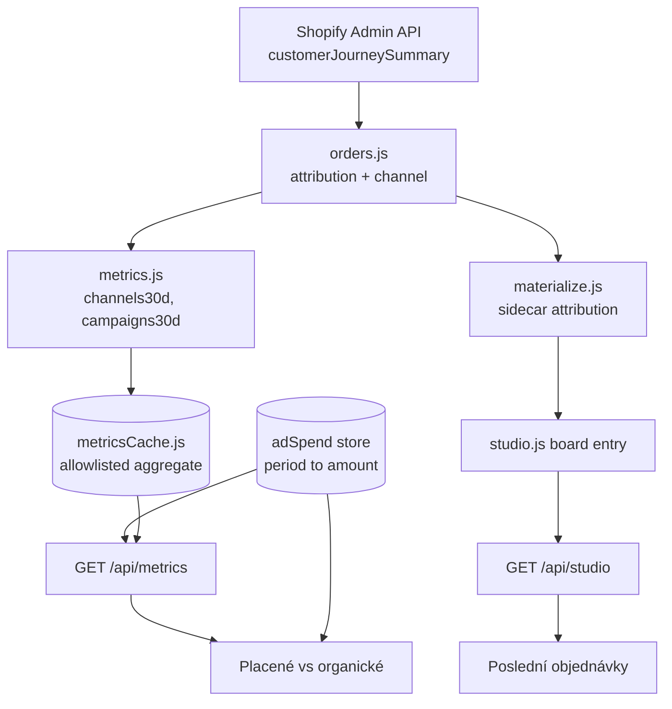

# Marketing Homepage - Plan

## Goal Capsule

- **Objective:** Put the paid-vs-organic comparison on the studio homepage, so the decision about who buys the media can be made from the shop's own numbers.
- **Product authority:** David (operator). Jirka's screens are out of scope and unchanged.
- **Authority order:** this plan, then the repo's existing patterns, then the implementer's judgment. A conflict with the Product Contract below is a blocker, not a judgment call.
- **Stop conditions:** stop and ask if the Shopify journey fields stop resolving, if a new aggregate cannot be added to the metrics cache allowlist without carrying customer data, or if removing the work card breaks a test whose intent is not obviously stale.
- **Open blockers:** none. Meta ad-account admin rights are unconfirmed, which is why hand-entered spend ships complete and the Meta fetch is a follow-up.
- **Product Contract preservation:** changed — R1, R4, R6 rewritten and R15 added, after the operator saw a rendered preview and cut the redesign back to an additive change. Everything else carried forward from the brainstorm unchanged.

---

## Product Contract

### Summary

The homepage gains a paid-vs-organic block and a recent-orders list, built from the components already on the page. Meta and organic sit side by side on the same terms over a rolling 30 days, with hand-entered spend. Two blocks that nobody reads — the work card and the tier-mix bar — come off.

### Problem Frame

The backend runs itself now. Orders arrive from Shopify, generate, build and reach the print queue without a person, so the homepage's current job — pointing at the one order that needs a human — describes a shrinking part of the day. What is left for David is marketing, and the page says nothing about it.

The immediate decision is who buys the media. An external person managed the Meta account while David and Lukáš made the creatives; that arrangement has ended and the replacement is undecided. Hiring again, or taking it over, turns on whether the ads pay for themselves — and nothing in the studio can answer that today. Spend lives in Meta, revenue lives in Shopify, and nobody has put them beside each other.

The store's own data already shows why the question is not just about ads. Of 49 paid orders since 1 May 2026, Meta produced 21 of them at an average of about 700 Kč, while seven orders came from Google search at 1 308 Kč each and cost nothing to acquire. The highest-value channel in the shop is the one with no representation on any screen.

### Key Decisions

- **The page is extended, not redesigned.** The existing shell, components and tokens stay. A rendered preview of a redesigned page was rejected; the operator likes the page as it is and wants the data, not a new layout.
- **Organic gets equal billing with paid.** Not because it is larger (it is not, by order count) but because it produces the biggest orders at zero cost, and a page that only showed what money was spent on would keep that invisible.
- **Attribution comes from Shopify, not from a tracking integration.** The Admin token already returns each order's first-visit source, referrer and UTM parameters, so channel and campaign revenue need no new data source. Only spend does.
- **Hand-entered spend is the primary path; the Meta Ads API is an upgrade.** Admin rights on the ad account are unconfirmed, and the page must work before that question is settled. A typed figure also survives the token expiry that would otherwise blank the page's central number, so the manual path stays even once the API lands.
- **The comparison runs on a rolling 30 days.** It means the same thing every day it is read, and it never collapses to a handful of orders at the start of a month. The existing economics block already uses this window.
- **PostHog stays out.** Its key sits in `config.json` and no code reads it. Nothing this page answers needs session analytics, and wiring it because it is available is how the page fills with numbers nobody acts on.

### Actors

- A1. Operator (David) — the only audience for this page. Makes the buy-or-hire call, makes the creatives, decides blog topics.
- A2. Printer (Jirka) — reaches the generator, the order board and the print queue. Must not reach this page or its money figures.
- A3. Autopilot — writes the order and status data the recent-orders list reads.

### Requirements

**Page composition**

- R1. The homepage carries a paid-vs-organic block: two tiles of equal weight — Meta, and Google plus Seznam — each showing revenue, order count, average order value, spend, and return on spend over a rolling 30 days.
- R2. A single written line states what the comparison currently means, recomputed from the same figures rather than authored by hand.
- R3. A per-campaign table shows spend against revenue and return on spend, keyed on the campaign names that arrive in order UTM parameters.
- R4. The homepage keeps its existing shell, components and design tokens. The new blocks are built from components already on the page and introduce no new visual language.
- R5. A recent-orders list shows the most recent orders with their status and the channel or campaign each came from.
- R6. The existing Ekonomika objednávek tiles, the Pošta card and the calendar rail stay in place and unchanged.
- R15. Pokračovat v práci and the Rozložení balíčků bar are removed from the homepage.

**Attribution**

- R7. Each order's channel is derived from its Shopify first-visit UTM parameters, falling back to the referrer source when no UTM is present.
- R8. Orders that carry no journey data are counted and shown as their own row, never silently dropped or folded into direct.
- R9. Every channel figure on the page is labelled as directional, with the share of unattributed orders visible on the page rather than in a tooltip.

**Spend**

- R10. Spend can be entered by hand for a period, and the page computes return on spend from it.
- R11. Meta spend is fetched per campaign and matched to revenue by campaign name, once ad-account access allows it. A hand-entered figure wins over a fetched one for the same period.
- R12. When spend is missing or stale for the displayed window, the page says so in place of the return-on-spend figure rather than rendering a number computed from partial spend.

**Organic evidence**

- R13. The organic panel shows which search queries brought traffic, from Search Console. Deferred — see Scope Boundaries.

**Access**

- R14. The page and every figure on it are operator-only; the printer's landing view and permitted views are unchanged.

### Key Flows

- F1. The weekly buy-or-hire check
  - **Trigger:** Operator opens the studio homepage.
  - **Actors:** A1
  - **Steps:** The two tiles show what paid and organic each returned for the window. The meaning line states the current comparison. The campaign table shows which campaigns carry the paid number.
  - **Outcome:** The operator can say whether paid is covering its cost and how it compares to the free channel.
  - **Covered by:** R1, R2, R3, R9

- F2. The window has no spend figure
  - **Trigger:** Nothing has been entered for the window, or a Meta fetch failed once the integration exists.
  - **Actors:** A1, and the Meta API as an upstream
  - **Steps:** The page detects that the window has no usable spend. Return on spend is replaced by a statement of what is missing. The operator enters the figure by hand for that period.
  - **Outcome:** The comparison stays truthful and usable without the integration.
  - **Covered by:** R10, R12

### Acceptance Examples

- AE1. Unattributed orders are visible, not absorbed
  - **Covers R8, R9.**
  - **Given:** 49 paid orders in the window, 10 of which carry no journey data.
  - **When:** The operator reads the channel breakdown.
  - **Then:** The 10 appear as their own row with their revenue, and the page states that about a fifth of orders are unattributed.

- AE2. Return on spend with no spend figure
  - **Covers R12.**
  - **Given:** No spend has been entered for the displayed window.
  - **When:** The operator opens the page.
  - **Then:** The paid tile shows revenue and order count, and in place of return on spend states that spend is missing for the window.

- AE3. A hand-entered figure beats a fetched one
  - **Covers R10, R11.**
  - **Given:** Meta reported spend for a week and the operator enters a different figure for that same week.
  - **When:** The page recomputes.
  - **Then:** The hand-entered figure is used, and the page shows that the figure was entered rather than fetched.

- AE4. The printer never sees the money
  - **Covers R14.**
  - **Given:** Jirka is signed in as printer.
  - **When:** He reaches the studio.
  - **Then:** He lands on the print queue as before, and no request he can make returns revenue, spend or channel data.

### Scope Boundaries

**Deferred for later**

- R13, the Search Console query panel. A separate Google API integration; the buy-or-hire decision does not depend on it, and the organic tile carries revenue, orders and average order value without it.
- Instagram organic performance. The posts carry no UTMs, so there is nothing to attribute until the links are tagged.
- Proton mail on the deployed dashboard. `mail.enabled` is false and Render answers `/api/mail` with `not-configured`, because Proton speaks IMAP only through Bridge — a desktop app on the operator's own machine that Render cannot reach. An infrastructure problem, not a homepage feature, and its own piece of work.

**Outside this work**

- A media-buying console. Budgets, ad creation and audiences stay in Meta. This page reads spend; it never writes it.
- PostHog. Configured but unread by any code, and not needed to answer this page's question.
- Jirka's views and the review grid.
- The Kalendář view.
- Per-order profitability. Cost of goods, printing and postage are not in the data set, so "profit" on this page means revenue after ad spend only.

**Deferred to follow-up work**

- The Meta Ads spend fetch (R11). Blocked on confirming who holds admin on the ad account. It writes into the same store U3 creates, so it lands as one unit later with no rework.
- Deleting the tier-mix aggregate from `src/metrics.js`. Only its rendering comes off now — see KTD6.

### Sources

- Live attribution check, 2026-08-06, orders since 2026-05-01: 49 paid orders. facebook/paid 14 orders / 10 499 Kč / AOV 750. Google organic 7 / 9 158 Kč / AOV 1 308. facebook/cpc 7 / 4 280 Kč / AOV 611. direct 10 / 1 113 Kč / AOV 111. seznam 1 / 1 057 Kč. No journey data 10 / 5 182 Kč. Campaign `A+ sales - 3-2026`: 17 orders / 11 700 Kč / AOV 688.
- `docs/plans/2026-07-11-002-feat-unified-studio-dashboard-plan.md` — the plan that established the current homepage.

---

## Planning Contract

### Key Technical Decisions

- KTD1. **Attribution is read from `customerJourneySummary` on the order node.** Confirmed live against orders 1560-1565: `firstVisit.utmParameters` carries source, medium and campaign; `firstVisit.source` carries a referrer-derived name when no UTM exists. The field is added to the existing `ORDER_FIELDS` selection, so every consumer of `listOrders` gets it from one place.
- KTD2. **Per-order channel and aggregate channel live in different stores.** The aggregate rides the metrics cache, which exists to answer "how is the shop doing" for the whole window. The per-order channel rides the order sidecar next to the dedication and the email, because that is what the board already reads to draw a row. Trying to serve the recent-orders list from the metrics cache would push per-order rows onto a store designed to hold none.
- KTD3. **Only aggregate rows cross onto disk, and only through the allowlist.** `src/metricsCache.js` reduces the aggregate through `CACHEABLE` field by field precisely so a new key cannot start persisting customer data by accident. Channel and campaign rows are added to that allowlist explicitly, and referrer URLs and landing pages are never among the fields carried — a referrer can hold a query string, and nothing on this page needs it.
- KTD4. **Spend is its own small store keyed by period.** Not part of the metrics cache: metrics are derived and disposable with a one-hour TTL, while a typed spend figure is operator input that must survive a cache refresh. The Meta fetch later writes the same shape with a different provenance field, so the display code does not change when it lands.
- KTD5. **Return on spend is withheld, not estimated, when spend is missing.** A page whose central number quietly degrades to a partial figure is worse than one that says it does not know. This is what AE2 pins.
- KTD6. **The tier-mix aggregate stays in `src/metrics.js`; only its rendering is removed.** It is a pure, tested function whose output already sits in the cache allowlist, and deleting it would touch nine assertions across two test files for no runtime gain. Removing it entirely is listed as follow-up work.
- KTD7. **Every new route gets a `ROUTE_POLICY` line.** `test/reviewServer.test.js:831` scans the dispatcher and fails on any route without one, so R14's operator-only gating is enforced by the suite rather than by care. The spend routes take `AUDIENCES.OPERATOR`, matching `GET /api/metrics`.

### High-Level Technical Design

Two paths out of one extraction. The aggregate path answers the comparison; the sidecar path answers "where did this one order come from". Spend joins only at render time, which is what lets the page withhold return on spend without disturbing the revenue figures.

### Risks

- **Query cost on the 90-day pull.** `metricsCache.js` fetches 90 days of orders per cache miss, and U1 adds a connection field to every node in that selection. Shopify's cost-based limiter may throttle a pull that used to pass. Watch for the existing `THROTTLED` path in `src/shopify/adminClient.js` firing on the metrics refresh; if it does, the answer is a smaller page size on that query, not dropping the field.
- **Campaign-name drift.** Matching spend to revenue by campaign name breaks silently if Meta renames a campaign mid-flight — revenue lands under the new name, spend under the old, and both return-on-spend figures look wrong rather than missing. U9 owns the mapping; until then, hand-entered spend is a single figure per period, which sidesteps it.

### Assumptions

- Campaign names in Meta match the campaign names arriving in order UTM parameters. Observed: `A+ sales - 3-2026` and `A+ sales`. If Meta reports different names, U9 needs a mapping.
- Roughly 20% of orders carry no journey data, and that share is assumed stable rather than improving.
- Orders materialized before U5 ships have no attribution in their sidecar; U7's backfill is what makes the recent-orders list useful on day one.

### Sequencing

U1 first — everything downstream reads what it extracts. U2, U3 and U5 are then independent of each other. U4 needs U2 and U3; U6 needs U5; U7 needs U5's sidecar shape. U8 is independent and can land any time.

---

## Implementation Units

### U1. Attribution extraction from the order node

- **Goal:** One place that turns a raw Shopify order node into a channel, and one place that names the channel groups.
- **Requirements:** R7, R8
- **Dependencies:** none
- **Files:** `src/shopify/adminClient.js`, `src/shopify/orders.js`, `test/shopifyOrders.test.js`
- **Approach:** Add `customerJourneySummary { firstVisit { source utmParameters { source medium campaign } } }` to `ORDER_FIELDS`. Add two pure exports to `orders.js`: one returning `{ source, medium, campaign }` for a node, one classifying that into `paid` / `organic` / `direct` / `unknown`. Facebook with `medium` of `paid` or `cpc` is paid; Google and Seznam without UTM are organic; `direct` is direct; a node with no journey data is unknown. Do not carry `referrerUrl` or `landingPage` out of the extractor — nothing downstream needs them and they can hold query strings.
- **Patterns to follow:** the existing pure-extraction split in `src/shopify/orders.js` — no I/O, everything testable against a literal node.
- **Test scenarios:**
  - A node with `utmParameters` of facebook / paid / `A+ sales - 3-2026` classifies as paid and keeps the campaign name.
  - A node with `medium` of `cpc` also classifies as paid.
  - A node with `firstVisit.source` of `Google` and no UTM classifies as organic with a null campaign.
  - A node with `source` of `direct` classifies as direct.
  - A node with `customerJourneySummary` null classifies as unknown, and does not throw.
  - The extractor's output holds no referrer or landing-page field.
- **Verification:** `node --test test/shopifyOrders.test.js` passes and the new classifier covers all five shapes above.

### U2. Channel and campaign aggregates

- **Goal:** Revenue, order count and average order value per channel and per campaign for the rolling window, cached like the existing aggregate.
- **Requirements:** R1, R3, R8
- **Dependencies:** U1
- **Files:** `src/metrics.js`, `src/metricsCache.js`, `test/metrics.test.js`, `test/metricsCache.test.js`
- **Approach:** Extend `computeMetrics` with a channel rollup and a campaign rollup over the same 30-day rolling window and the same `COUNTED` financial-status filter the rest of the module uses. Unknown-source orders are their own row, not merged into direct. Add both keys to `CACHEABLE` in `metricsCache.js` and rebuild their rows field by field in `cacheableMetrics`, the way `tierMix30d` already is — a spread would let an added field ride onto disk.
- **Patterns to follow:** `tierMix30d` in `src/metrics.js` for the rollup shape, and its field-by-field rebuild in `cacheableMetrics` for the allowlist treatment.
- **Test scenarios:**
  - Two paid orders and one organic order produce two channel rows with the right sums and averages.
  - An order with no journey data lands in its own row and is not counted as direct.
  - An unpaid order is excluded from both rollups, matching the existing `COUNTED` behavior.
  - Orders outside the 30-day window are excluded.
  - Covers AE1. The channel rollup exposes the unattributed count and revenue, so the page can state the share.
  - The cache file, serialized, holds no customer email, no photo URL, no referrer and no landing page after the new keys are added.
- **Verification:** `node --test test/metrics.test.js test/metricsCache.test.js` passes, including the existing no-PII assertion.

### U3. Hand-entered ad spend

- **Goal:** A store and two routes so the operator can type spend for a period and have it survive a metrics refresh.
- **Requirements:** R10, R12, R14
- **Dependencies:** none
- **Files:** `src/adSpend.js`, `src/ui/server.js`, `test/adSpend.test.js`, `test/reviewServer.test.js`
- **Approach:** A small module over a JSON file in the same data dir as the metrics cache, written `0o600` for the reason `metricsCache.js` gives. One record per period: amount, currency, the period bounds, and how it arrived — typed or fetched. Reading for a window returns the typed figure when one exists for it, the fetched figure otherwise, and null when neither does. Two routes, both `AUDIENCES.OPERATOR` with `ROUTE_POLICY` lines: one to read the current window's figure, one to write a typed one.
- **Patterns to follow:** `src/metricsCache.js` for the data-dir, file-mode and error-shape conventions; the `GET /api/metrics` route and its `ROUTE_POLICY` entry for the audience wiring.
- **Test scenarios:**
  - A typed figure for a period is returned for a window inside that period.
  - Covers AE3. A typed figure wins over a fetched one for the same period, and the returned record says it was typed.
  - A window with no record returns null rather than zero — zero would compute a return on spend of infinity.
  - The file is written `0o600`.
  - A malformed or hand-edited file does not crash the reader; it reads as no data.
  - The printer role is refused on both routes.
  - The dispatcher scan in `test/reviewServer.test.js` still passes, which requires both routes to have `ROUTE_POLICY` lines.
- **Verification:** `node --test test/adSpend.test.js test/reviewServer.test.js` passes.

### U4. Placené vs organické on the homepage

- **Goal:** The comparison block, built from the components already on the page.
- **Requirements:** R1, R2, R3, R4, R9, R12
- **Dependencies:** U2, U3
- **Files:** `src/ui/static/dashboard.html`, `test/studio.test.js`
- **Approach:** A new `<section data-operator hidden>` in the home view's work column, below the existing economics block: a `.mx-grid` of two `.mx-card` tiles, then a `.mx-card.wide` holding the campaign table and the meaning line in `.mx-note`. The `data-operator hidden` pair is not optional — the page ships hidden and the identity poll reveals it, which is how `metricsSection` avoids painting revenue for a printer during the first frame. No new CSS classes — `.mx-*`, `.sec-h`, `.chip` and the existing table styles carry it. Return on spend and cost per order are computed page-side from the metrics payload and the spend figure; when spend is null the tile renders the missing-spend statement in place of both. The meaning line is generated from the two tiles' numbers, and the unattributed share is stated beneath it, not hidden in a title attribute.
- **Execution note:** the missing-spend branch is the one that matters and is easy to leave until last; write it first so the block is correct before any spend exists.
- **Patterns to follow:** `renderMetrics` in `dashboard.html` for how a section reads its payload and paints `.mx-card`s; `pageFunction` in `test/studio.test.js` for lifting a page-side rule into a test.
- **Test scenarios:**
  - Covers AE2. With spend null, the paid tile renders the missing-spend statement and no return-on-spend number.
  - With spend present, return on spend and cost per order compute from revenue and order count.
  - Spend of zero for the organic tile renders as zero cost, not as missing data — the two states are different and must not collapse.
  - The unattributed count and revenue appear in the rendered block.
  - The block uses no class that is not already defined in `components.css` or the page's own style block.
  - Covers AE4. The section carries `data-operator` and ships with `hidden`, so a printer session never paints it even for one frame.
- **Verification:** `node --test test/studio.test.js` passes, and the ROAS rule is lifted and run rather than matched as source text.

### U5. Attribution into the order sidecar

- **Goal:** Each order folder records where its order came from, so the board can show it.
- **Requirements:** R5, R7
- **Dependencies:** U1
- **Files:** `src/shopify/materialize.js`, `src/orderInfo.js`, `src/studio.js`, `test/materialize.test.js`, `test/studio.test.js`
- **Approach:** `materializeOrder` writes an `attribution` field into `objednavka.json` from U1's extractor. `orderInfo.js` parses it with the same defensive shape it uses for the rest of the sidecar, and the board entry in `studio.js` carries channel and campaign. An order whose sidecar predates this reads as unknown rather than throwing.
- **Patterns to follow:** how `dedication` and `layout` already flow from the sidecar through `orderInfo.js` onto the board entry.
- **Test scenarios:**
  - A materialized order's sidecar holds the channel and campaign from its node.
  - A sidecar with no `attribution` key parses as unknown and does not throw.
  - A sidecar with a malformed `attribution` value parses as unknown.
  - The board entry for an order carries its channel through to `studioBoard`'s output.
- **Verification:** `node --test test/materialize.test.js test/studio.test.js` passes.

### U6. Poslední objednávky on the homepage

- **Goal:** A recent-orders list that shows where each order came from.
- **Requirements:** R4, R5
- **Dependencies:** U5
- **Files:** `src/ui/static/dashboard.html`, `test/studio.test.js`
- **Approach:** A new `<section data-operator hidden>` below the comparison block using the existing `.table` component — the same one Tisková fronta uses — with columns for order, source, dedication, value and status. Status chips reuse the existing `chipHtml`. The list is capped at the most recent handful and links out to the full board; it is a glance, not a second copy of Objednávky.
- **Patterns to follow:** the queue table markup at `src/ui/static/dashboard.html` and `renderQueue` for how rows are built from the board payload.
- **Test scenarios:**
  - An order with no attribution renders a muted "bez zdroje" rather than an empty cell.
  - An order with a campaign shows channel and campaign together.
  - The list is capped and does not grow with the board.
  - Status chips match the board's own chip for the same status.
  - Covers AE4. The section carries `data-operator` and ships with `hidden`. This one matters more than U4's: `/api/studio` answers both roles, so without the attribute a printer session would paint real order rows.
- **Verification:** `node --test test/studio.test.js` passes.

### U7. Backfill attribution for existing orders

- **Goal:** The recent-orders list is useful on the day it ships, not weeks later.
- **Requirements:** R5
- **Dependencies:** U5
- **Files:** `tools/backfillAttribution.mjs`
- **Approach:** A one-shot tool that reads existing order folders, fetches their orders from Shopify by name, and patches `attribution` into each sidecar without touching any other field. Idempotent — running it twice changes nothing. It reports what it patched and what it could not resolve. Not wired into the autopilot; this is a migration the operator runs once.
- **Patterns to follow:** `src/migrations/sentMarker.js` for the shape of a one-shot migration over order folders.
- **Test scenarios:** none — a one-shot migration tool over live data, verified by running it. `Test expectation: none -- one-shot tool, no branching logic worth pinning; correctness is observable in the sidecars it writes.`
- **Verification:** run it against the live outbox; sidecars gain `attribution`, no other field changes, and a second run reports zero patches.

### U8. Remove the work card and the tier-mix bar

- **Goal:** Two blocks nobody reads come off the homepage.
- **Requirements:** R15
- **Dependencies:** none
- **Files:** `src/ui/static/dashboard.html`, `test/reviewServer.test.js`
- **Approach:** Delete the Pokračovat v práci section, its `continueRow` container and `renderContinue`, and the tier-mix markup and its rendering. Leave `tierMix30d` in `src/metrics.js` and in the cache allowlist — see KTD6. `test/reviewServer.test.js:1107` asserts `id="continueRow"` is present with the comment "and Pokračovat v práci stays"; that assertion is now stale and is removed along with the markup, not worked around.
- **Test scenarios:**
  - The home view holds no `continueRow` and no tier-mix bar.
  - `renderStudio` still paints without them — no reference to the removed renderer survives.
  - The remaining economics tiles are untouched.
- **Verification:** `node --test test/reviewServer.test.js test/studio.test.js` passes, and the stale assertion is deleted rather than inverted.

---

## Verification Contract

| Gate | Command | Applies to | Done signal |
|---|---|---|---|
| Unit and integration suite | `npm test` | all units | 831 of 833 or better; the only red is the known Windows `0600` account-file test |
| Attribution extraction | `node --test test/shopifyOrders.test.js` | U1 | all five node shapes classify, no referrer in the output |
| Aggregates and privacy | `node --test test/metrics.test.js test/metricsCache.test.js` | U2 | rollups correct and the existing no-PII cache assertion still passes |
| Spend store and routes | `node --test test/adSpend.test.js test/reviewServer.test.js` | U3 | typed beats fetched, printer refused, dispatcher scan green |
| Page rules | `node --test test/studio.test.js` | U4, U5, U6 | the missing-spend rule is lifted and run, not source-matched |
| Live smoke | `npm run studio-smoke` | U4, U6 | the homepage renders both new blocks against a real board |

The dispatcher scan in `test/reviewServer.test.js` is the gate that matters most for R14: a new route without a `ROUTE_POLICY` line fails the suite rather than shipping ungated.

---

## Definition of Done

**Global**

- Every requirement except R13 is met, or explicitly deferred in Scope Boundaries with the reason.
- `npm test` is green apart from the known Windows-only `0600` failure.
- The homepage renders against the live board with no new CSS class and no new dependency.
- No customer email, photo URL, referrer or landing page reaches the metrics cache file.
- Jirka's landing view and permitted views are unchanged, proven by the role tests rather than by inspection.
- Abandoned approaches are removed. A long run accumulates half-built spend shapes and dead render branches; the diff holds none.

**Per unit**

- U1 — the classifier covers paid, organic, direct and unknown, and carries no referrer field.
- U2 — channel and campaign rows are on the cache allowlist and rebuilt field by field.
- U3 — a typed figure survives a metrics refresh and beats a fetched one; both routes are operator-only.
- U4 — with no spend, the block states what is missing instead of rendering a number.
- U5 — an order folder predating this unit reads as unknown rather than throwing.
- U6 — the list is capped and links out; it is not a second order board.
- U7 — running it twice patches nothing the second time.
- U8 — the stale `continueRow` assertion is deleted, not inverted.
